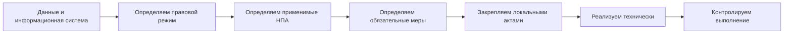
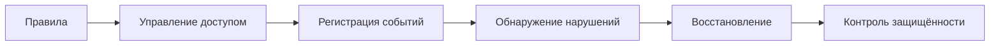
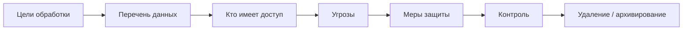
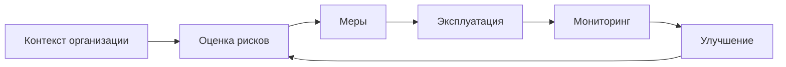
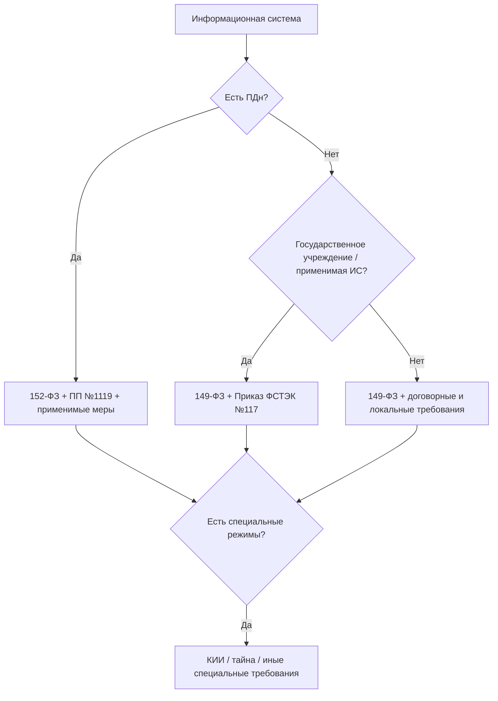
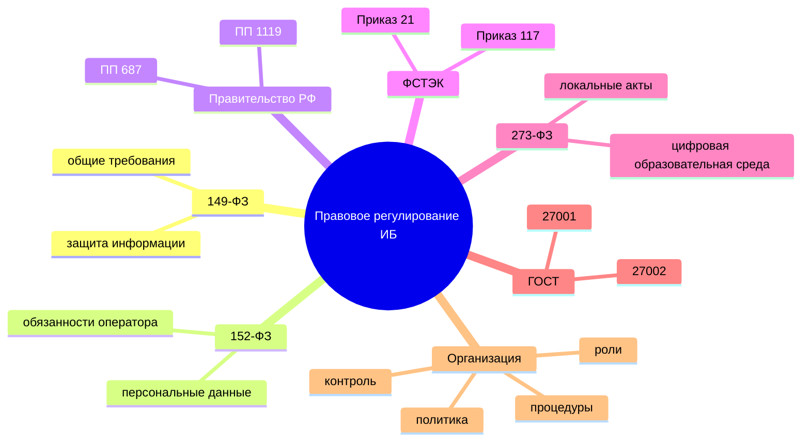

# Правовое регулирование информационной безопасности в Российской Федерации

> **Вводная лекция**  
> Дисциплина: «Информационная безопасность в образовательных учреждениях»  
> Актуальность нормативных ссылок: **20 августа 2026 г.**

---

## 1. Зачем специалисту по образованию знать правовую базу ИБ

Информационная безопасность в образовательной организации — это не только антивирус, пароли и резервные копии. Организация работает с персональными данными обучающихся и работников, электронными журналами, LMS, облачными сервисами, корпоративной почтой, сайтами и другими информационными системами. Для части этих объектов требования к защите установлены законодательством.

Поэтому при проектировании защиты необходимо отвечать не только на вопрос:

> **«Какая мера технически полезна?»**

но и на вопрос:

> **«Какие требования организация обязана выполнить и почему?»**

Практический принцип:

---

# 2. Как устроено регулирование информационной безопасности

Для вводного уровня достаточно различать пять уровней документов.

| Уровень | Что задаёт | Примеры |
|---|---|---|
| Федеральные законы | основные права, обязанности и режимы информации | 149-ФЗ, 152-ФЗ, 187-ФЗ, 273-ФЗ |
| Указы Президента РФ | стратегические направления государственной политики | Доктрина информационной безопасности РФ |
| Постановления Правительства РФ | конкретизируют требования федеральных законов | ПП РФ № 1119, № 687 |
| Приказы регуляторов | определяют организационные и технические требования | приказы ФСТЭК России |
| Национальные стандарты | систематизируют лучшие практики и процессы | ГОСТ Р ИСО/МЭК 27001, 27002 |

Важно различать:

- **обязательное требование законодательства**;
- **требование, применимое только к определённому типу организации или системы**;
- **рекомендацию стандарта**;
- **локальное правило самой организации**.

ГОСТ сам по себе не заменяет федеральный закон и не отменяет требования регуляторов.

---

# 3. Базовый закон: 149-ФЗ «Об информации, информационных технологиях и о защите информации»

Федеральный закон от 27.07.2006 № 149-ФЗ является базовым законом для отношений, связанных с информацией, информационными технологиями и защитой информации.

Для курса особенно важна **статья 16 «Защита информации»**.

В ней защита информации связывается с правовыми, организационными и техническими мерами.

Основные задачи защиты:

1. предотвращение неправомерного доступа;
2. защита от уничтожения, изменения, блокирования, копирования и распространения информации;
3. соблюдение конфиденциальности информации ограниченного доступа;
4. обеспечение возможности восстановления информации;
5. контроль состояния защищённости.

### Что это означает для образовательной организации

Недостаточно просто приобрести средство защиты.

Организация должна выстроить процесс:

Например, для LMS требуется не только пароль, но и:

- управление ролями;
- своевременный отзыв доступа;
- журналирование;
- резервирование;
- реагирование на инциденты.

**Источник:** [Федеральный закон № 149-ФЗ](https://www.consultant.ru/document/cons_doc_LAW_61798/)

---

# 4. Персональные данные: 152-ФЗ

Для образовательных организаций наиболее практически значим Федеральный закон от 27.07.2006 № 152-ФЗ **«О персональных данных»**.

Персональные данные — любая информация, относящаяся к прямо или косвенно определённому или определяемому физическому лицу.

В образовательной среде это может быть:

- ФИО;
- дата рождения;
- контактные данные;
- сведения об обучении;
- оценки;
- посещаемость;
- сведения о работниках;
- фотографии, если по ним можно определить человека;
- идентификаторы пользователя, связанные с конкретным человеком.

## 4.1. Главный принцип: сначала цель, затем данные

Статья 5 закона устанавливает принцип целевой обработки.

Нельзя собирать данные «на всякий случай».

Правильная логика:

> **цель → минимально необходимый набор данных → срок хранения → доступ → удаление**

Пример:

Для регистрации обучающегося на внешнем олимпиадном сервисе не следует автоматически передавать весь профиль из LMS, если для участия достаточно имени, класса и адреса электронной почты.

---

## 4.2. Оператор персональных данных

Образовательная организация во многих процессах выступает **оператором персональных данных**, поскольку определяет цели обработки, состав данных и действия с ними.

Это означает ответственность не только ИТ-службы.

Защита ПДн включает:

- правовые меры;
- организационные меры;
- технические меры.

---

## 4.3. Что обязан организовать оператор

Статья 18.1 Федерального закона № 152-ФЗ предусматривает, в частности:

- назначение ответственного за организацию обработки персональных данных;
- принятие политики обработки ПДн;
- принятие локальных актов;
- внутренний контроль;
- ознакомление и обучение работников;
- применение мер защиты.

Статья 19 требует принимать меры защиты от неправомерного или случайного доступа, уничтожения, изменения, блокирования, копирования, предоставления и распространения персональных данных.

### Практический вывод

Защита ПДн — это не документ «Политика обработки персональных данных», лежащий на сайте.

Нужна связка:

**Источник:** [Федеральный закон № 152-ФЗ](https://www.consultant.ru/document/cons_doc_LAW_61801/)

---

# 5. Постановления Правительства РФ по защите персональных данных

Федеральный закон задаёт общие обязанности. Более конкретные требования устанавливаются подзаконными актами.

## 5.1. Постановление Правительства РФ № 1119

**Постановление Правительства РФ от 01.11.2012 № 1119** устанавливает требования к защите персональных данных при их обработке в информационных системах персональных данных.

Ключевая идея — для ИСПДн определяется необходимый **уровень защищённости**, а затем реализуется соответствующий набор мер.

Для вводного курса не требуется запоминать все комбинации уровней.

Важно понимать последовательность:

1. определить, какие ПДн обрабатываются;
2. определить актуальные угрозы;
3. определить требуемый уровень защищённости;
4. выбрать и реализовать меры.

**Источник:** [Постановление Правительства РФ № 1119](https://www.consultant.ru/document/cons_doc_LAW_137356/)

---

## 5.2. Постановление Правительства РФ № 687

**Постановление Правительства РФ от 15.09.2008 № 687** регулирует особенности обработки персональных данных **без использования средств автоматизации**.

Это важно и для цифровой организации: не все данные находятся только в LMS.

Примеры:

- бумажные личные дела;
- распечатанные списки;
- ведомости;
- заявления;
- анкеты.

Основной смысл требований:

- данные разных целей должны быть разделены;
- необходимо определить места хранения;
- определить лиц, имеющих доступ;
- исключить несанкционированный доступ.

Следовательно:

> переход к цифровой среде не отменяет требований к бумажным носителям.

**Источник:** [Постановление Правительства РФ № 687](https://www.consultant.ru/document/cons_doc_LAW_80028/)

---

# 6. Требования ФСТЭК России

ФСТЭК России играет ключевую роль в регулировании **технической защиты информации**.

Для вводного курса необходимо знать два документа.

## 6.1. Приказ ФСТЭК России № 21

Приказ ФСТЭК России от 18.02.2013 № 21 определяет состав и содержание организационных и технических мер защиты персональных данных в информационных системах персональных данных.

Типовые группы мер:

- идентификация и аутентификация;
- управление доступом;
- регистрация событий безопасности;
- антивирусная защита;
- обеспечение целостности;
- обеспечение доступности;
- управление конфигурацией;
- выявление инцидентов и реагирование;
- защита носителей;
- контроль защищённости.

Это полезно рассматривать не как список программ, которые требуется приобрести, а как **функции системы защиты**.

Например:

> «регистрация событий безопасности» — это требование к функции, а не указание приобрести конкретную SIEM.

**Источник:** [Приказ ФСТЭК России № 21](https://www.consultant.ru/document/cons_doc_LAW_146520/)

---

## 6.2. Приказ ФСТЭК России № 117 — актуально с 2026 года

С **1 марта 2026 г.** действует приказ ФСТЭК России от 11.04.2025 № 117.

Он устанавливает требования к защите информации:

- в государственных информационных системах;
- в иных информационных системах государственных органов;
- государственных унитарных предприятий;
- **государственных учреждений**.

Приказ № 117 заменил ранее применявшийся приказ ФСТЭК России № 17.

Для государственных образовательных учреждений это особенно важно: применимость требований нужно оценивать не только по наличию персональных данных, но и по статусу организации и информационной системы.

**Источник:** [Приказ ФСТЭК России № 117](https://www.consultant.ru/document/cons_doc_LAW_507869/)

---

# 7. Федеральные органы: кто за что отвечает

Не следует воспринимать «государственного регулятора ИБ» как один орган. Полномочия распределены.

| Орган | Для вводного курса |
|---|---|
| **ФСТЭК России** | техническая защита информации, требования к защите ряда информационных систем, меры защиты ПДн |
| **ФСБ России** | криптографическая защита, безопасность в соответствующих сферах, государственная система реагирования на компьютерные атаки |
| **Роскомнадзор** | государственный контроль и надзор за обработкой персональных данных, защита прав субъектов ПДн |
| **Росстандарт** | национальная стандартизация, включая стандарты серии ГОСТ Р ИСО/МЭК 27000 |

Практически это означает:

> один и тот же цифровой сервис может одновременно попадать в область нескольких нормативных требований.

Например, LMS образовательной организации может обрабатывать персональные данные, использовать средства криптографической защиты и входить в информационную инфраструктуру государственного учреждения.

---

# 8. Критическая информационная инфраструктура: 187-ФЗ

Федеральный закон от 26.07.2017 № 187-ФЗ регулирует безопасность критической информационной инфраструктуры Российской Федерации.

В рамках вводного курса важно не делать ошибочный вывод:

> **любая образовательная организация автоматически является субъектом КИИ.**

Это неверно.

Применимость 187-ФЗ зависит от:

- вида деятельности организации;
- наличия соответствующих объектов;
- отраслевой принадлежности;
- выполнения критериев, установленных законодательством.

Если организация действительно подпадает под требования законодательства о КИИ, возникают отдельные обязанности по категорированию, защите и взаимодействию с государственной системой обнаружения, предупреждения и ликвидации последствий компьютерных атак.

Для обычного анализа школьной LMS начинать с 187-ФЗ обычно не требуется.

**Источник:** [Федеральный закон № 187-ФЗ](https://publication.pravo.gov.ru/Document/View/0001201707260023)

---

# 9. Закон об образовании и информационная безопасность

Информационная безопасность образовательной организации регулируется не только «специальными законами об ИБ».

Федеральный закон от 29.12.2012 № 273-ФЗ **«Об образовании в Российской Федерации»** непосредственно связан с цифровой образовательной средой.

## 9.1. Электронное обучение

Статья 16 связывает электронное обучение с использованием:

- баз данных;
- информационных технологий;
- технических средств;
- информационно-телекоммуникационных сетей;
- электронной информационно-образовательной среды.

При применении электронного обучения организация должна обеспечить предусмотренные законом условия функционирования электронной информационно-образовательной среды.

Также закон требует обеспечивать защиту сведений, составляющих государственную или иную охраняемую законом тайну.

## 9.2. Ответственность образовательной организации

Статья 28 закрепляет компетенцию и ответственность образовательной организации, в том числе:

- использование электронного обучения;
- ведение официального сайта;
- хранение информации о результатах обучения;
- создание безопасных условий образовательного процесса.

## 9.3. Локальные нормативные акты

Статья 30 позволяет образовательной организации принимать локальные нормативные акты в пределах своей компетенции.

В сфере ИБ это позволяет формализовать:

- правила использования цифровых сервисов;
- порядок выдачи и отзыва доступа;
- порядок работы с ПДн;
- порядок реагирования на инциденты;
- правила использования облачных сервисов и ИИ;
- обязанности работников.

**Источник:** [Федеральный закон № 273-ФЗ](https://www.consultant.ru/document/cons_doc_LAW_140174/)

---

# 10. ГОСТы в сфере информационной безопасности

ГОСТы нужны не для замены законодательства, а для организации **системного управления безопасностью**.

## 10.1. ГОСТ Р ИСО/МЭК 27000-2021

Содержит общий обзор и терминологию систем менеджмента информационной безопасности.

Полезен для унификации понятий:

- информационная безопасность;
- риск;
- средство контроля;
- система менеджмента информационной безопасности.

## 10.2. ГОСТ Р ИСО/МЭК 27001-2021

Устанавливает требования к системе менеджмента информационной безопасности — СМИБ.

Ключевая логика:

То есть безопасность рассматривается как **постоянный управляемый процесс**, а не разовое внедрение средств защиты.

## 10.3. ГОСТ Р ИСО/МЭК 27002-2021

Содержит рекомендации по выбору и применению мер информационной безопасности.

Для образовательной организации полезны направления:

- управление доступом;
- безопасность персонала;
- управление активами;
- эксплуатационная безопасность;
- резервирование;
- реагирование на инциденты;
- отношения с поставщиками.

**Источники:**

- [ГОСТ Р ИСО/МЭК 27001-2021](https://docs.cntd.ru/document/1200181890)
- [ГОСТ Р ИСО/МЭК 27002-2021 — Росстандарт](https://protect.gost.ru/gost/details/be00167c-6e26-4042-ac31-36be8a9d6b2e)

---

# 11. Закон, подзаконный акт и ГОСТ: не путать

Типичная ошибка — поставить все документы в один ряд.

Правильнее понимать их функции.

| Документ | Главный вопрос |
|---|---|
| 149-ФЗ | что такое защита информации и какие общие обязанности существуют |
| 152-ФЗ | как законно обрабатывать и защищать персональные данные |
| ПП РФ № 1119 | какой уровень защищённости требуется ИСПДн |
| Приказ ФСТЭК № 21 | какие группы мер реализуются в ИСПДн |
| Приказ ФСТЭК № 117 | как защищаются применимые ИС государственных учреждений и иные системы в его области |
| ГОСТ Р ИСО/МЭК 27001 | как построить систему управления ИБ |
| ГОСТ Р ИСО/МЭК 27002 | какие практики и меры можно использовать |

---

# 12. Что должна сделать образовательная организация на практике

Для вводного уровня можно использовать следующий алгоритм.

## Шаг 1. Провести инвентаризацию

Определить:

- информационные системы;
- базы данных;
- облачные сервисы;
- сайты;
- оборудование;
- учётные записи;
- интеграции;
- бумажные и электронные носители.

## Шаг 2. Определить данные

Для каждого процесса:

- какие данные используются;
- являются ли они персональными;
- есть ли информация ограниченного доступа;
- кому данные передаются.

## Шаг 3. Определить применимые требования

Нельзя начинать с фразы:

> «Нам нужен приказ ФСТЭК № ...»

Сначала определяется статус системы и данных, затем нормативный акт.

## Шаг 4. Назначить ответственность

Должны быть понятны:

- владелец процесса;
- ответственный за обработку ПДн;
- ИТ-служба;
- ответственные за ИБ;
- владельцы информационных систем;
- пользователи.

## Шаг 5. Принять локальные документы

Минимальный смысл локального документа:

> определить **кто**, **что**, **когда** и **как** делает.

Плохая формулировка:

> «Работники обязаны соблюдать информационную безопасность».

Хорошая:

> «При прекращении трудовых отношений инициатор кадровой процедуры направляет заявку на блокирование учётной записи; доступ блокируется не позднее момента прекращения полномочий; выполнение подтверждается ответственным администратором».

## Шаг 6. Реализовать и контролировать меры

Например:

- MFA;
- RBAC;
- сегментация;
- журналирование;
- резервирование;
- контроль обновлений;
- реагирование на инциденты;
- обучение пользователей.

---

# 13. Что особенно важно для педагога

Педагог не обязан быть специалистом ФСТЭК или администратором безопасности.

Но педагог должен понимать границы допустимого поведения.

### Минимум, который необходимо знать

1. Персональные данные нельзя переносить в произвольный внешний сервис только потому, что это удобно.
2. Публичная ссылка на облачный файл меняет режим доступа к данным.
3. Рабочая учётная запись персональна.
4. Выгрузка из электронного журнала создаёт новую копию данных, которую тоже необходимо защищать.
5. Передача данных в генеративный ИИ является передачей данных внешнему сервису, если используется внешний сервис.
6. Подозрительное событие нужно сообщать, а не скрывать.
7. Локальные правила организации обязательны для работника в пределах их законности и компетенции организации.

---

# 14. Ответственность

Нарушения законодательства в сфере информации и персональных данных могут повлечь различные виды ответственности в зависимости от состава нарушения:

- дисциплинарную;
- гражданско-правовую;
- административную;
- в отдельных случаях — уголовную.

Для вводного курса важнее не запоминать размеры штрафов, которые меняются, а понимать:

> ответственность возникает не только после «взлома», но и при нарушении установленных обязанностей по обработке и защите информации.

---

# 15. Главное, что нужно запомнить

### Ключевая формула

> **Правовой режим данных → применимые требования → локальные процедуры → технические меры → контроль.**

Не наоборот.

---

# 16. Вопросы для самопроверки

1. Почему информационная безопасность не сводится к техническим средствам?
2. Какую роль играет Федеральный закон № 149-ФЗ?
3. Когда образовательная организация является оператором персональных данных?
4. Чем ПП РФ № 1119 отличается от приказа ФСТЭК № 21?
5. Для чего применяется ПП РФ № 687?
6. Какова роль Роскомнадзора в сфере персональных данных?
7. Чем требования закона отличаются от рекомендаций ГОСТ?
8. Почему приказ ФСТЭК № 117 особенно важен для государственных учреждений?
9. Почему не каждая образовательная организация автоматически относится к КИИ?
10. Какие локальные процедуры информационной безопасности необходимы образовательной организации?

---

# 17. Материалы курса СПбГУ на «Открытом образовании»

Материалы ниже используются как дополнительная вводная основа для самостоятельного изучения:

1. [Добро пожаловать!](https://apps.openedu.ru/learning/course/course-v1:spbu+INFOSEC_BASIC+self_paced_2023/block-v1:spbu+INFOSEC_BASIC+self_paced_2023+type@sequential+block@d2de4d9443c645f6b57b4c74788b8a81)
2. [Законодательство в области защиты информации](https://apps.openedu.ru/learning/course/course-v1:spbu+INFOSEC_BASIC+self_paced_2023/block-v1:spbu+INFOSEC_BASIC+self_paced_2023+type@sequential+block@101c330205ce454c818b766a2dd8533a)
3. [Постановления Правительства Российской Федерации в области информационной безопасности](https://apps.openedu.ru/learning/course/course-v1:spbu+INFOSEC_BASIC+self_paced_2023/block-v1:spbu+INFOSEC_BASIC+self_paced_2023+type@sequential+block@1ab2b6f9346044f5888c6b5d65b5860b)
4. [Федеральные службы и информационная безопасность](https://apps.openedu.ru/learning/course/course-v1:spbu+INFOSEC_BASIC+self_paced_2023/block-v1:spbu+INFOSEC_BASIC+self_paced_2023+type@sequential+block@78f6ceed769042be908a19a6e9afc64d)
5. [ГОСТы в сфере информационной безопасности](https://apps.openedu.ru/learning/course/course-v1:spbu+INFOSEC_BASIC+self_paced_2023/block-v1:spbu+INFOSEC_BASIC+self_paced_2023+type@sequential+block@1cdd1e094cb2485e9d75b118b424c026)

---

# 18. Основные нормативные источники

1. Федеральный закон от 27.07.2006 № 149-ФЗ «Об информации, информационных технологиях и о защите информации».
2. Федеральный закон от 27.07.2006 № 152-ФЗ «О персональных данных».
3. Федеральный закон от 26.07.2017 № 187-ФЗ «О безопасности критической информационной инфраструктуры Российской Федерации».
4. Федеральный закон от 29.12.2012 № 273-ФЗ «Об образовании в Российской Федерации».
5. Постановление Правительства РФ от 01.11.2012 № 1119.
6. Постановление Правительства РФ от 15.09.2008 № 687.
7. Приказ ФСТЭК России от 18.02.2013 № 21.
8. Приказ ФСТЭК России от 11.04.2025 № 117.
9. ГОСТ Р ИСО/МЭК 27000-2021.
10. ГОСТ Р ИСО/МЭК 27001-2021.
11. ГОСТ Р ИСО/МЭК 27002-2021.

> Перед практическим применением нормативного документа необходимо проверять его действующую редакцию и область применимости.
