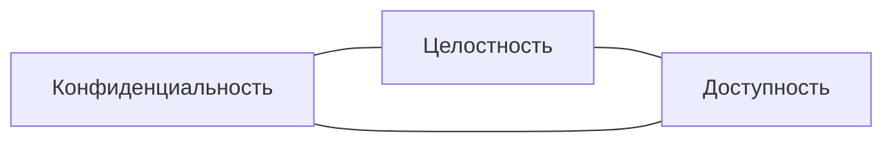
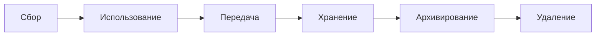
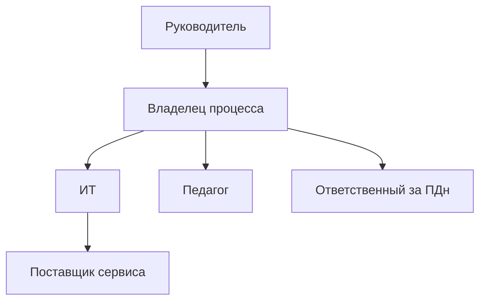

# Раздел 1. Управление информационной безопасностью и защита персональных данных в образовательной организации

## Цель мини-лекции

Понять, что именно защищает образовательная организация, какие данные и цифровые сервисы являются критичными, чем отличаются угроза, уязвимость и риск, а также как персональные данные, локальные правила и управление рисками связаны в единую систему.

---

## 1. Информационная безопасность образовательной организации

Информационная безопасность — это состояние защищённости информации и цифровых процессов. Для практической работы удобно использовать три свойства:

- **конфиденциальность** — данные доступны только тем, кому это разрешено;
- **целостность** — данные не изменяются без полномочий;
- **доступность** — информация и сервисы доступны тогда, когда они нужны.

Примеры:

- раскрытие списка обучающихся — нарушение конфиденциальности;
- изменение оценки — нарушение целостности;
- недоступность LMS во время аттестации — нарушение доступности.

---

## 2. Что является объектом защиты

Цифровая образовательная среда включает:

- LMS;
- электронный журнал;
- сайт;
- базы данных обучающихся и работников;
- почту;
- облачные хранилища;
- видеоконференции;
- локальную сеть и Wi-Fi;
- рабочие станции;
- учётные записи;
- резервные копии;
- интеграционные токены;
- журналы событий.

Важно: **актив — это не только оборудование**. Учётная запись администратора или резервная копия базы могут быть важнее отдельного компьютера.

---

## 3. Информационный актив

**Информационный актив** — ресурс, имеющий ценность для образовательного процесса или работы организации.

Для актива определяют:

- владельца;
- пользователей;
- тип данных;
- критичность;
- связанные процессы;
- меры защиты.

| Актив | Основной риск | Критичное свойство |
|---|---|---|
| Электронный журнал | изменение оценок | целостность |
| LMS | отказ сервиса | доступность |
| База контингента | утечка | конфиденциальность |
| Резервная копия | невозможность восстановления | целостность, доступность |

---

## 4. Персональные данные

Образовательная организация обрабатывает данные:

- обучающихся;
- родителей;
- педагогов;
- административных работников.

Примеры:

- ФИО;
- дата рождения;
- контакты;
- сведения об обучении;
- оценки;
- посещаемость;
- фотографии;
- сведения о работниках.

Особое внимание требуется данным несовершеннолетних.

---

## 5. Минимизация и обезличивание

**Минимизация** означает: использовать только те данные, которые нужны для конкретной цели.

Пример: если внешнему олимпиадному сервису нужны имя, класс и e-mail, нет оснований передавать ему домашний адрес и историю оценок.

**Обезличивание** — изменение данных так, чтобы без дополнительной информации нельзя было определить конкретного человека.

Но простая замена ФИО на код не всегда достаточна: человека иногда можно определить по совокупности признаков.

---

## 6. Жизненный цикл данных

Риски возникают на каждом этапе:

- избыточный сбор;
- неправильный адресат;
- лишние права;
- забытые архивы;
- несвоевременное удаление.

---

## 7. Угроза, уязвимость и риск

**Угроза** — потенциальная причина негативного события.

**Уязвимость** — слабое место, позволяющее угрозе реализоваться.

**Риск** — сочетание вероятности события и тяжести последствий.

Пример:

> фишинг → отсутствие MFA → компрометация учётной записи → LMS → доступ к работам обучающихся.

Упрощённо:

`R = P × I`

где `P` — вероятность, `I` — влияние.

---

## 8. Остаточный риск

После внедрения мер риск обычно не исчезает полностью.

Пример:

- до MFA: `P=4`, `I=4`, `R=16`;
- после MFA: `P=2`, `I=4`, `R=8`.

MFA уменьшила вероятность, но последствия успешной компрометации остались серьёзными.

---

## 9. Кто отвечает за ИБ

Информационная безопасность — не только задача системного администратора.

Участвуют:

- руководитель;
- владелец процесса;
- ответственный за персональные данные;
- системный администратор;
- педагог;
- пользователь;
- поставщик цифрового сервиса.

---

## 10. Локальные правила

Локальный документ должен задавать процедуру.

Плохо:

> Работники должны соблюдать информационную безопасность.

Лучше:

> При увольнении работника доступ к LMS, почте и облаку блокируется не позднее момента прекращения полномочий.

Полезны:

- политика обработки ПДн;
- правила управления доступом;
- порядок работы с внешними сервисами;
- резервное копирование;
- сообщение об инцидентах;
- правила использования ИИ.

---

## 11. Что должен понимать педагог

1. Рабочая учётная запись персональна.
2. Выгрузка из электронного журнала создаёт новую копию данных.
3. Публичная ссылка меняет режим доступа.
4. Внешний сервис получает переданные ему данные.
5. Нельзя собирать данные «на всякий случай».
6. Подозрительное событие необходимо сообщать.

---

## 12. Связь с практической работой № 1

В ПР1 студент:

- выбирает пять критичных активов;
- строит Mermaid-схему;
- формирует пять рисков;
- оценивает `P`, `I` и остаточный риск;
- предлагает меры;
- выполняет индивидуальный вариант.

Главная цепочка:

> **актив → угроза → уязвимость → риск → мера → остаточный риск.**

---

## Вопросы для самопроверки

1. Чем конфиденциальность отличается от целостности?
2. Почему учётная запись является активом?
3. Что означает минимизация данных?
4. Чем угроза отличается от уязвимости?
5. Что такое остаточный риск?
6. Почему ИБ не является только задачей ИТ-службы?
