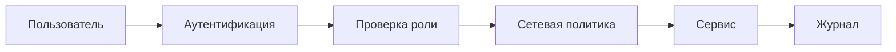
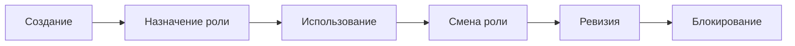
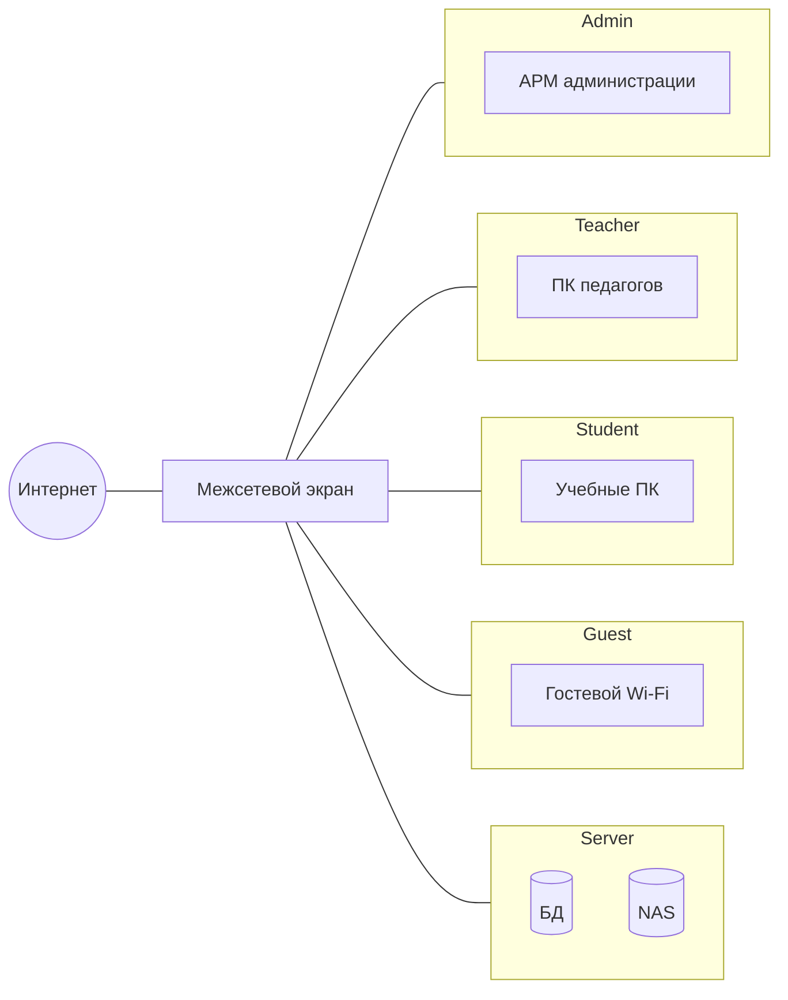
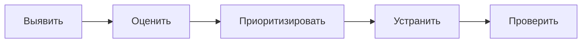
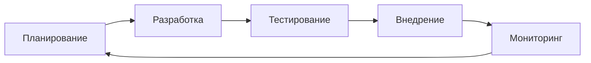

# Раздел 2. Защита цифровой инфраструктуры и образовательных информационных систем

## Цель мини-лекции

Понять, как проектируется защищённая инфраструктура образовательной организации: сегментация сети, управление доступом, MFA, RBAC, сервисные аккаунты, резервирование и безопасная эксплуатация.

---

## 1. Основные принципы

Защищённая архитектура строится на нескольких принципах:

- минимальные привилегии;
- разделение зон;
- недоверие по умолчанию;
- эшелонированная защита;
- журналирование;
- восстановимость.

---

## 2. Идентификация, аутентификация и авторизация

**Идентификация** — пользователь сообщает, кто он.

**Аутентификация** — система проверяет его личность.

**Авторизация** — система определяет, что ему разрешено.

Пример: педагог может изменять оценки только своих обучающихся, а обучающийся — видеть только свои результаты.

---

## 3. Многофакторная аутентификация

**MFA** использует два или более независимых факторов.

Например:

- пароль;
- одноразовый код.

MFA особенно важна для:

- администраторов;
- руководителей;
- педагогов с критичными правами;
- удалённого доступа.

Важно: MFA защищает вход, но не исправляет избыточные права.

---

## 4. Минимальные привилегии и RBAC

Пользователь или сервис получает только те права, которые нужны для задачи.

**RBAC** — ролевое управление доступом.

| Роль | LMS | Журнал | Облако | Backup |
|---|---|---|---|---|
| Обучающийся | RW* | R* | RW* | — |
| Педагог | RW | RW | RW | — |
| Методист | RW | R | RW | — |
| Руководитель | R | R | R | — |
| Администратор | A | A | A | A |

`*` — только собственные объекты или назначенные области.

---

## 5. Жизненный цикл учётной записи

Критичные события:

- зачисление;
- перевод;
- выпуск;
- приём на работу;
- смена должности;
- увольнение.

Типичный риск: работник уволен, но доступ к облаку остался активным.

---

## 6. Почему плоская сеть опасна

В плоской сети административные ПК, педагогические компьютеры, ученические устройства и серверы находятся в одном логическом контуре.

Компрометация одного устройства увеличивает возможность обращения к другим узлам.

Поэтому сеть разделяют на зоны.

---

## 7. Сегментация

Минимальные сегменты:

- административный;
- педагогический;
- ученический;
- гостевой;
- серверный;
- DMZ для публичных сервисов.

---

## 8. Межсегментные правила

Каждое соединение должно иметь понятную цель.

| Источник | Назначение | Решение |
|---|---|---|
| Guest | Internet | разрешить |
| Guest | Server | запретить |
| Student | LMS | разрешить |
| Student | Admin | запретить |
| Teacher | File Server | разрешить |
| Admin | DB | разрешить |

Правило: **если взаимодействие не требуется для учебного или административного процесса, его не следует разрешать автоматически**.

---

## 9. Zero Trust

Принцип Zero Trust:

> **Never trust, always verify.**

Устройство внутри сети не считается доверенным автоматически. Проверяются пользователь, устройство, роль и контекст.

Это архитектурный подход, а не отдельная программа.

---

## 10. Рабочие станции и мобильные устройства

Базовые меры:

- обновления;
- ограниченные права;
- блокировка экрана;
- шифрование;
- безопасный браузер;
- контроль локального хранения;
- защита рабочих данных.

Личное устройство педагога не должно автоматически получать прямой доступ к серверной зоне.

---

## 11. Уязвимости и обновления

Риск создают:

- устаревшие версии;
- ошибочная конфигурация;
- ненужные службы;
- тестовые аккаунты;
- открытые административные интерфейсы.

---

## 12. Секреты и сертификаты

К секретам относятся:

- пароли сервисных аккаунтов;
- API-токены;
- приватные ключи;
- ключи облачных сервисов.

Нельзя хранить их:

- в открытом репозитории;
- в учебных примерах;
- в обычной переписке;
- бессрочно без ротации.

Цифровые сертификаты используются для подтверждения подлинности и защищённого соединения.

---

## 13. Шифрование

Шифрование применяется для:

- каналов связи;
- ноутбуков;
- резервных копий;
- внешних носителей.

Но шифрование не заменяет авторизацию. Пользователь с избыточными правами всё равно получит доступ к расшифрованным данным.

---

## 14. Резервное копирование

Наличие backup-файла ещё не означает возможность восстановления.

Нужно обеспечить:

- регулярное копирование;
- контроль успешности;
- ограничение доступа;
- несколько копий;
- контрольное восстановление.

---

## 15. RPO и RTO

**RPO** — допустимый объём потери данных во времени.

**RTO** — допустимое время восстановления сервиса.

| Сервис | Пример RPO | Пример RTO |
|---|---:|---:|
| LMS | 4 часа | 4 часа |
| Электронный журнал | 1 час | 4 часа |
| Сайт | 24 часа | 24 часа |

Значения зависят от роли сервиса в образовательном процессе.

---

## 16. Облачные сервисы и подрядчики

Передача сервиса внешнему поставщику не означает передачу ему всей ответственности.

Нужно понимать:

- какие данные передаются;
- кто имеет доступ;
- как выполняется резервирование;
- как прекращается доступ;
- как удаляются данные;
- как сообщается об инциденте.

---

## 17. DevSecOps

Безопасность должна учитываться на всём жизненном цикле цифрового ресурса.

---

## 18. Связь с практической работой № 2

В ПР2 студент:

- выявляет риски плоской сети;
- строит сегментированную архитектуру;
- задаёт сетевые правила;
- проектирует RBAC;
- анализирует сервисные аккаунты;
- определяет RPO/RTO;
- выполняет контрольное восстановление;
- выполняет индивидуальный вариант.

Главная идея:

> **сегментация + минимальные привилегии + управляемый доступ + восстановимость.**

---

## Вопросы для самопроверки

1. Чем аутентификация отличается от авторизации?
2. Почему MFA не заменяет RBAC?
3. Что означает минимальная привилегия?
4. Почему плоская сеть опасна?
5. Для чего нужен гостевой сегмент?
6. Что такое сервисный аккаунт?
7. Чем RPO отличается от RTO?
8. Почему backup нужно проверять восстановлением?
