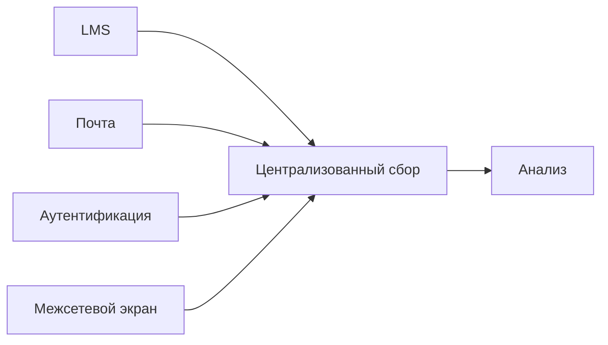
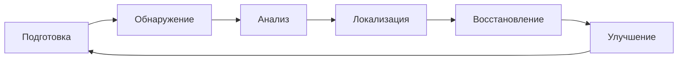

# Раздел 3. Мониторинг, реагирование на инциденты и обеспечение устойчивости образовательного процесса

## Цель мини-лекции

Понять, как образовательная организация обнаруживает и анализирует инциденты, строит временную линию событий, локализует последствия, восстанавливает сервисы и сохраняет непрерывность образовательного процесса.

---

## 1. Событие, инцидент и кризис

**Событие** — зарегистрированное действие или изменение состояния.

Примеры:

- успешный вход;
- изменение оценки;
- создание токена;
- скачивание файла.

**Инцидент** — событие или совокупность событий, которые нарушают или могут нарушить информационную безопасность.

**Кризис** — инцидент, последствия которого существенно влияют на деятельность организации.

Пример кризиса: длительная недоступность ключевых сервисов во время итоговой аттестации.

---

## 2. Типичные инциденты в образовательной среде

Наиболее характерны:

- компрометация учётной записи;
- фишинг;
- вредоносное ПО;
- шифрование файлов;
- утечка персональных данных;
- изменение оценок;
- недоступность LMS;
- потеря оборудования;
- ошибочная публикация;
- неотозванный доступ;
- компрометация облачного аккаунта.

Инцидент не обязательно начинается с внешней атаки. Причиной может быть ошибка пользователя или администратора.

---

## 3. Социальная инженерия

Социальная инженерия использует человека как канал воздействия.

Примеры сообщений:

- «Срочно подтвердите пароль»;
- «Ваш аккаунт будет заблокирован»;
- «Откройте ведомость»;
- «Я директор, пришлите файл».

Цель — заставить человека:

- раскрыть пароль;
- перейти по ссылке;
- открыть вложение;
- передать данные;
- выполнить действие.

---

## 4. Зачем нужны журналы

Без журналов трудно установить:

- кто входил;
- когда;
- откуда;
- что изменял;
- что экспортировал;
- создавались ли новые токены.

Источники журналов:

- LMS;
- электронный журнал;
- почта;
- система аутентификации;
- межсетевой экран;
- сервер;
- VPN;
- облачный сервис.

---

## 5. Централизованный сбор событий

Цель — не накопить как можно больше логов, а получить возможность сопоставить события из разных систем.

---

## 6. Корреляция

Одно событие редко доказывает инцидент.

Например, вход с нового IP может быть легитимным.

Но последовательность:

1. подозрительное письмо;
2. переход по ссылке;
3. вход с нового IP;
4. экспорт данных;
5. изменение оценки;
6. создание токена

уже требует расследования.

---

## 7. Факт и гипотеза

Это ключевой принцип расследования.

### Факт

Подтверждается журналом.

> В 08:47 выполнен успешный вход с IP X.

### Гипотеза

Объясняет факты, но требует проверки.

> Учётная запись могла быть скомпрометирована после фишинга.

Нельзя выдавать гипотезу за установленный факт.

---

## 8. Дополнительная проверка

Если данных недостаточно, фиксируют, что нужно запросить дополнительно.

Например:

- журнал MFA;
- user-agent;
- VPN;
- DNS;
- proxy;
- список активных сессий;
- список токенов;
- подтверждение пользователя.

---

## 9. Временная линия

Timeline — последовательность значимых событий во времени.

| Время | Источник | Событие |
|---|---|---|
| 08:44 | Mail | переход по ссылке |
| 08:47 | Auth | внешний вход |
| 08:51 | LMS | экспорт |
| 08:54 | LMS | изменение оценки |
| 08:57 | LMS | создание токена |

Timeline помогает увидеть последовательность и определить границы инцидента.

---

## 10. Аномальная активность

Аномалией может быть:

- вход с нового адреса;
- массовый экспорт;
- создание токена;
- много неудачных входов;
- доступ к нетипичному ресурсу;
- административное действие в необычное время.

Важно: **аномалия не равна атаке**. Она является основанием для проверки.

---

## 11. Жизненный цикл реагирования

---

## 12. Локализация

Цель локализации — остановить развитие инцидента.

Типовые действия:

- завершить подозрительные сессии;
- отозвать токен;
- временно заблокировать аккаунт;
- ограничить экспорт;
- изолировать устройство;
- сохранить журналы.

Меры должны быть соразмерны. Отключать всю LMS без необходимости обычно неправильно.

---

## 13. Восстановление

Для скомпрометированной учётной записи обычно необходимо:

1. изменить учётные данные;
2. проверить MFA;
3. завершить старые сессии;
4. отозвать неизвестные токены;
5. проверить изменения;
6. восстановить корректные данные;
7. продолжить мониторинг.

---

## 14. Почему смены пароля недостаточно

Если уже существует:

- активная сессия;
- API-токен;
- другой механизм доступа,

смена пароля не всегда завершает этот доступ.

Поэтому нужно проверять все связанные механизмы аутентификации и авторизации.

---

## 15. Сохранение цифровых свидетельств

Во время анализа нельзя уничтожать полезные сведения.

Сохраняют:

- журналы;
- временные метки;
- идентификаторы событий;
- сведения об изменениях;
- конфигурации.

Это обеспечивает воспроизводимость расследования.

---

## 16. Коммуникация

### Техническому специалисту нужны:

- время;
- учётная запись;
- сервис;
- подтверждённые события;
- требуемые действия.

### Педагогу нужны:

- понятные действия;
- минимум технической терминологии;
- понятный канал сообщения;
- отсутствие обвинений.

---

## 17. Непрерывность образовательного процесса

Для критичных сервисов заранее предусматривают:

- резервный канал связи;
- альтернативный способ выдачи заданий;
- локальные копии материалов;
- резервный способ сдачи;
- порядок информирования.

Безопасность должна сохранять образовательный процесс, а не автоматически его останавливать.

---

## 18. Анализ причин

После восстановления нужно выяснить, почему инцидент стал возможен.

Причины могут быть:

- отсутствие MFA;
- избыточные права;
- слабый отзыв доступа;
- отсутствие мониторинга;
- ошибочная настройка;
- недостаточное обучение.

Цель — улучшить систему, а не только устранить единичный симптом.

---

## 19. Культура без обвинения

Если пользователь боится наказания, он может скрыть ошибку или подозрительное событие.

Это увеличивает последствия.

Правильный принцип:

> **раннее сообщение об ошибке или подозрении является ожидаемым безопасным поведением.**

---

## 20. Связь с практической работой № 3

В ПР3 студент:

- коррелирует три источника;
- строит timeline;
- отделяет факты от гипотез;
- определяет масштаб;
- предлагает локализацию;
- формулирует критерии восстановления;
- готовит сообщение педагогам;
- выполняет индивидуальный вариант.

Главная идея:

> **не угадывать причину, а строить доказательную цепочку.**

---

## Вопросы для самопроверки

1. Чем событие отличается от инцидента?
2. Почему один необычный вход не доказывает компрометацию?
3. Что такое корреляция?
4. Чем факт отличается от гипотезы?
5. Для чего нужен timeline?
6. Чем локализация отличается от восстановления?
7. Почему смены пароля может быть недостаточно?
8. Почему раннее сообщение пользователя полезно для ИБ?
