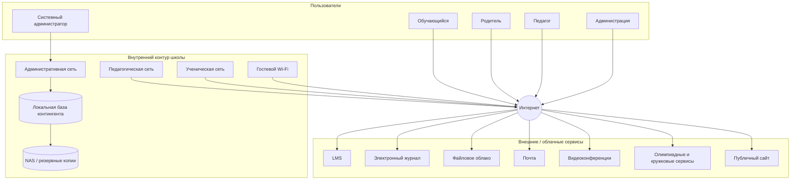

# Исходный кейс
## «Школа цифровых практик»

> Организация, названия систем, учётные записи и данные являются вымышленными.

## 1. Общая характеристика

| Показатель | Значение |
|---|---:|
| Обучающиеся | 850 |
| Педагогические работники | 62 |
| Административные и технические работники | 18 |
| Компьютерных классов | 2 |
| Основных цифровых сервисов | 8+ |

Учебный процесс сочетает очные занятия, электронные материалы, домашние задания в LMS, электронный журнал и отдельные дистанционные занятия.

## 2. Роли

- директор;
- заместитель директора;
- секретарь;
- специалист по кадрам;
- системный администратор;
- педагог;
- классный руководитель;
- обучающийся;
- родитель/законный представитель;
- внешний технический подрядчик;
- поставщик облачного сервиса.

## 3. Системы

### LMS

Используется для учебных материалов, заданий, загрузки работ, тестирования, комментариев и отчётов по активности. Доступна из Интернета. MFA включена для администраторов, но не является обязательной для педагогов.

### Электронный журнал

Облачный сервис внешнего поставщика. Содержит оценки, посещаемость, расписание и данные контингента. Педагоги могут экспортировать отдельные отчёты в XLSX.

### Публичный сайт

Размещается у внешнего хостинг-провайдера. Публикуются новости, документы, фотографии, сведения о педагогах и формы обратной связи. Публикацию выполняют два сотрудника с ролью редактора.

### Файловое облако

Используется педагогами и администрацией. Есть персональные и групповые папки, а также возможность создавать внешние ссылки. Формального процесса периодической проверки старых общедоступных ссылок нет.

### Корпоративная почта

Используется для служебной переписки. Часть педагогов получает уведомления сервисов на личные мобильные устройства.

### Видеоконференции

Используются для родительских собраний, консультаций и дистанционных занятий. В отдельных случаях ссылки пересылаются через классные чаты.

### Локальная база контингента

Расположена на сервере внутри организации. Содержит идентификатор, ФИО, класс, статус обучения и данные для внутренних списков и интеграций. Доступ имеют ограниченные административные роли.

### Сетевые зоны

- административная сеть;
- педагогическая сеть;
- ученическая сеть компьютерных классов;
- гостевой Wi-Fi.

Гостевая сеть отделена от серверного сегмента, однако правила межсетевого взаимодействия документированы не полностью.

## 4. Резервное копирование

Локальная база копируется каждую ночь на NAS.

- журнал выполнения резервного задания хранится;
- последняя документированная проверка полного восстановления проводилась около восьми месяцев назад;
- часть конфигураций сетевого оборудования сохраняется вручную;
- резервные копии облачных сервисов зависят от возможностей поставщика.

## 5. Управление учётными записями

При зачислении и приёме на работу учётные записи создаются по заявке. Изменение прав при переводе выполняется вручную. При увольнении учётная запись должна блокироваться в день прекращения доступа, но централизованного автоматического контроля выполнения нет.

## 6. Внешние сервисы

Для олимпиад, кружков и проектов периодически используются внешние платформы. Возможны самостоятельная регистрация, загрузка списка участников педагогом, приглашение по почте и интеграции через ссылку/токен. Единого каталога одобренных внешних сервисов пока нет.

## 7. Наблюдаемые особенности

1. некоторые педагоги выгружают отчёты из журнала в XLSX;
2. часть файлов в облаке передаётся по ссылке;
3. MFA обязательна не для всех ролей;
4. процесс отзыва доступа выполняется вручную;
5. проверка восстановления резервной копии проводится нерегулярно;
6. внешние сервисы используются неодинаково разными педагогами;
7. материалы для сайта сначала готовятся в общей папке;
8. журналы входа в LMS доступны администратору;
9. централизованный перечень всех интеграционных токенов отсутствует;
10. по окончании учебного года создаются архивные выгрузки отдельных отчётов.

Эти факты не являются готовым перечнем уязвимостей. Их требуется интерпретировать в контексте актива и сценария.

## 8. Стартовая архитектура

## 9. Что намеренно отсутствует

В исходном перечне активов и потоков намеренно нет части объектов: учётных записей, локальных выгрузок, резервных данных, интеграционных секретов, административных потоков и взаимодействий с подрядчиками. Их выявление — часть задания.
