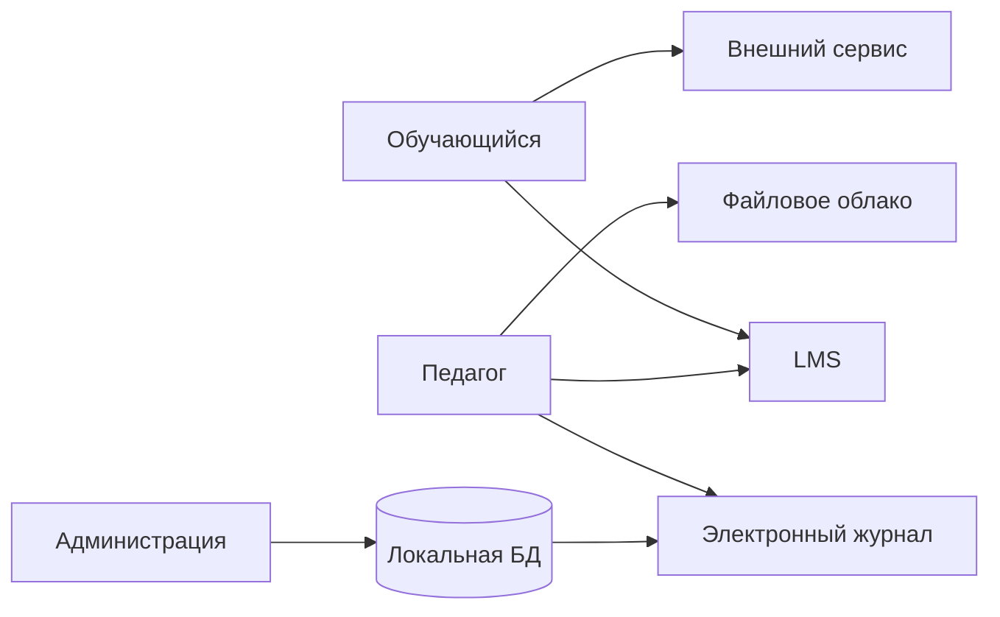
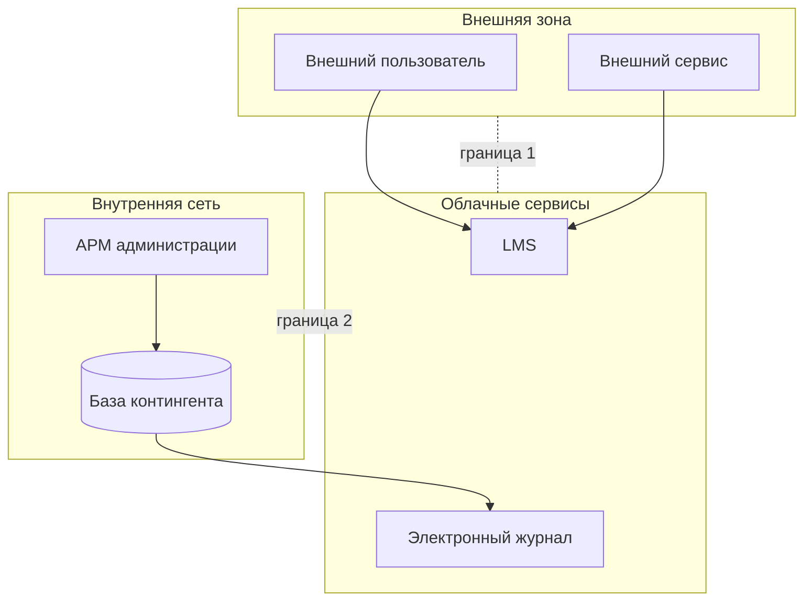
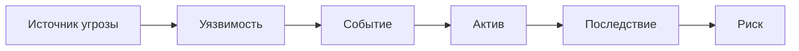
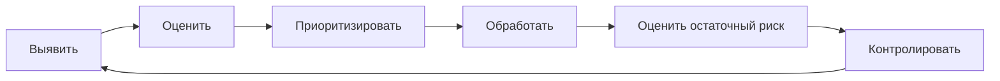
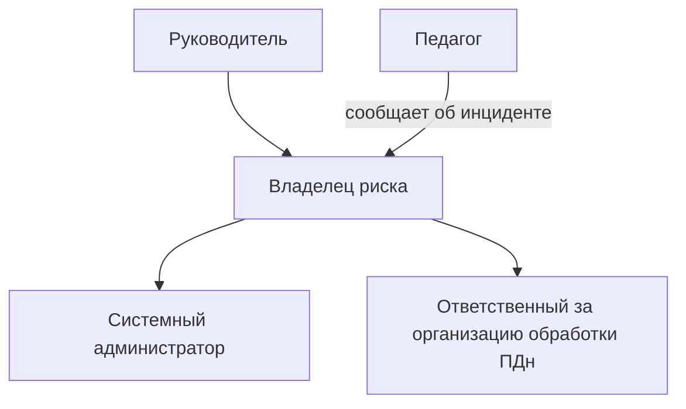
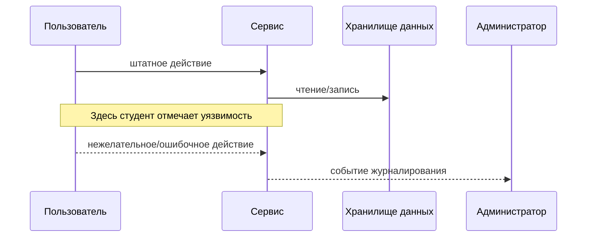

# Mermaid-шаблоны для ПР1

Все итоговые рисунки в отчёте должны храниться как Mermaid-код.

## 1. Контекстная схема

## 2. Доверительные границы

## 3. Цепочка сценария угрозы

## 4. Жизненный цикл обработки риска

## 5. Роли

## 6. Шаблон диаграммы конкретного риска

