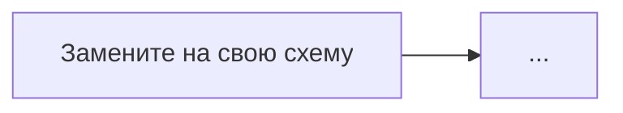

# Отчёт по практической работе № 1
## «Моделирование угроз цифровой образовательной среды»

**ФИО:**  
**Группа:**  
**Вариант:**  
**Дата:**

## 1. Цель работы

...

## 2. Краткое описание кейса

...

## 3. Инвентаризация активов

Ссылка на `assets_completed.csv`.

### 3.1. Пять критичных активов

1. ...
2. ...
3. ...
4. ...
5. ...

## 4. Потоки данных

### Дополнительно выявленные потоки

| Поток | Источник | Получатель | Данные | Обоснование |
|---|---|---|---|---|
| | | | | |

## 5. Модель источников угроз

| Источник | Доступ | Причина/мотивация | Возможные действия |
|---|---|---|---|
| | | | |

## 6. Сценарии угроз

См. `threat_scenarios.csv`.

## 7. Реестр рисков

См. `risk_register.csv`.

### Обоснование пяти приоритетных рисков

#### R-...
**P = ...; I = ...; R = ...**

Обоснование вероятности: ...  
Обоснование влияния: ...

## 8. Меры защиты и остаточный риск

| Риск | Мера 1 | Тип | Мера 2 | Тип | Остаточный риск |
|---|---|---|---|---|---:|
| | | | | | |

## 9. Индивидуальный вариант

### Задание 1
...

### Задание 2
...

### Задание 3
...

## 10. Фрагмент локальной политики

...

## 11. Памятка педагогу

| № | Действие | Какой риск снижает | Пример |
|---:|---|---|---|
| 1 | | | |
| 2 | | | |
| 3 | | | |
| 4 | | | |
| 5 | | | |

## 12. Вывод

Укажите три наиболее значимых риска именно для образовательного процесса и объясните приоритетность.
