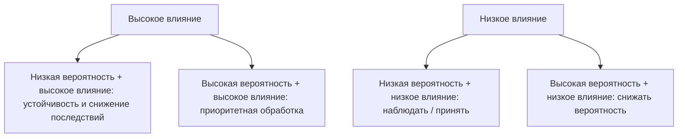

# Шкалы оценки риска

## Вероятность P

| P | Уровень | Ориентир |
|---:|---|---|
| 1 | очень низкая | нужны редкие/специальные условия |
| 2 | низкая | возможна, но предпосылки возникают редко |
| 3 | средняя | реалистична в обычной эксплуатации |
| 4 | высокая | предпосылки присутствуют регулярно |
| 5 | очень высокая | сценарий повторяем/почти неизбежен без изменений |

## Влияние I

| I | Уровень | Ориентир для образования |
|---:|---|---|
| 1 | незначительное | локальное неудобство |
| 2 | малое | затронута небольшая группа, быстрое восстановление |
| 3 | существенное | требуется вмешательство администрации |
| 4 | серьёзное | значимый простой, утечка, искажение результатов |
| 5 | критическое | массовое раскрытие, срыв аттестации/занятий, длительная недоступность |

## Приоритизация

**R = P × I**

| R | Категория |
|---:|---|
| 1–4 | низкий |
| 5–9 | умеренный |
| 10–16 | высокий |
| 17–25 | критический |

**Rостат = Pпосле × Iпосле**. Каждое снижение P или I должно быть обосновано конкретной мерой.
