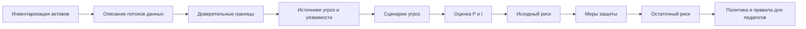
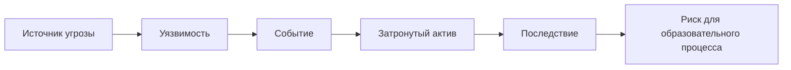
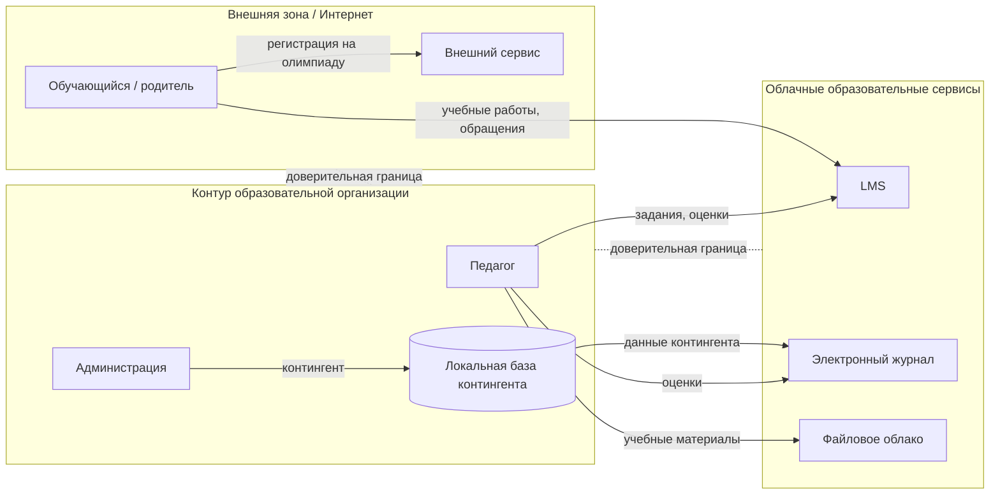
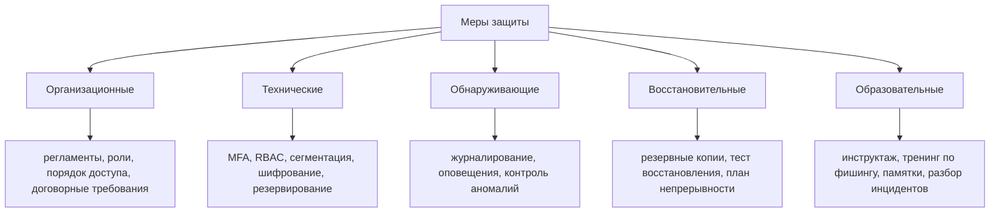

# Практическая работа № 1
## Моделирование угроз цифровой образовательной среды

**Дисциплина:** «Информационная безопасность в образовательных учреждениях»  
**Формат:** индивидуальная практическая работа со сквозным кейсом  
**Рекомендуемая продолжительность контактной работы:** 4 академических часа  
**Итоговые схемы:** Mermaid, совместимые с GitHub/GitLab

---

## 1. Цель работы

Научиться выделять информационные активы образовательной организации, описывать потоки персональных и учебных данных, формировать сценарии угроз и реестр рисков, выбирать организационные и технические меры защиты и переводить результаты анализа в понятные правила для педагогических работников.

## 2. Планируемые результаты

После выполнения работы студент должен уметь:

1. проводить инвентаризацию информационных активов;
2. различать актив, угрозу, уязвимость, событие, последствие и риск;
3. описывать основные потоки персональных и учебных данных;
4. строить упрощённую диаграмму потоков данных и выделять доверительные границы;
5. определять категории пользователей, источники угроз и возможных нарушителей;
6. формулировать сценарии угроз в причинно-следственной форме;
7. оценивать вероятность и влияние риска по пятибалльной шкале;
8. определять исходный и остаточный риск;
9. выбирать меры защиты, связанные с причиной конкретного риска;
10. формировать фрагмент локальной политики;
11. адаптировать требования информационной безопасности для педагогических работников.

## 3. Ключевые понятия

| Понятие | Рабочее определение |
|---|---|
| **Актив** | Данные, информационная система, учётная запись, сервис, устройство, инфраструктурный компонент или иной ресурс, значимый для образовательного процесса |
| **Информационная система** | Совокупность данных, программных и технических средств, используемых для их обработки |
| **Угроза** | Потенциальная причина события, способного нанести ущерб активу или образовательному процессу |
| **Уязвимость** | Слабое место в технологии, настройке, процессе или поведении пользователя, которое может быть использовано источником угрозы |
| **Событие** | Фактически произошедшее действие или изменение состояния системы |
| **Последствие** | Негативный результат реализации угрозы |
| **Риск** | Сочетание вероятности реализации сценария и тяжести его последствий |
| **Мера защиты** | Организационное, техническое, обнаруживающее, восстановительное или образовательное действие, уменьшающее вероятность и/или влияние риска |
| **Остаточный риск** | Риск, который остаётся после внедрения выбранных мер |
| **Владелец риска** | Роль или должностное лицо, ответственное за принятие решения о способе обработки риска и контроль выполнения мер |
| **Доверительная граница** | Граница между зонами или компонентами, для которых различаются уровень доверия, правила доступа или ответственность |

## 4. Сквозной кейс

Используется вымышленная образовательная организация **«Школа цифровых практик»**:

- 850 обучающихся;
- 62 педагогических работника;
- 18 административных и технических работников;
- LMS;
- электронный журнал;
- публичный сайт;
- файловое облако;
- корпоративная электронная почта;
- сервис видеоконференций;
- локальная база контингента;
- административная, педагогическая и ученическая сети;
- гостевой Wi-Fi;
- внешние сервисы олимпиад, кружков и проектной деятельности.

Подробности: [`case_description.md`](case_description.md).

> Все данные синтетические. Использование реальных персональных данных обучающихся, родителей или работников не допускается.

## 5. Общая логика моделирования



Для каждого существенного риска покажите причинно-следственную связь:



# 6. Порядок выполнения

## Этап 1. Инвентаризация активов

1. Изучите `case_description.md` и `assets_initial.csv`.
2. Добавьте **не менее пяти активов**, отсутствующих в исходном перечне.
3. Ищите не только оборудование, но и:
   - резервные копии;
   - учётные записи и роли;
   - облачные папки;
   - интеграционные токены/API-ключи;
   - локальные выгрузки и экспортированные файлы;
   - устройства педагогов;
   - журналы событий;
   - конфигурации сетевого оборудования.
4. Для каждого актива укажите тип, местоположение, владельца процесса, пользователей, категорию данных, критичность по C/I/A и существующие меры.
5. Выделите минимум **пять критичных активов** и обоснуйте выбор.

### Шкала C/I/A

- **1** — несущественное влияние;
- **2** — малое;
- **3** — заметное;
- **4** — серьёзное;
- **5** — критическое.

Учитывайте влияние на права субъектов персональных данных, объективность результатов обучения, проведение уроков и аттестации, работу педагогов и администрации, доверие родителей и возможность продолжать образовательный процесс.

## Этап 2. Потоки данных

1. Проанализируйте `data_flows.csv`.
2. Добавьте минимум **три логичных потока**, отсутствующих в исходном файле.
3. Постройте собственную DFD-схему в Mermaid.
4. На схеме обязательно покажите:
   - обучающегося/родителя;
   - педагога;
   - администрацию;
   - LMS;
   - электронный журнал;
   - локальную базу;
   - файловое облако;
   - внешний сервис;
   - Интернет;
   - минимум две доверительные границы.

### Стартовый каркас



Стартовый каркас необходимо изменить и дополнить.

## Этап 3. Модель источников угроз

Минимально рассмотрите:

1. внешнего злоумышленника;
2. обучающегося с обычной учётной записью;
3. педагога;
4. администратора информационной системы;
5. бывшего работника;
6. подрядчика/поставщика цифрового сервиса;
7. случайную ошибку пользователя;
8. технический отказ;
9. вредоносное ПО;
10. ошибочную конфигурацию или автоматизированный процесс.

| Источник | Возможность доступа | Мотивация/причина | Типичные действия | Ограничения |
|---|---|---|---|---|
| Внешний злоумышленник | Интернет | получение доступа/данных | фишинг, попытки входа | нет штатной учётной записи |
| Обучающийся | LMS, учебная сеть | интерес, обход ограничений | попытка доступа к чужим данным | обычная роль |
| Педагог | LMS, журнал, облако | ошибка или превышение полномочий | публикация, выгрузка | доступ ограничен ролью |
| Администратор | расширенный | ошибка/злоупотребление | изменение настроек | действия должны журналироваться |

## Этап 4. Сценарии угроз

Сформулируйте **не менее 12 сценариев** по шаблону:

> **источник угрозы → используемая уязвимость → событие → затронутый актив → последствие**.

Обязательно включите сценарии, связанные с:

- компрометацией учётной записи;
- ошибочной публикацией данных;
- неотозванным доступом;
- недоступностью LMS;
- внешним облачным сервисом;
- резервными копиями;
- ошибкой пользователя;
- ошибкой администратора.

Используйте `threat_scenarios_template.csv`.

## Этап 5. Реестр рисков

Для каждого сценария создайте запись в `risk_register_template.csv`.

**Исходный риск:** `R = P × I`  
**Остаточный риск:** `Rостат = Pпосле × Iпосле`

| Балл | Уровень | Типовое решение |
|---:|---|---|
| 1–4 | низкий | принять/наблюдать |
| 5–9 | умеренный | запланировать улучшения |
| 10–16 | высокий | обязательные меры и срок |
| 17–25 | критический | приоритетная обработка, управленческое решение |

Для пяти приоритетных рисков напишите отдельное текстовое обоснование P и I.

## Этап 6. Выбор мер защиты

Для каждого из пяти приоритетных рисков предложите минимум **две меры разных типов**.



Мера должна быть связана с причиной риска. Ответ «установить антивирус» для всех сценариев не принимается.

## Этап 7. Остаточный риск

Для каждого риска укажите P и I до мер, меры, P и I после мер, остаточный риск и владельца риска.

В большинстве случаев техническая мера уменьшает **вероятность**, а не автоматически влияние. Снижение влияния требуется обосновать, например резервированием, минимизацией данных или планом непрерывности.

## Этап 8. Фрагмент политики

По `policy_fragment_template.md` подготовьте **1–2 страницы** локального документа.

Минимальные разделы:

1. область применения;
2. роли;
3. допустимые цифровые сервисы;
4. работа с персональными данными;
5. управление доступом;
6. внешняя передача и публикация;
7. сообщение об инциденте;
8. ответственность за актуализацию правил.

## Этап 9. Педагогический результат

Создайте одностраничную памятку **«5 правил безопасной работы с цифровыми образовательными сервисами для педагога»**.

Каждое правило должно содержать:

- конкретное действие;
- какой риск оно снижает;
- пример правильного поведения.

## Этап 10. Индивидуальный вариант

Все студенты выполняют общую часть полностью. Дополнительно выполните **три задания своего варианта** из [`variants_25.md`](variants_25.md).

# 7. Что должно быть в отчёте

1. Титульный лист.
2. Цель и исходный кейс.
3. Таблица активов.
4. Обоснование пяти критичных активов.
5. Mermaid-диаграмма потоков данных.
6. Модель источников угроз.
7. Таблица не менее 12 сценариев угроз.
8. Реестр рисков.
9. Обоснование пяти приоритетных рисков.
10. Перечень мер и оценка остаточного риска.
11. Выполнение трёх заданий индивидуального варианта.
12. Фрагмент политики.
13. Памятка педагогу.
14. Вывод: какие три риска наиболее значимы именно для образовательного процесса и почему.

# 8. Структура репозитория студента

```text
practice_01/
├── report.md
├── assets_completed.csv
├── data_flows_completed.csv
├── threat_scenarios.csv
├── risk_register.csv
├── policy_fragment.md
└── README.md
```

Все диаграммы должны быть представлены исходным Mermaid-кодом.

# 9. Критерии оценивания

| Критерий | Баллы |
|---|---:|
| Инвентаризация и классификация активов | 15 |
| Потоки данных и доверительные границы | 10 |
| Корректность сценариев угроз | 20 |
| Реестр и обоснование рисков | 20 |
| Связь мер с рисками и остаточный риск | 15 |
| Фрагмент локальной политики | 10 |
| Педагогическая памятка | 5 |
| Оформление, выводы, воспроизводимость | 5 |
| **Итого** | **100** |

## Детализация рубрики

### Инвентаризация — 15
- 5 — список дополнен минимум пятью осмысленными активами;
- 4 — C/I/A заданы осмысленно;
- 3 — владельцы, пользователи и категории данных определены;
- 3 — пять критичных активов обоснованы.

### Потоки — 10
- 4 — основные потоки отражены;
- 2 — добавлено минимум три логичных потока;
- 2 — показаны внешние сервисы;
- 2 — показаны доверительные границы.

### Сценарии — 20
- 6 — не менее 12 содержательных сценариев;
- 6 — выдержана причинная цепочка;
- 4 — присутствуют обязательные классы;
- 4 — сценарии не являются переименованными дублями.

### Реестр рисков — 20
- 6 — корректные P/I/R;
- 5 — оценки аргументированы;
- 4 — выделены приоритеты;
- 3 — назначены владельцы;
- 2 — реестр согласуется со сценариями.

### Меры и остаточный риск — 15
- 6 — меры связаны с причиной риска;
- 4 — использованы разные типы мер;
- 3 — остаточный риск пересчитан;
- 2 — снижение P/I объяснено.

### Политика — 10
- 3 — полная требуемая структура;
- 3 — правила конкретны и проверяемы;
- 2 — учтены внешние сервисы и персональные данные;
- 2 — определены роли и актуализация.

### Памятка — 5
- 2 — пять конкретных действий;
- 2 — понятность для педагога;
- 1 — связь правил с рисками.

### Оформление — 5
- 2 — логичная структура;
- 1 — Mermaid корректно отображается;
- 1 — CSV-файлы согласованы с отчётом;
- 1 — вывод отвечает на вопрос о влиянии на образовательный процесс.

# 10. Типичные ошибки

1. Активом называется только оборудование.
2. «Персональные данные» записываются как угроза.
3. Уязвимость описывается как событие: «утечка данных».
4. Все риски получают P=5 и I=5 без обоснования.
5. Меры не связаны с причиной риска.
6. Для любого риска предлагается только антивирус.
7. Не учитываются ошибки педагогов и администраторов.
8. Не учитываются внешние облачные сервисы.
9. Резервная копия считается достаточной без проверки восстановления.
10. Остаточный риск уменьшается без объяснения изменения P/I.
11. Владелец риска обозначается как «IT», а не конкретная роль.
12. Памятка написана языком системного администратора, а не педагога.

# 11. Контрольные вопросы

1. Чем актив отличается от информационной системы?
2. Чем угроза отличается от уязвимости?
3. Почему персональные данные не являются угрозой сами по себе?
4. Чем событие отличается от последствия?
5. Почему риск нельзя оценивать только размером технического ущерба?
6. Почему оценка риска должна сопровождаться обоснованием?
7. Что означает риск 15 баллов по принятой шкале?
8. Что такое остаточный риск?
9. Может ли остаточный риск быть равен исходному?
10. Почему MFA в первую очередь снижает вероятность, а не влияние?
11. Как минимизация данных уменьшает риск?
12. Почему резервирование может уменьшать влияние?
13. Чем владелец актива отличается от владельца риска?
14. Зачем назначать владельца риска?
15. Почему внешний облачный сервис создаёт отдельную доверительную границу?
16. Может ли педагог выступать источником угрозы без злого умысла?
17. Почему неотозванная учётная запись является уязвимостью процесса управления доступом?
18. Какие образовательные последствия имеет нарушение целостности электронного журнала?
19. Какие риски создаёт публичная ссылка на облачный файл?
20. Почему доступность LMS особенно критична во время аттестации?
21. Что необходимо проверить кроме факта создания резервной копии?
22. Для чего журналировать действия администраторов?
23. В каких случаях образовательная мера эффективнее технической?
24. Почему нельзя полностью передать ответственность за риск подрядчику?
25. Как объяснить минимизацию данных педагогическому работнику без технической терминологии?

# 12. Минимальные источники

1. Федеральный закон от 27.07.2006 № 152-ФЗ «О персональных данных».
2. Федеральный закон от 27.07.2006 № 149-ФЗ «Об информации, информационных технологиях и о защите информации».
3. Федеральный закон от 29.12.2012 № 273-ФЗ «Об образовании в Российской Федерации».
4. NIST Cybersecurity Framework (CSF) 2.0 — https://www.nist.gov/cyberframework
5. OWASP — https://owasp.org/

При выполнении работы используйте актуальные редакции нормативных документов.
