# ОСНОВНАЯ МЕТОДИЧКА

# Практическая работа № 1
## Моделирование угроз цифровой образовательной среды

**Дисциплина:** «Информационная безопасность в образовательных учреждениях»  
**Формат:** индивидуальная практическая работа со сквозным кейсом  
**Рекомендуемая продолжительность контактной работы:** 4 академических часа  
**Итоговые схемы:** Mermaid, совместимые с GitHub/GitLab

---

## 1. Цель работы

Научиться выделять информационные активы образовательной организации, описывать потоки персональных и учебных данных, формировать сценарии угроз и реестр рисков, выбирать организационные и технические меры защиты и переводить результаты анализа в понятные правила для педагогических работников.

## 2. Планируемые результаты

После выполнения работы студент должен уметь:

1. проводить инвентаризацию информационных активов;
2. различать актив, угрозу, уязвимость, событие, последствие и риск;
3. описывать основные потоки персональных и учебных данных;
4. строить упрощённую диаграмму потоков данных и выделять доверительные границы;
5. определять категории пользователей, источники угроз и возможных нарушителей;
6. формулировать сценарии угроз в причинно-следственной форме;
7. оценивать вероятность и влияние риска по пятибалльной шкале;
8. определять исходный и остаточный риск;
9. выбирать меры защиты, связанные с причиной конкретного риска;
10. формировать фрагмент локальной политики;
11. адаптировать требования информационной безопасности для педагогических работников.

## 3. Ключевые понятия

| Понятие | Рабочее определение |
|---|---|
| **Актив** | Данные, информационная система, учётная запись, сервис, устройство, инфраструктурный компонент или иной ресурс, значимый для образовательного процесса |
| **Информационная система** | Совокупность данных, программных и технических средств, используемых для их обработки |
| **Угроза** | Потенциальная причина события, способного нанести ущерб активу или образовательному процессу |
| **Уязвимость** | Слабое место в технологии, настройке, процессе или поведении пользователя, которое может быть использовано источником угрозы |
| **Событие** | Фактически произошедшее действие или изменение состояния системы |
| **Последствие** | Негативный результат реализации угрозы |
| **Риск** | Сочетание вероятности реализации сценария и тяжести его последствий |
| **Мера защиты** | Организационное, техническое, обнаруживающее, восстановительное или образовательное действие, уменьшающее вероятность и/или влияние риска |
| **Остаточный риск** | Риск, который остаётся после внедрения выбранных мер |
| **Владелец риска** | Роль или должностное лицо, ответственное за принятие решения о способе обработки риска и контроль выполнения мер |
| **Доверительная граница** | Граница между зонами или компонентами, для которых различаются уровень доверия, правила доступа или ответственность |

## 4. Сквозной кейс

Используется вымышленная образовательная организация **«Школа цифровых практик»**:

- 850 обучающихся;
- 62 педагогических работника;
- 18 административных и технических работников;
- LMS;
- электронный журнал;
- публичный сайт;
- файловое облако;
- корпоративная электронная почта;
- сервис видеоконференций;
- локальная база контингента;
- административная, педагогическая и ученическая сети;
- гостевой Wi-Fi;
- внешние сервисы олимпиад, кружков и проектной деятельности.

Подробности: [`case_description.md`](case_description.md).

> Все данные синтетические. Использование реальных персональных данных обучающихся, родителей или работников не допускается.

## 5. Общая логика моделирования

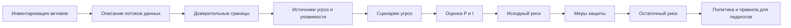

Для каждого существенного риска покажите причинно-следственную связь:

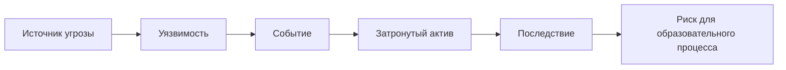

# 6. Порядок выполнения

## Этап 1. Инвентаризация активов

1. Изучите `case_description.md` и `assets_initial.csv`.
2. Добавьте **не менее пяти активов**, отсутствующих в исходном перечне.
3. Ищите не только оборудование, но и:
   - резервные копии;
   - учётные записи и роли;
   - облачные папки;
   - интеграционные токены/API-ключи;
   - локальные выгрузки и экспортированные файлы;
   - устройства педагогов;
   - журналы событий;
   - конфигурации сетевого оборудования.
4. Для каждого актива укажите тип, местоположение, владельца процесса, пользователей, категорию данных, критичность по C/I/A и существующие меры.
5. Выделите минимум **пять критичных активов** и обоснуйте выбор.

### Шкала C/I/A

- **1** — несущественное влияние;
- **2** — малое;
- **3** — заметное;
- **4** — серьёзное;
- **5** — критическое.

Учитывайте влияние на права субъектов персональных данных, объективность результатов обучения, проведение уроков и аттестации, работу педагогов и администрации, доверие родителей и возможность продолжать образовательный процесс.

## Этап 2. Потоки данных

1. Проанализируйте `data_flows.csv`.
2. Добавьте минимум **три логичных потока**, отсутствующих в исходном файле.
3. Постройте собственную DFD-схему в Mermaid.
4. На схеме обязательно покажите:
   - обучающегося/родителя;
   - педагога;
   - администрацию;
   - LMS;
   - электронный журнал;
   - локальную базу;
   - файловое облако;
   - внешний сервис;
   - Интернет;
   - минимум две доверительные границы.

### Стартовый каркас

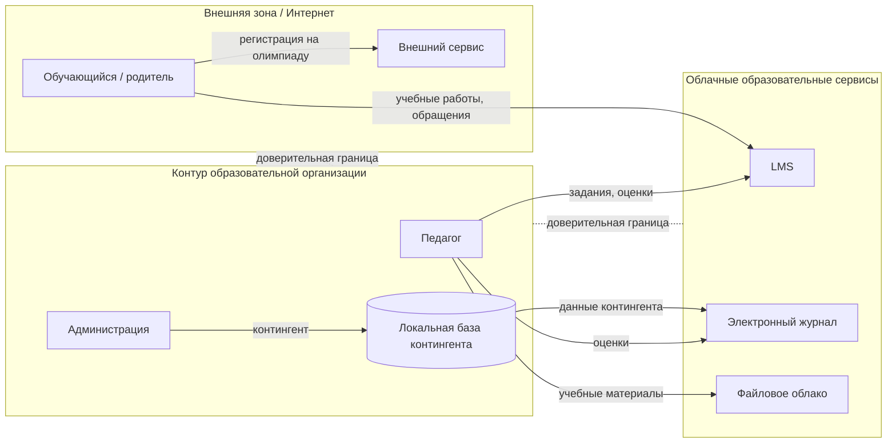

Стартовый каркас необходимо изменить и дополнить.

## Этап 3. Модель источников угроз

Минимально рассмотрите:

1. внешнего злоумышленника;
2. обучающегося с обычной учётной записью;
3. педагога;
4. администратора информационной системы;
5. бывшего работника;
6. подрядчика/поставщика цифрового сервиса;
7. случайную ошибку пользователя;
8. технический отказ;
9. вредоносное ПО;
10. ошибочную конфигурацию или автоматизированный процесс.

| Источник | Возможность доступа | Мотивация/причина | Типичные действия | Ограничения |
|---|---|---|---|---|
| Внешний злоумышленник | Интернет | получение доступа/данных | фишинг, попытки входа | нет штатной учётной записи |
| Обучающийся | LMS, учебная сеть | интерес, обход ограничений | попытка доступа к чужим данным | обычная роль |
| Педагог | LMS, журнал, облако | ошибка или превышение полномочий | публикация, выгрузка | доступ ограничен ролью |
| Администратор | расширенный | ошибка/злоупотребление | изменение настроек | действия должны журналироваться |

## Этап 4. Сценарии угроз

Сформулируйте **не менее 12 сценариев** по шаблону:

> **источник угрозы → используемая уязвимость → событие → затронутый актив → последствие**.

Обязательно включите сценарии, связанные с:

- компрометацией учётной записи;
- ошибочной публикацией данных;
- неотозванным доступом;
- недоступностью LMS;
- внешним облачным сервисом;
- резервными копиями;
- ошибкой пользователя;
- ошибкой администратора.

Используйте `threat_scenarios_template.csv`.

## Этап 5. Реестр рисков

Для каждого сценария создайте запись в `risk_register_template.csv`.

**Исходный риск:** `R = P × I`  
**Остаточный риск:** `Rостат = Pпосле × Iпосле`

| Балл | Уровень | Типовое решение |
|---:|---|---|
| 1–4 | низкий | принять/наблюдать |
| 5–9 | умеренный | запланировать улучшения |
| 10–16 | высокий | обязательные меры и срок |
| 17–25 | критический | приоритетная обработка, управленческое решение |

Для пяти приоритетных рисков напишите отдельное текстовое обоснование P и I.

## Этап 6. Выбор мер защиты

Для каждого из пяти приоритетных рисков предложите минимум **две меры разных типов**.

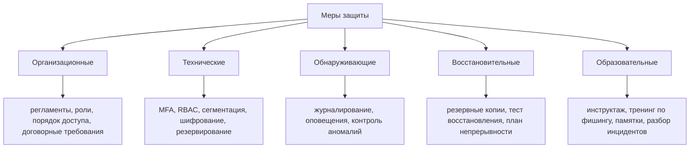

Мера должна быть связана с причиной риска. Ответ «установить антивирус» для всех сценариев не принимается.

## Этап 7. Остаточный риск

Для каждого риска укажите P и I до мер, меры, P и I после мер, остаточный риск и владельца риска.

В большинстве случаев техническая мера уменьшает **вероятность**, а не автоматически влияние. Снижение влияния требуется обосновать, например резервированием, минимизацией данных или планом непрерывности.

## Этап 8. Фрагмент политики

По `policy_fragment_template.md` подготовьте **1–2 страницы** локального документа.

Минимальные разделы:

1. область применения;
2. роли;
3. допустимые цифровые сервисы;
4. работа с персональными данными;
5. управление доступом;
6. внешняя передача и публикация;
7. сообщение об инциденте;
8. ответственность за актуализацию правил.

## Этап 9. Педагогический результат

Создайте одностраничную памятку **«5 правил безопасной работы с цифровыми образовательными сервисами для педагога»**.

Каждое правило должно содержать:

- конкретное действие;
- какой риск оно снижает;
- пример правильного поведения.

## Этап 10. Индивидуальный вариант

Все студенты выполняют общую часть полностью. Дополнительно выполните **три задания своего варианта** из [`variants_25.md`](variants_25.md).

# 7. Что должно быть в отчёте

1. Титульный лист.
2. Цель и исходный кейс.
3. Таблица активов.
4. Обоснование пяти критичных активов.
5. Mermaid-диаграмма потоков данных.
6. Модель источников угроз.
7. Таблица не менее 12 сценариев угроз.
8. Реестр рисков.
9. Обоснование пяти приоритетных рисков.
10. Перечень мер и оценка остаточного риска.
11. Выполнение трёх заданий индивидуального варианта.
12. Фрагмент политики.
13. Памятка педагогу.
14. Вывод: какие три риска наиболее значимы именно для образовательного процесса и почему.

# 8. Структура репозитория студента

```text
practice_01/
├── report.md
├── assets_completed.csv
├── data_flows_completed.csv
├── threat_scenarios.csv
├── risk_register.csv
├── policy_fragment.md
└── README.md
```

Все диаграммы должны быть представлены исходным Mermaid-кодом.

# 9. Критерии оценивания

| Критерий | Баллы |
|---|---:|
| Инвентаризация и классификация активов | 15 |
| Потоки данных и доверительные границы | 10 |
| Корректность сценариев угроз | 20 |
| Реестр и обоснование рисков | 20 |
| Связь мер с рисками и остаточный риск | 15 |
| Фрагмент локальной политики | 10 |
| Педагогическая памятка | 5 |
| Оформление, выводы, воспроизводимость | 5 |
| **Итого** | **100** |

## Детализация рубрики

### Инвентаризация — 15
- 5 — список дополнен минимум пятью осмысленными активами;
- 4 — C/I/A заданы осмысленно;
- 3 — владельцы, пользователи и категории данных определены;
- 3 — пять критичных активов обоснованы.

### Потоки — 10
- 4 — основные потоки отражены;
- 2 — добавлено минимум три логичных потока;
- 2 — показаны внешние сервисы;
- 2 — показаны доверительные границы.

### Сценарии — 20
- 6 — не менее 12 содержательных сценариев;
- 6 — выдержана причинная цепочка;
- 4 — присутствуют обязательные классы;
- 4 — сценарии не являются переименованными дублями.

### Реестр рисков — 20
- 6 — корректные P/I/R;
- 5 — оценки аргументированы;
- 4 — выделены приоритеты;
- 3 — назначены владельцы;
- 2 — реестр согласуется со сценариями.

### Меры и остаточный риск — 15
- 6 — меры связаны с причиной риска;
- 4 — использованы разные типы мер;
- 3 — остаточный риск пересчитан;
- 2 — снижение P/I объяснено.

### Политика — 10
- 3 — полная требуемая структура;
- 3 — правила конкретны и проверяемы;
- 2 — учтены внешние сервисы и персональные данные;
- 2 — определены роли и актуализация.

### Памятка — 5
- 2 — пять конкретных действий;
- 2 — понятность для педагога;
- 1 — связь правил с рисками.

### Оформление — 5
- 2 — логичная структура;
- 1 — Mermaid корректно отображается;
- 1 — CSV-файлы согласованы с отчётом;
- 1 — вывод отвечает на вопрос о влиянии на образовательный процесс.

# 10. Типичные ошибки

1. Активом называется только оборудование.
2. «Персональные данные» записываются как угроза.
3. Уязвимость описывается как событие: «утечка данных».
4. Все риски получают P=5 и I=5 без обоснования.
5. Меры не связаны с причиной риска.
6. Для любого риска предлагается только антивирус.
7. Не учитываются ошибки педагогов и администраторов.
8. Не учитываются внешние облачные сервисы.
9. Резервная копия считается достаточной без проверки восстановления.
10. Остаточный риск уменьшается без объяснения изменения P/I.
11. Владелец риска обозначается как «IT», а не конкретная роль.
12. Памятка написана языком системного администратора, а не педагога.

# 11. Контрольные вопросы

1. Чем актив отличается от информационной системы?
2. Чем угроза отличается от уязвимости?
3. Почему персональные данные не являются угрозой сами по себе?
4. Чем событие отличается от последствия?
5. Почему риск нельзя оценивать только размером технического ущерба?
6. Почему оценка риска должна сопровождаться обоснованием?
7. Что означает риск 15 баллов по принятой шкале?
8. Что такое остаточный риск?
9. Может ли остаточный риск быть равен исходному?
10. Почему MFA в первую очередь снижает вероятность, а не влияние?
11. Как минимизация данных уменьшает риск?
12. Почему резервирование может уменьшать влияние?
13. Чем владелец актива отличается от владельца риска?
14. Зачем назначать владельца риска?
15. Почему внешний облачный сервис создаёт отдельную доверительную границу?
16. Может ли педагог выступать источником угрозы без злого умысла?
17. Почему неотозванная учётная запись является уязвимостью процесса управления доступом?
18. Какие образовательные последствия имеет нарушение целостности электронного журнала?
19. Какие риски создаёт публичная ссылка на облачный файл?
20. Почему доступность LMS особенно критична во время аттестации?
21. Что необходимо проверить кроме факта создания резервной копии?
22. Для чего журналировать действия администраторов?
23. В каких случаях образовательная мера эффективнее технической?
24. Почему нельзя полностью передать ответственность за риск подрядчику?
25. Как объяснить минимизацию данных педагогическому работнику без технической терминологии?

# 12. Минимальные источники

1. Федеральный закон от 27.07.2006 № 152-ФЗ «О персональных данных».
2. Федеральный закон от 27.07.2006 № 149-ФЗ «Об информации, информационных технологиях и о защите информации».
3. Федеральный закон от 29.12.2012 № 273-ФЗ «Об образовании в Российской Федерации».
4. NIST Cybersecurity Framework (CSF) 2.0 — https://www.nist.gov/cyberframework
5. OWASP — https://owasp.org/

При выполнении работы используйте актуальные редакции нормативных документов.

---

# ПРИЛОЖЕНИЕ А. ИСХОДНЫЙ КЕЙС

# Исходный кейс
## «Школа цифровых практик»

> Организация, названия систем, учётные записи и данные являются вымышленными.

## 1. Общая характеристика

| Показатель | Значение |
|---|---:|
| Обучающиеся | 850 |
| Педагогические работники | 62 |
| Административные и технические работники | 18 |
| Компьютерных классов | 2 |
| Основных цифровых сервисов | 8+ |

Учебный процесс сочетает очные занятия, электронные материалы, домашние задания в LMS, электронный журнал и отдельные дистанционные занятия.

## 2. Роли

- директор;
- заместитель директора;
- секретарь;
- специалист по кадрам;
- системный администратор;
- педагог;
- классный руководитель;
- обучающийся;
- родитель/законный представитель;
- внешний технический подрядчик;
- поставщик облачного сервиса.

## 3. Системы

### LMS

Используется для учебных материалов, заданий, загрузки работ, тестирования, комментариев и отчётов по активности. Доступна из Интернета. MFA включена для администраторов, но не является обязательной для педагогов.

### Электронный журнал

Облачный сервис внешнего поставщика. Содержит оценки, посещаемость, расписание и данные контингента. Педагоги могут экспортировать отдельные отчёты в XLSX.

### Публичный сайт

Размещается у внешнего хостинг-провайдера. Публикуются новости, документы, фотографии, сведения о педагогах и формы обратной связи. Публикацию выполняют два сотрудника с ролью редактора.

### Файловое облако

Используется педагогами и администрацией. Есть персональные и групповые папки, а также возможность создавать внешние ссылки. Формального процесса периодической проверки старых общедоступных ссылок нет.

### Корпоративная почта

Используется для служебной переписки. Часть педагогов получает уведомления сервисов на личные мобильные устройства.

### Видеоконференции

Используются для родительских собраний, консультаций и дистанционных занятий. В отдельных случаях ссылки пересылаются через классные чаты.

### Локальная база контингента

Расположена на сервере внутри организации. Содержит идентификатор, ФИО, класс, статус обучения и данные для внутренних списков и интеграций. Доступ имеют ограниченные административные роли.

### Сетевые зоны

- административная сеть;
- педагогическая сеть;
- ученическая сеть компьютерных классов;
- гостевой Wi-Fi.

Гостевая сеть отделена от серверного сегмента, однако правила межсетевого взаимодействия документированы не полностью.

## 4. Резервное копирование

Локальная база копируется каждую ночь на NAS.

- журнал выполнения резервного задания хранится;
- последняя документированная проверка полного восстановления проводилась около восьми месяцев назад;
- часть конфигураций сетевого оборудования сохраняется вручную;
- резервные копии облачных сервисов зависят от возможностей поставщика.

## 5. Управление учётными записями

При зачислении и приёме на работу учётные записи создаются по заявке. Изменение прав при переводе выполняется вручную. При увольнении учётная запись должна блокироваться в день прекращения доступа, но централизованного автоматического контроля выполнения нет.

## 6. Внешние сервисы

Для олимпиад, кружков и проектов периодически используются внешние платформы. Возможны самостоятельная регистрация, загрузка списка участников педагогом, приглашение по почте и интеграции через ссылку/токен. Единого каталога одобренных внешних сервисов пока нет.

## 7. Наблюдаемые особенности

1. некоторые педагоги выгружают отчёты из журнала в XLSX;
2. часть файлов в облаке передаётся по ссылке;
3. MFA обязательна не для всех ролей;
4. процесс отзыва доступа выполняется вручную;
5. проверка восстановления резервной копии проводится нерегулярно;
6. внешние сервисы используются неодинаково разными педагогами;
7. материалы для сайта сначала готовятся в общей папке;
8. журналы входа в LMS доступны администратору;
9. централизованный перечень всех интеграционных токенов отсутствует;
10. по окончании учебного года создаются архивные выгрузки отдельных отчётов.

Эти факты не являются готовым перечнем уязвимостей. Их требуется интерпретировать в контексте актива и сценария.

## 8. Стартовая архитектура

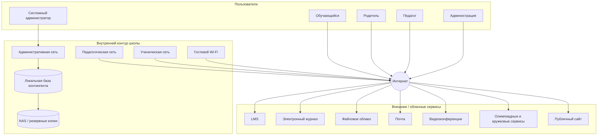

## 9. Что намеренно отсутствует

В исходном перечне активов и потоков намеренно нет части объектов: учётных записей, локальных выгрузок, резервных данных, интеграционных секретов, административных потоков и взаимодействий с подрядчиками. Их выявление — часть задания.

---

# ПРИЛОЖЕНИЕ Б. ШКАЛЫ РИСКА

# Шкалы оценки риска

## Вероятность P

| P | Уровень | Ориентир |
|---:|---|---|
| 1 | очень низкая | нужны редкие/специальные условия |
| 2 | низкая | возможна, но предпосылки возникают редко |
| 3 | средняя | реалистична в обычной эксплуатации |
| 4 | высокая | предпосылки присутствуют регулярно |
| 5 | очень высокая | сценарий повторяем/почти неизбежен без изменений |

## Влияние I

| I | Уровень | Ориентир для образования |
|---:|---|---|
| 1 | незначительное | локальное неудобство |
| 2 | малое | затронута небольшая группа, быстрое восстановление |
| 3 | существенное | требуется вмешательство администрации |
| 4 | серьёзное | значимый простой, утечка, искажение результатов |
| 5 | критическое | массовое раскрытие, срыв аттестации/занятий, длительная недоступность |

## Приоритизация

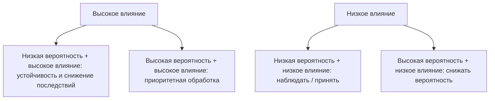

**R = P × I**

| R | Категория |
|---:|---|
| 1–4 | низкий |
| 5–9 | умеренный |
| 10–16 | высокий |
| 17–25 | критический |

**Rостат = Pпосле × Iпосле**. Каждое снижение P или I должно быть обосновано конкретной мерой.

---

# ПРИЛОЖЕНИЕ В. MERMAID-ШАБЛОНЫ

# Mermaid-шаблоны для ПР1

Все итоговые рисунки в отчёте должны храниться как Mermaid-код.

## 1. Контекстная схема

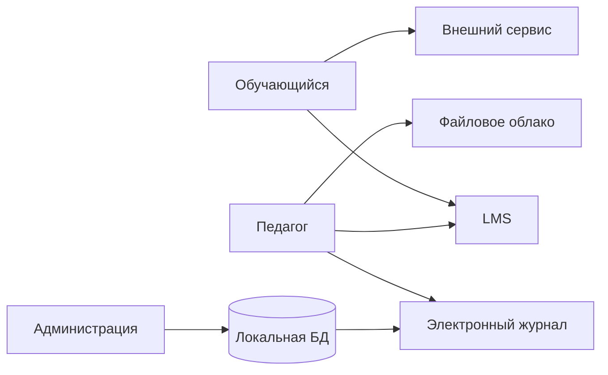

## 2. Доверительные границы

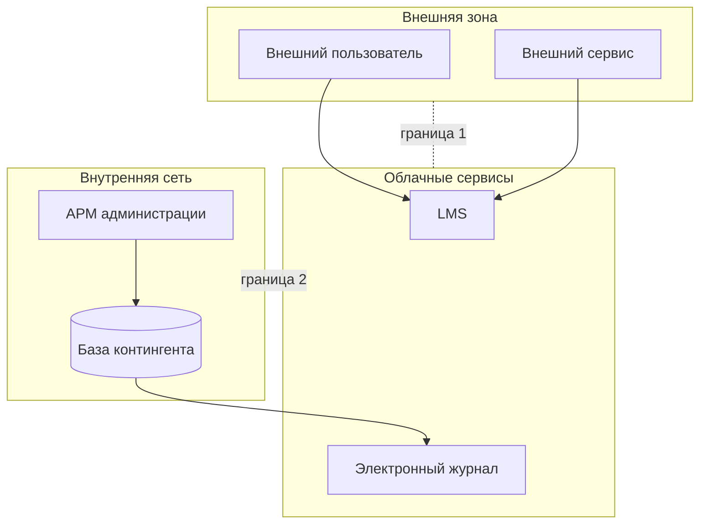

## 3. Цепочка сценария угрозы

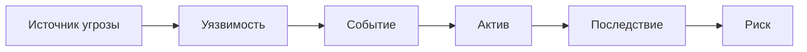

## 4. Жизненный цикл обработки риска

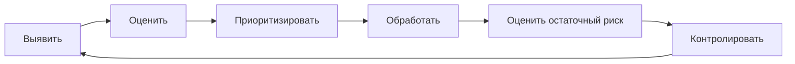

## 5. Роли

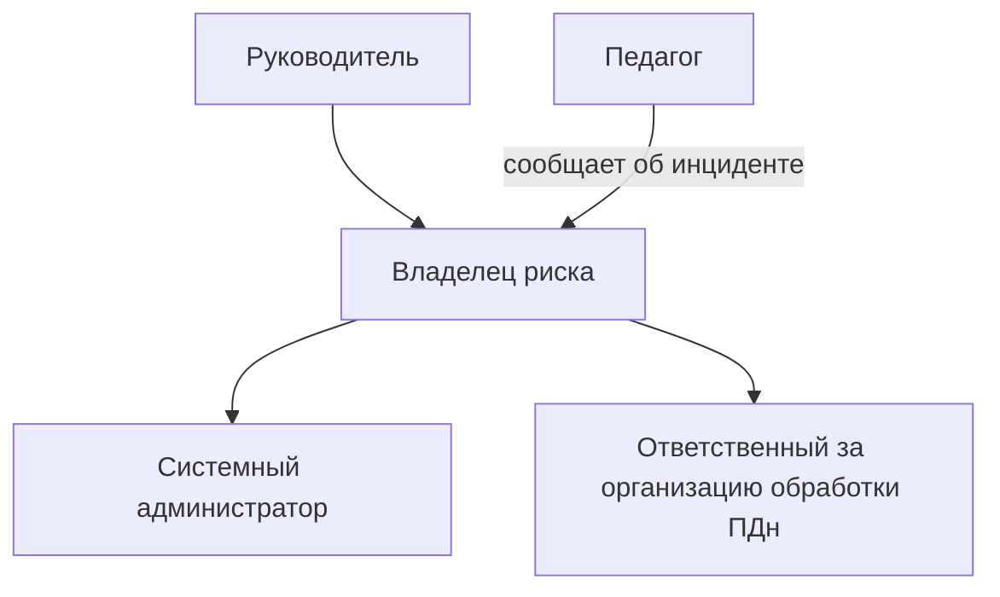

## 6. Шаблон диаграммы конкретного риска

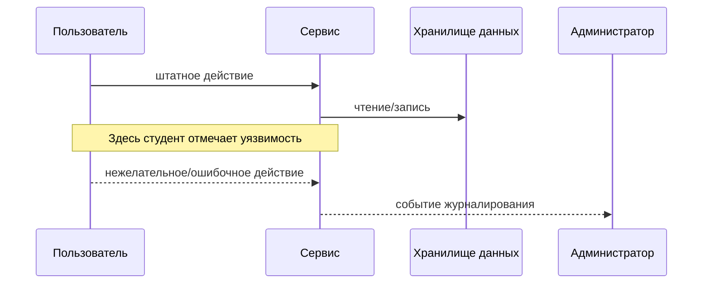

---

# ПРИЛОЖЕНИЕ Г. 25 ИНДИВИДУАЛЬНЫХ ВАРИАНТОВ

# Индивидуальные варианты ПР1

## Правило выполнения

Все студенты выполняют **общую часть практической работы полностью**. Индивидуальный вариант добавляет **три обязательных задания**. Результаты варианта включаются в раздел 9 отчёта и согласуются с активами, потоками, сценариями и реестром рисков.

---

## Вариант 1. LMS и учётные записи

**Задание 1.** Выделите LMS как основной актив и сформулируйте три дополнительных сценария: компрометация учётной записи педагога, избыточная роль и массовая выгрузка работ.

**Задание 2.** Добавьте на DFD поток журналов аутентификации LMS к администратору/системе мониторинга и объясните, какую доверительную границу он пересекает.

**Задание 3.** Дополните памятку правилом для педагога о входе в LMS с чужого или общего компьютера и укажите, какой риск снижается.

---

## Вариант 2. Электронный журнал и целостность оценок

**Задание 1.** Постройте три сценария нарушения целостности электронного журнала: ошибочное изменение, компрометация аккаунта и неотозванный доступ.

**Задание 2.** Добавьте поток экспорта ведомости из журнала в локальный XLSX-файл педагога и оцените новые риски хранения.

**Задание 3.** Сформулируйте два конкретных правила локальной политики по контролю экспорта и хранению ведомостей.

---

## Вариант 3. Файловое облако и публичные ссылки

**Задание 1.** Выявите минимум три риска, связанных с общими папками и ссылками внешнего доступа.

**Задание 2.** Добавьте поток передачи учебного файла внешнему участнику по публичной ссылке и покажите доверительную границу.

**Задание 3.** Разработайте мини-чек-лист из пяти пунктов «Перед публикацией ссылки» для педагогов.

---

## Вариант 4. Резервное копирование

**Задание 1.** Оцените три сценария: повреждённая резервная копия, недоступность NAS и несанкционированный доступ к резервным данным.

**Задание 2.** Постройте Mermaid-схему процесса резервного копирования и контрольного восстановления, включая точку проверки результата.

**Задание 3.** Предложите организационный регламент проверки восстановления: периодичность, ответственный и фиксируемый результат.

---

## Вариант 5. Публичный сайт

**Задание 1.** Сформулируйте три сценария: ошибочная публикация персональных данных, компрометация редактора и публикация устаревшего или неверного документа.

**Задание 2.** Добавьте поток подготовки материала из общей папки в CMS и покажите контрольную точку перед публикацией.

**Задание 3.** Сформулируйте правило двойной проверки материалов, содержащих сведения об обучающихся.

---

## Вариант 6. Электронная почта и фишинг

**Задание 1.** Сформулируйте три сценария, связанные с фишингом, вредоносным вложением и ошибочной отправкой сообщения не тому адресату.

**Задание 2.** Добавьте поток восстановления пароля через корпоративную почту и оцените его влияние на другие сервисы.

**Задание 3.** Создайте фрагмент памятки «Как сообщить о подозрительном письме» без требования самостоятельно расследовать инцидент.

---

## Вариант 7. Видеоконференции

**Задание 1.** Сформулируйте три риска: посторонний участник, публикация ссылки и несанкционированная запись/распространение материалов.

**Задание 2.** Добавьте поток приглашения на родительское собрание через классный канал коммуникации и покажите внешнюю границу.

**Задание 3.** Определите четыре настройки или организационных действия, которые педагог проверяет перед началом онлайн-занятия.

---

## Вариант 8. Внешний олимпиадный сервис

**Задание 1.** Сформулируйте три риска передачи данных внешней платформе и отдельно укажите риск избыточного состава передаваемых данных.

**Задание 2.** Добавьте поток загрузки педагогом списка участников в CSV и определите, где появляется копия данных.

**Задание 3.** Сформулируйте критерии допуска нового внешнего образовательного сервиса: минимум пять проверяемых пунктов.

---

## Вариант 9. Управление увольнением работника

**Задание 1.** Сформулируйте три сценария, связанные с неотозванными правами после увольнения или смены роли.

**Задание 2.** Постройте Mermaid-процесс блокирования доступа в LMS, почте, облаке и локальной сети.

**Задание 3.** Добавьте в политику правило о сроке блокирования и роли, которая подтверждает завершение процедуры.

---

## Вариант 10. Административные учётные записи

**Задание 1.** Сформулируйте три сценария: общая admin-учётная запись, компрометация привилегированного аккаунта и ошибочная команда администратора.

**Задание 2.** Добавьте поток административного журналирования и хранение журналов как отдельный актив.

**Задание 3.** Предложите набор из пяти правил для привилегированных учётных записей.

---

## Вариант 11. Ученический компьютерный класс

**Задание 1.** Сформулируйте три риска: остаточные файлы другого ученика, изменение настроек и использование сохранённой сессии.

**Задание 2.** Добавьте поток входа обучающегося в LMS с общего ПК и отметьте, где хранение сессии создаёт риск.

**Задание 3.** Составьте короткую инструкцию завершения работы на общем компьютере для обучающегося.

---

## Вариант 12. Гостевой Wi-Fi

**Задание 1.** Сформулируйте три сценария, связанные с ошибочной сегментацией, доступом к внутреннему ресурсу и использованием гостевого устройства.

**Задание 2.** Доработайте Mermaid-схему зон Guest, Student, Teacher, Admin, Server и разрешённых направлений взаимодействия.

**Задание 3.** Определите три риска, которые необходимо повторно проверить после изменения сетевых правил.

---

## Вариант 13. Локальная база контингента

**Задание 1.** Сформулируйте три сценария: избыточный доступ, ошибочное массовое изменение и утечка через выгрузку.

**Задание 2.** Добавьте поток формирования архивной выгрузки по окончании учебного года и определите жизненный цикл файла.

**Задание 3.** Предложите правила минимизации и удаления локальных выгрузок.

---

## Вариант 14. Интеграционные токены

**Задание 1.** Рассмотрите токен интеграции БД и электронного журнала как отдельный актив и сформулируйте три сценария его компрометации или неправильного использования.

**Задание 2.** Добавьте на DFD хранилище секретов или иной контролируемый механизм и покажите изменение потока.

**Задание 3.** Сформулируйте пять требований к учёту, выдаче, замене и отзыву интеграционных секретов.

---

## Вариант 15. Личные мобильные устройства педагогов

**Задание 1.** Сформулируйте три сценария: потеря устройства, сохранённая сессия и отображение служебного уведомления третьему лицу.

**Задание 2.** Добавьте поток доступа педагога к почте/LMS с личного мобильного устройства и отдельную доверительную границу BYOD.

**Задание 3.** Сформулируйте педагогически понятные правила безопасного использования личного устройства для рабочих сервисов.

---

## Вариант 16. Родительский доступ

**Задание 1.** Сформулируйте три риска: ошибочная привязка учётной записи, компрометация и доступ после изменения семейного/правового контекста.

**Задание 2.** Добавьте поток восстановления родительского доступа и покажите, какие данные используются для подтверждения.

**Задание 3.** Предложите правило поддержки пользователей, исключающее передачу пароля сотруднику школы.

---

## Вариант 17. Архивные выгрузки

**Задание 1.** Рассмотрите архивные XLSX/PDF-выгрузки как отдельный класс активов и сформулируйте три риска их жизненного цикла.

**Задание 2.** Постройте Mermaid-схему «создание → использование → архивирование → удаление».

**Задание 3.** Определите признаки, по которым файл должен быть удалён или перенесён в контролируемое хранилище.

---

## Вариант 18. Фотографии и публикации

**Задание 1.** Сформулируйте три сценария ошибочной публикации фотографий, подписей или метаданных на публичном сайте.

**Задание 2.** Добавьте поток подготовки фотографии от мероприятия до сайта и контроль согласования публикации.

**Задание 3.** Сформулируйте пять вопросов, которые редактор должен проверить перед публикацией материала.

---

## Вариант 19. Подрядчик технической поддержки

**Задание 1.** Сформулируйте три сценария риска при удалённой поддержке внешним подрядчиком.

**Задание 2.** Добавьте поток временного удалённого доступа подрядчика во внутренний контур и укажите условия его открытия и закрытия.

**Задание 3.** Предложите пять требований к процедуре предоставления временного доступа подрядчику.

---

## Вариант 20. Недоступность LMS

**Задание 1.** Сформулируйте три причины недоступности LMS и отдельно оцените влияние в обычную неделю и во время аттестации.

**Задание 2.** Постройте Mermaid-схему резервного образовательного процесса при отказе LMS.

**Задание 3.** Разработайте короткий план коммуникации педагога с обучающимися при недоступности LMS.

---

## Вариант 21. Ошибки прав доступа в облаке

**Задание 1.** Сформулируйте три сценария ошибочной настройки доступа к папкам администрации, методического объединения и отдельного педагога.

**Задание 2.** Добавьте поток периодической ревизии прав и назначьте владельца.

**Задание 3.** Сформулируйте критерии, по которым ссылка или право доступа считается избыточным.

---

## Вариант 22. Журналы событий

**Задание 1.** Рассмотрите журналы LMS и административных действий как отдельный актив и сформулируйте три риска: отсутствие события, изменение/удаление журнала и чрезмерный объём чувствительных данных в журнале.

**Задание 2.** Постройте поток «сервис → журнал → администратор → карточка инцидента».

**Задание 3.** Определите пять типов событий, полезных для расследования образовательного инцидента.

---

## Вариант 23. Роль классного руководителя

**Задание 1.** Сформулируйте три сценария, в которых классный руководитель получает или передаёт избыточный объём информации.

**Задание 2.** Добавьте поток рассылки информации родителям и укажите риск ошибочного выбора адресатов или канала.

**Задание 3.** Разработайте памятку из пяти правил безопасной групповой коммуникации с родителями.

---

## Вариант 24. Смена класса или перевод обучающегося

**Задание 1.** Сформулируйте три сценария несвоевременного изменения прав обучающегося при переводе между классами или группами.

**Задание 2.** Постройте Mermaid-процесс изменения членства в группах LMS, журнала и файлового облака.

**Задание 3.** Определите, кто инициирует, кто выполняет и кто проверяет изменение доступа.

---

## Вариант 25. Комплексный риск внешних сервисов

**Задание 1.** Выберите два внешних сервиса из кейса и сравните по трём критериям: объём данных, критичность процесса и возможность отзыва доступа.

**Задание 2.** Постройте единую Mermaid-схему передачи данных двум поставщикам и выделите две доверительные границы.

**Задание 3.** Разработайте мини-форму оценки внешнего сервиса перед использованием педагогом: минимум шесть полей.

---

---

# ПРИЛОЖЕНИЕ Д. ШАБЛОН ПОЛИТИКИ

# Фрагмент политики информационной безопасности

## 1. Назначение и область применения

Укажите: пользователей, цифровые сервисы и цель документа.

## 2. Роли и ответственность

| Роль | Ответственность |
|---|---|
| Руководитель | |
| Ответственный за организацию обработки персональных данных | |
| Системный администратор | |
| Педагогический работник | |
| Пользователь/обучающийся | |

## 3. Допустимые цифровые сервисы

Определите, кто согласовывает сервис, какие данные можно передавать и кто ведёт перечень используемых сервисов.

## 4. Работа с персональными и учебными данными

1. ...
2. ...
3. ...
4. ...

## 5. Управление доступом

Опишите создание, изменение роли, периодическую проверку и блокирование доступа.

## 6. Внешняя передача и публикация

Опишите правила для сайта, публичных ссылок, внешних сервисов и экспортов данных.

## 7. Сообщение об инциденте

Пользователь сообщает: что произошло, какой сервис затронут, какие данные могли быть затронуты и время обнаружения.

**Канал сообщения:** ____________________.

## 8. Актуализация

**Владелец документа:** ____________________.  
**Периодичность пересмотра:** ____________________.

Внеплановый пересмотр: значимый инцидент, новый сервис, изменение архитектуры, существенный новый риск или изменение нормативных требований.

---

# ПРИЛОЖЕНИЕ Е. ШАБЛОН ОТЧЁТА

# Отчёт по практической работе № 1
## «Моделирование угроз цифровой образовательной среды»

**ФИО:**  
**Группа:**  
**Вариант:**  
**Дата:**

## 1. Цель работы

...

## 2. Краткое описание кейса

...

## 3. Инвентаризация активов

Ссылка на `assets_completed.csv`.

### 3.1. Пять критичных активов

1. ...
2. ...
3. ...
4. ...
5. ...

## 4. Потоки данных

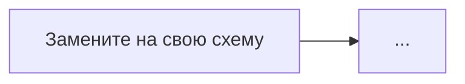

### Дополнительно выявленные потоки

| Поток | Источник | Получатель | Данные | Обоснование |
|---|---|---|---|---|
| | | | | |

## 5. Модель источников угроз

| Источник | Доступ | Причина/мотивация | Возможные действия |
|---|---|---|---|
| | | | |

## 6. Сценарии угроз

См. `threat_scenarios.csv`.

## 7. Реестр рисков

См. `risk_register.csv`.

### Обоснование пяти приоритетных рисков

#### R-...
**P = ...; I = ...; R = ...**

Обоснование вероятности: ...  
Обоснование влияния: ...

## 8. Меры защиты и остаточный риск

| Риск | Мера 1 | Тип | Мера 2 | Тип | Остаточный риск |
|---|---|---|---|---|---:|
| | | | | | |

## 9. Индивидуальный вариант

### Задание 1
...

### Задание 2
...

### Задание 3
...

## 10. Фрагмент локальной политики

...

## 11. Памятка педагогу

| № | Действие | Какой риск снижает | Пример |
|---:|---|---|---|
| 1 | | | |
| 2 | | | |
| 3 | | | |
| 4 | | | |
| 5 | | | |

## 12. Вывод

Укажите три наиболее значимых риска именно для образовательного процесса и объясните приоритетность.

---

# ПРИЛОЖЕНИЕ Ж. СПРАВОЧНИК МЕР

# Справочник типов мер защиты

> Это справочник классов мер, а не готовые ответы.

## Организационные
- каталог разрешённых цифровых сервисов;
- процедура согласования нового сервиса;
- процесс создания/изменения/блокирования учётных записей;
- регулярная ревизия прав;
- назначение владельца актива;
- регламент публикации;
- регламент резервного копирования;
- процесс управления инцидентами;
- договорные требования к поставщику;
- периодический пересмотр публичных ссылок.

## Технические
- MFA;
- RBAC;
- минимальные привилегии;
- отдельные административные учётные записи;
- ограничение публичного доступа;
- шифрование каналов;
- сегментация сети;
- контроль доступа к резервным копиям;
- управление сессиями;
- управление секретами и токенами;
- резервирование критичных сервисов.

## Обнаруживающие
- журналирование входов;
- журналирование административных действий;
- оповещение о входе с нового устройства;
- контроль массовых выгрузок;
- проверка публикаций;
- мониторинг резервного копирования;
- инвентаризация внешних ссылок.

## Восстановительные
- резервные копии;
- тестовое восстановление;
- документированный порядок восстановления;
- резервный канал выдачи учебных материалов;
- резервная коммуникация с обучающимися.

## Образовательные
- обучение распознаванию фишинга;
- инструкции по безопасному совместному доступу;
- правила использования внешних сервисов;
- тренировки по сообщению об инциденте;
- разбор ошибок публикации;
- короткие памятки для педагогов.

---
