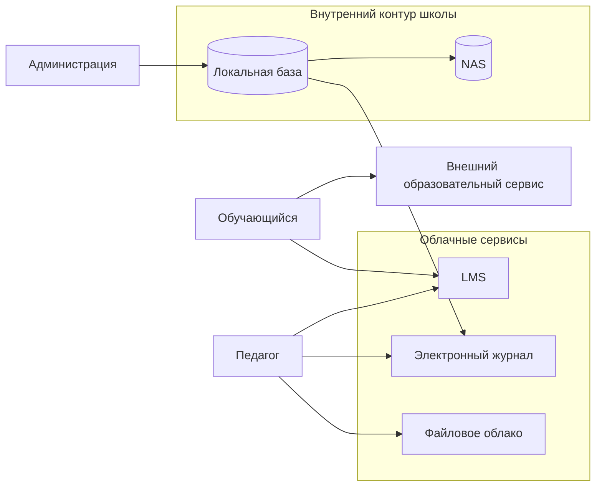

# Практическая работа № 1  
## Моделирование угроз цифровой образовательной среды

**Дисциплина:** Информационная безопасность в образовательных учреждениях  
**Максимальная оценка:** 15 баллов  

---

## 1. Цель работы

Научиться выделять наиболее значимые информационные активы образовательной организации, описывать основные потоки данных, формулировать риски и выбирать меры защиты с учётом влияния на образовательный процесс.

---

## 2. Исходная ситуация

Рассматривается условная организация **«Школа цифровых практик»**.

В школе обучаются **850 учащихся**, работают **62 педагогических работника** и **18 административных/технических сотрудников**.

Используются:

- LMS;
- электронный журнал;
- публичный сайт;
- файловое облако;
- корпоративная почта;
- видеоконференции;
- локальная база контингента;
- административная сеть;
- педагогическая сеть;
- ученический компьютерный класс;
- гостевой Wi-Fi;
- внешние сервисы олимпиад, кружков и проектов.

Дополнительные условия:

1. LMS доступна из Интернета.
2. MFA обязательна для администраторов LMS, но не для педагогов.
3. Педагоги могут экспортировать данные из электронного журнала в XLSX.
4. В файловом облаке можно создавать публичные ссылки.
5. Регулярная проверка старых публичных ссылок не проводится.
6. Учётные записи при увольнении блокируются вручную.
7. Локальная база контингента резервируется на NAS каждую ночь.
8. Последняя документированная проверка полного восстановления выполнялась около восьми месяцев назад.
9. Для олимпиад и кружков используются внешние сервисы.
10. Единого перечня разрешённых внешних сервисов и интеграционных токенов нет.
11. Ссылки на видеоконференции иногда пересылаются через классные чаты.
12. На публичном сайте размещаются документы, новости и фотографии мероприятий.

> Все сведения являются учебными и вымышленными. Использование реальных персональных данных в работе не допускается.

---

# 3. Исходные данные

## 3.1. Начальный перечень активов

Перечень **неполный**. В ходе работы допускается добавлять активы.

| № | Актив | Основные данные / назначение |
|---:|---|---|
| A1 | LMS | учебные материалы, работы студентов, тесты, результаты |
| A2 | Электронный журнал | оценки, посещаемость, данные контингента |
| A3 | Публичный сайт | новости, документы, фотографии |
| A4 | Файловое облако | учебные и рабочие документы |
| A5 | Корпоративная почта | служебная переписка и вложения |
| A6 | Видеоконференции | онлайн-занятия, консультации, родительские собрания |
| A7 | Локальная база контингента | ФИО, класс, статус обучения |
| A8 | NAS | резервные копии локальной базы |
| A9 | Педагогическая сеть | доступ педагогов к цифровым сервисам |
| A10 | Ученический компьютерный класс | учебная работа обучающихся |

Дополнительно можно учитывать:

- учётные записи;
- локальные XLSX-выгрузки;
- архивные файлы;
- интеграционные токены;
- журналы событий;
- личные устройства педагогов.

---

## 3.2. Основные потоки данных

| № | Откуда | Куда | Данные |
|---:|---|---|---|
| F1 | Обучающийся | LMS | работы, ответы тестов |
| F2 | Педагог | LMS | задания, оценки, комментарии |
| F3 | Педагог | Электронный журнал | оценки, посещаемость |
| F4 | Администрация | Локальная база | данные контингента |
| F5 | Локальная база | Электронный журнал | состав классов, идентификаторы |
| F6 | Педагог | Файловое облако | учебные и рабочие файлы |
| F7 | Администрация | Публичный сайт | документы, новости, фотографии |
| F8 | Педагог | Корпоративная почта | сообщения, вложения |
| F9 | Педагог | Видеоконференции | аудио, видео, чат |
| F10 | Обучающийся / педагог | Внешний сервис | регистрационные сведения |
| F11 | Локальная база | NAS | резервная копия |

---

# 4. Что требуется выполнить

Работа состоит только из **трёх блоков**.

---

## Блок 1. Активы и потоки данных

### Задание 1

Выберите **пять наиболее критичных активов**.

Для каждого укажите:

- почему актив важен;
- что особенно критично: конфиденциальность, целостность или доступность;
- какое нарушение сильнее всего повлияет на образовательный процесс.

Используйте таблицу:

| Актив | Что защищаем | Критичное свойство | Почему важен |
|---|---|---|---|
| | | | |
| | | | |
| | | | |
| | | | |
| | | | |

### Задание 2

Постройте **одну Mermaid-диаграмму** цифровой среды.

На ней должны быть:

- педагог;
- обучающийся;
- администрация;
- LMS;
- электронный журнал;
- локальная база;
- файловое облако;
- хотя бы один внешний сервис;
- NAS;
- не менее **двух доверительных границ**.

Можно использовать этот каркас:



Схему необходимо **доработать**, а не копировать без изменений.

---

# Блок 2. Реестр из пяти рисков

Сформулируйте **ровно пять наиболее значимых рисков**.

Не требуется составлять отдельную модель из 12 сценариев.

Для каждого риска заполните одну строку таблицы:

| ID | Актив | Сценарий риска | P (1–5) | I (1–5) | R=P×I | Меры защиты | Остаточный риск |
|---|---|---|---:|---:|---:|---|---:|
| R1 | | | | | | | |
| R2 | | | | | | | |
| R3 | | | | | | | |
| R4 | | | | | | | |
| R5 | | | | | | | |

Сценарий формулируется коротко:

> **источник / причина → уязвимость → событие → последствие**

Пример формы:

> фишинг → отсутствие MFA у педагога → компрометация учётной записи LMS → доступ к работам и результатам обучающихся.

### Шкала

**Вероятность P**

- 1 — маловероятно;
- 2 — возможно, но редко;
- 3 — реалистично;
- 4 — вероятно;
- 5 — очень вероятно.

**Влияние I**

- 1 — незначительное;
- 2 — небольшое;
- 3 — заметное;
- 4 — серьёзное;
- 5 — критическое для данных или образовательного процесса.

### Уровень риска

\[
R = P \times I
\]

- 1–4 — низкий;
- 5–9 — умеренный;
- 10–16 — высокий;
- 17–25 — критический.

### Остаточный риск

После предложенных мер повторно оцените P и I.

Например:

> до мер: P=4, I=4, R=16;  
> после MFA и уведомления о новом входе: P=2, I=4, остаточный риск = 8.

Для **двух наиболее высоких рисков** дополнительно напишите по 3–5 предложений:

1. почему выбраны именно такие P и I;
2. почему предложенные меры должны снизить риск;
3. чем этот риск опасен именно для образовательного процесса.

---

# Блок 3. Индивидуальный вариант

По номеру, назначенному преподавателем, выполните **три дополнительных задания**.

---

## Вариант 1. LMS и учётные записи

1. Добавьте риск компрометации учётной записи педагога.
2. Покажите на Mermaid-схеме поток журналов входа LMS к администратору.
3. Сформулируйте одно правило безопасного входа в LMS с общего компьютера.

## Вариант 2. Электронный журнал

1. Добавьте риск несанкционированного изменения оценок.
2. Добавьте на схему экспорт XLSX из журнала на компьютер педагога.
3. Сформулируйте два правила хранения экспортированных ведомостей.

## Вариант 3. Файловое облако

1. Добавьте риск ошибочной публичной ссылки.
2. Добавьте внешний поток передачи файла по ссылке.
3. Сформулируйте три действия педагога перед созданием публичной ссылки.

## Вариант 4. Резервное копирование

1. Добавьте риск невозможности восстановления из резервной копии.
2. Покажите на схеме `Локальная база → NAS → восстановление`.
3. Предложите периодичность контрольного восстановления и ответственного.

## Вариант 5. Публичный сайт

1. Добавьте риск ошибочной публикации персональных данных.
2. Покажите поток `рабочая папка → редактор → сайт`.
3. Сформулируйте правило проверки материала перед публикацией.

## Вариант 6. Электронная почта

1. Добавьте риск фишинга педагогического работника.
2. Покажите связь почты с восстановлением доступа к другому сервису.
3. Напишите короткую инструкцию: что делать при подозрительном письме.

## Вариант 7. Видеоконференции

1. Добавьте риск подключения постороннего участника.
2. Добавьте на схему распространение ссылки на конференцию.
3. Укажите три проверки перед началом онлайн-занятия.

## Вариант 8. Олимпиадный сервис

1. Добавьте риск передачи внешнему сервису избыточных данных.
2. Покажите поток загрузки списка участников.
3. Укажите три критерия выбора допустимого внешнего сервиса.

## Вариант 9. Увольнение работника

1. Добавьте риск неотозванного доступа.
2. Покажите на схеме сервисы, доступ к которым нужно закрыть.
3. Укажите, кто инициирует и кто подтверждает блокирование.

## Вариант 10. Административные учётные записи

1. Добавьте риск компрометации привилегированной учётной записи.
2. Покажите поток административных журналов.
3. Сформулируйте три правила работы с административными аккаунтами.

## Вариант 11. Компьютерный класс

1. Добавьте риск сохранённой пользовательской сессии на общем ПК.
2. Покажите поток `общий ПК → LMS`.
3. Сформулируйте три действия обучающегося перед завершением работы.

## Вариант 12. Гостевой Wi-Fi

1. Добавьте риск ошибочного доступа из гостевой сети во внутренний контур.
2. Добавьте на схему отдельный гостевой сегмент.
3. Укажите, какие взаимодействия гостевой сети должны быть запрещены.

## Вариант 13. Локальная база контингента

1. Добавьте риск массовой несанкционированной выгрузки.
2. Покажите создание локального файла-выгрузки.
3. Сформулируйте правило удаления временных выгрузок.

## Вариант 14. Интеграционный токен

1. Рассмотрите API-токен как отдельный актив и добавьте риск его компрометации.
2. Покажите поток интеграции `БД → электронный журнал`.
3. Укажите три правила хранения и замены токена.

## Вариант 15. Личное устройство педагога

1. Добавьте риск потери телефона с активной рабочей сессией.
2. Покажите доступ личного устройства к почте или LMS.
3. Сформулируйте три правила BYOD для педагога.

## Вариант 16. Родительский доступ

1. Добавьте риск ошибочной привязки учётной записи родителя.
2. Покажите поток восстановления доступа.
3. Сформулируйте правило поддержки пользователя без передачи пароля сотруднику.

## Вариант 17. Архивные выгрузки

1. Добавьте риск длительного хранения старых XLSX/PDF с персональными данными.
2. Покажите жизненный цикл `создание → использование → архив → удаление`.
3. Укажите два условия, при которых файл должен быть удалён.

## Вариант 18. Фотографии и публикации

1. Добавьте риск публикации фотографии/подписи с избыточными сведениями.
2. Покажите поток фотографии до публичного сайта.
3. Сформулируйте три проверки перед публикацией.

## Вариант 19. Внешний подрядчик

1. Добавьте риск избыточного удалённого доступа подрядчика.
2. Покажите временный удалённый доступ во внутренний контур.
3. Укажите три условия предоставления такого доступа.

## Вариант 20. Недоступность LMS

1. Добавьте риск отказа LMS во время аттестации.
2. Покажите резервный канал выдачи задания.
3. Составьте короткий порядок действий педагога при недоступности LMS.

## Вариант 21. Права доступа в облаке

1. Добавьте риск избыточных прав на общую папку.
2. Покажите процесс периодической проверки прав.
3. Укажите три признака избыточного доступа.

## Вариант 22. Журналы событий

1. Рассмотрите журналы событий как актив и добавьте риск их отсутствия или удаления.
2. Покажите поток `сервис → журнал → администратор`.
3. Укажите четыре события, которые необходимо фиксировать.

## Вариант 23. Классный руководитель

1. Добавьте риск ошибочной массовой отправки данных родителям.
2. Покажите поток групповой коммуникации.
3. Сформулируйте три правила безопасной коммуникации с родителями.

## Вариант 24. Перевод обучающегося

1. Добавьте риск сохранения старых прав после перевода в другой класс.
2. Покажите изменение групп в LMS и файловом облаке.
3. Укажите, кто инициирует, выполняет и проверяет изменение доступа.

## Вариант 25. Внешние образовательные сервисы

1. Сравните **два внешних сервиса** по риску: объём передаваемых данных, критичность процесса, возможность отзыва доступа.
2. Добавьте оба сервиса на Mermaid-схему и покажите отдельные внешние потоки.
3. Сформулируйте **пять полей мини-карточки согласования нового сервиса** педагогом.

---

# 5. Что сдаёт студент

**Один файл**:

```text
pr_01_Фамилия.md
```

Структура файла:

```markdown
# ПР1. Моделирование угроз цифровой образовательной среды

## 1. Пять критичных активов
[таблица]

## 2. Схема цифровой среды
[Mermaid]

## 3. Реестр пяти рисков
[таблица]

### Обоснование риска R...
...

### Обоснование риска R...
...

## 4. Индивидуальный вариант № ...
### Задание 1
...
### Задание 2
...
### Задание 3
...

## 5. Вывод
...
```

В выводе укажите:

- какой риск считаете наиболее значимым;
- почему он влияет именно на образовательный процесс;
- какая мера должна быть реализована первой.

---

# 6. Критерии оценивания — 15 баллов

| Критерий | Баллы |
|---|---:|
| Выбор и обоснование пяти критичных активов | 2 |
| Mermaid-схема, потоки и доверительные границы | 2 |
| Пять корректно сформулированных рисков | 3 |
| Оценка P, I, исходного и остаточного риска | 2 |
| Связь мер защиты с причинами рисков | 1 |
| Три задания индивидуального варианта | 4 |
| Вывод и оформление | 1 |
| **Итого** | **15** |

---

# 7. Контрольные вопросы

1. Чем актив отличается от угрозы?
2. Чем угроза отличается от уязвимости?
3. Что показывает вероятность риска?
4. Что показывает влияние риска?
5. Что такое остаточный риск?
6. Почему MFA обычно уменьшает вероятность, но не обязательно влияние?
7. Почему резервное копирование необходимо проверять восстановлением?
8. Почему внешний цифровой сервис является отдельной зоной доверия?
9. Почему педагог может быть источником угрозы без злого умысла?
10. Какие риски информационной безопасности непосредственно влияют на непрерывность образовательного процесса?
