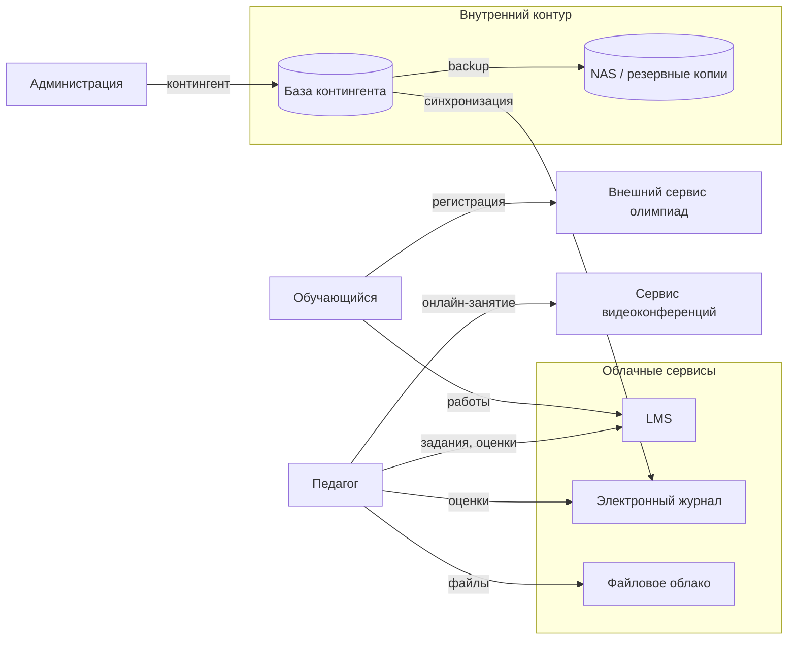
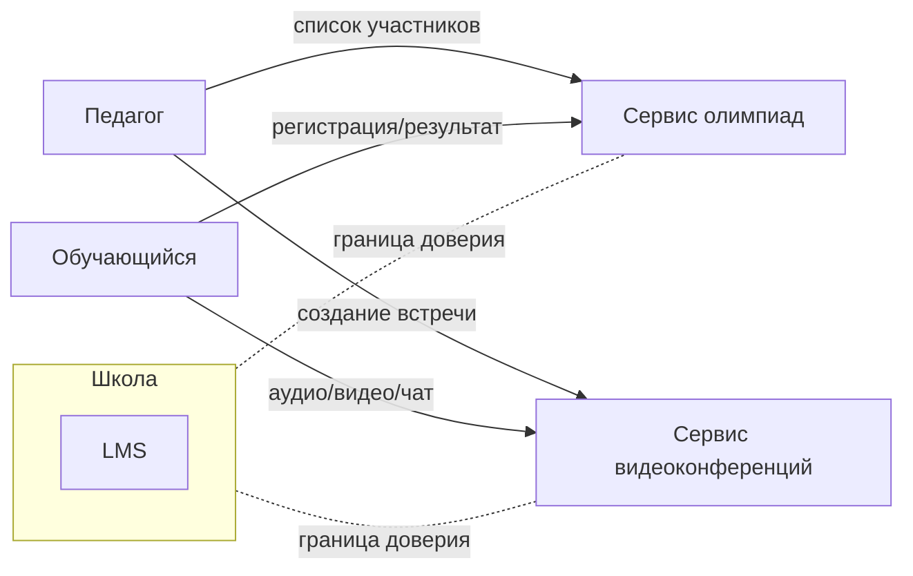

# Практическая работа № 1 — материалы преподавателя  
## Моделирование угроз цифровой образовательной среды

**Максимальная оценка:** 15 баллов  
**Студенческий файл:** `pr_01.md`  
**Результат студента:** один файл `pr_01_Фамилия.md`

---

# 1. Методика проведения

Практика намеренно упрощена.

Студент выполняет только:

1. выбор пяти критичных активов;
2. одну Mermaid-схему;
3. реестр из пяти рисков;
4. три задания индивидуального варианта;
5. короткий вывод.

Не требуется:

- отдельный реестр активов;
- отдельная таблица источников угроз;
- 12 сценариев;
- отдельный файл политики;
- отдельная памятка;
- несколько CSV;
- отдельный чек-лист.

Главная цель — проверить, понимает ли студент причинную цепочку:

> **актив → уязвимость → событие → последствие → риск → мера → остаточный риск**

---

# 2. Ориентир общего решения

## 2.1. Примеры критичных активов

Допустимы разные наборы. Наиболее обоснованными обычно являются:

| Актив | Критичное свойство | Причина |
|---|---|---|
| Электронный журнал | целостность | изменение оценок нарушает достоверность результатов обучения |
| LMS | доступность / целостность | отказ или изменение материалов влияет на занятия и аттестацию |
| Локальная база контингента | конфиденциальность / целостность | содержит данные обучающихся и используется для интеграций |
| Учётные записи педагогов | конфиденциальность / целостность | через них доступно изменение и просмотр учебных данных |
| Резервные копии | целостность / доступность | определяют возможность восстановления |
| Файловое облако | конфиденциальность | возможны рабочие документы и публичные ссылки |
| Интеграционные токены | конфиденциальность | дают машинный доступ к системам |

Не снижать балл, если студент выбрал другой актив и убедительно объяснил его критичность.

---

## 2.2. Пример Mermaid-схемы

Достаточно, если:
- схема читаема;
- есть внутренний и внешний контур;
- видны основные данные/потоки;
- отражено требование варианта.

---

## 2.3. Пример реестра пяти рисков

| ID | Актив | Сценарий | P | I | R | Меры | Остаточный риск |
|---|---|---|---:|---:|---:|---|---:|
| R1 | Учётная запись педагога LMS | фишинг + отсутствие MFA → захват аккаунта → доступ к работам и оценкам | 4 | 4 | 16 | MFA, уведомление о новом входе, обучение | 8 |
| R2 | Файловое облако | публичная ссылка → доступ посторонних к рабочему файлу | 4 | 4 | 16 | ограничение срока ссылки, ревизия доступа | 8 |
| R3 | Учётная запись бывшего работника | ручной отзыв доступа → блокирование не выполнено → сохранение доступа | 3 | 4 | 12 | чек-лист увольнения, ответственный, контроль закрытия | 4–8 |
| R4 | LMS | сбой сервиса во время аттестации → невозможность сдать работу | 3 | 5 | 15 | резервный порядок сдачи, информирование, резерв материалов | 6–9 |
| R5 | Резервные копии | backup существует, но восстановление не проверяется → восстановление невозможно | 3 | 5 | 15 | регулярное тестовое восстановление, журнал проверки | 6 |

Числа не являются единственно правильными.

---

# 3. Критерии оценивания — 15 баллов

| Критерий | Баллы | Что проверять |
|---|---:|---|
| Пять критичных активов | 2 | выбор не случайный, есть связь с образовательным процессом |
| Mermaid-схема | 2 | сервисы, потоки, внутренний/внешний контур, вариант |
| Пять рисков | 3 | различаются; есть уязвимость/событие/последствие |
| P/I и остаточный риск | 2 | расчёт корректен, снижение обосновано |
| Меры | 1 | связаны с причиной риска |
| Вариант: три задания | 4 | по 1–1,5 балла в зависимости от сложности |
| Вывод и оформление | 1 | выделен приоритетный риск и первая мера |
| **Итого** | **15** | |

### Быстрое снижение баллов

- −1: Mermaid отсутствует или не отображается.
- −1: все риски P=5/I=5 без объяснения.
- −1: «угроза», «уязвимость» и «последствие» фактически смешаны.
- до −2: индивидуальный вариант выполнен формально.
- работа возвращается на исправление: используются реальные персональные данные.

---

# 4. Ориентиры решений 25 вариантов

Это **не единственные правильные ответы**. Они нужны для быстрой проверки.

---

## Вариант 1. LMS и учётные записи

**1. Риск.** Фишинг/повторный пароль + отсутствие MFA у педагога → захват учётной записи → просмотр работ и изменение учебных данных.

**2. Схема.** Добавить `LMS -->|журналы входа| Admin/SIEM`.

**3. Правило.** На общем ПК не сохранять пароль, завершать сессию и не подтверждать «запомнить меня».

---

## Вариант 2. Электронный журнал

**1. Риск.** Компрометация/неотозванный доступ → изменение оценок → нарушение целостности результатов обучения.

**2. Схема.** `Электронный журнал -->|XLSX| ПК педагога`.

**3. Правила.** Хранить выгрузку только в согласованном месте; удалить после завершения задачи; не отправлять через неразрешённые каналы.

---

## Вариант 3. Файловое облако

**1. Риск.** Публичная ссылка без срока → файл становится доступен посторонним.

**2. Схема.** `Файловое облако -->|публичная ссылка| Внешний пользователь`.

**3. Действия.** Проверить состав файла; ограничить адресатов/срок; после использования закрыть доступ.

---

## Вариант 4. Резервное копирование

**1. Риск.** Backup создаётся, но не тестируется → при аварии восстановление невозможно.

**2. Схема.** `БД --> NAS --> Тестовое восстановление`.

**3. Решение.** Например, ежеквартальное тестовое восстановление; ответственный — системный администратор; результат фиксируется.

---

## Вариант 5. Публичный сайт

**1. Риск.** Ошибка редактора → публикация документа/фото с лишними данными.

**2. Схема.** `Рабочая папка --> Редактор --> Публичный сайт`.

**3. Правило.** Перед публикацией проверить содержание, персональные данные и предназначение материала; для чувствительных публикаций — второй просмотр.

---

## Вариант 6. Электронная почта

**1. Риск.** Фишинговое письмо → ввод пароля → компрометация почты и связанных сервисов.

**2. Схема.** `Почта -->|ссылка восстановления| LMS/другой сервис`.

**3. Инструкция.** Не открывать подозрительные ссылки/вложения; не вводить пароль; сообщить ответственному/ИТ-службе.

---

## Вариант 7. Видеоконференции

**1. Риск.** Распространение ссылки → подключение постороннего.

**2. Схема.** `Педагог --> Классный чат --> Ссылка ВКС --> Участники`.

**3. Проверки.** Контроль участников; зал ожидания/пароль; права записи/демонстрации экрана.

---

## Вариант 8. Олимпиадный сервис

**1. Риск.** Педагог загружает избыточный список → внешнему оператору передаются лишние данные.

**2. Схема.** `Педагог --> CSV --> Внешний сервис`.

**3. Критерии.** Минимальный состав данных; понятный поставщик/условия; способ удаления/отзыва; наличие согласованного использования.

---

## Вариант 9. Увольнение работника

**1. Риск.** Ручной процесс → один из сервисов не заблокирован → бывший работник сохраняет доступ.

**2. Схема.** От кадрового события к `LMS`, `Почта`, `Облако`, `Локальная сеть`.

**3. Роли.** Инициатор — кадровая/административная роль; выполнение — администратор; подтверждение — владелец процесса/ответственный.

---

## Вариант 10. Административные учётные записи

**1. Риск.** Компрометация admin → массовое изменение настроек/данных.

**2. Схема.** `Admin account --> Сервис --> Журнал действий`.

**3. Правила.** Отдельная admin-учётная запись; MFA; не использовать её для повседневной работы; журналировать действия.

---

## Вариант 11. Компьютерный класс

**1. Риск.** Предыдущий пользователь не завершил сессию → следующий получает доступ к его LMS.

**2. Схема.** `Обучающийся --> Общий ПК --> LMS`.

**3. Действия.** Выйти из LMS; закрыть браузер; удалить локальный файл/не сохранять пароль.

---

## Вариант 12. Гостевой Wi-Fi

**1. Риск.** Ошибка сегментации → гостевое устройство получает доступ к внутреннему серверу.

**2. Схема.** Отдельные зоны `Guest`, `Student`, `Teacher`, `Admin`, `Server`.

**3. Запрет.** Guest не должен обращаться к административной сети, БД и NAS; только в Интернет.

---

## Вариант 13. Локальная база контингента

**1. Риск.** Избыточные права/выгрузка → копия данных оказывается на обычном ПК.

**2. Схема.** `БД -->|XLSX/CSV| Рабочий ПК`.

**3. Правило.** Выгрузка удаляется после достижения цели либо переносится в контролируемое хранилище.

---

## Вариант 14. Интеграционный токен

**1. Риск.** Токен хранится неконтролируемо → утечка → несанкционированный машинный доступ.

**2. Схема.** `БД -->|API + token| Электронный журнал`.

**3. Правила.** Не хранить в открытом файле/репозитории; учитывать владельца и срок; менять при компрометации/смене интеграции.

---

## Вариант 15. Личное устройство педагога

**1. Риск.** Потеря телефона с активной сессией → посторонний получает доступ к почте/LMS.

**2. Схема.** `Личный смартфон --> Internet --> LMS/Почта`.

**3. Правила.** Блокировка устройства; MFA; отсутствие локального хранения чувствительных файлов; выход/удалённое завершение сессий при потере.

---

## Вариант 16. Родительский доступ

**1. Риск.** Ошибка привязки → родитель получает данные другого обучающегося.

**2. Схема.** `Родитель --> Восстановление --> Электронный журнал`.

**3. Правило.** Сотрудник не сообщает пароль; выполняется идентификация и процедура сброса.

---

## Вариант 17. Архивные выгрузки

**1. Риск.** Старые файлы с ПДн хранятся без необходимости → увеличивается объём потенциальной утечки.

**2. Схема.** `Создание --> Использование --> Архив --> Удаление`.

**3. Удаление.** Цель обработки завершена; установленный срок хранения истёк; данные перенесены в штатную систему.

---

## Вариант 18. Фотографии и публикации

**1. Риск.** Фото/подпись содержит лишние данные → публичное раскрытие.

**2. Схема.** `Педагог/мероприятие --> Рабочая папка --> Редактор --> Сайт`.

**3. Проверки.** Допустимость публикации; подписи/метаданные; отсутствие лишних персональных сведений.

---

## Вариант 19. Внешний подрядчик

**1. Риск.** Временный доступ не ограничен/не закрыт → подрядчик сохраняет доступ после работ.

**2. Схема.** `Подрядчик --> VPN/Remote --> Внутренний сервис`.

**3. Условия.** Согласованная заявка; минимальные права/время; журналирование; закрытие после завершения.

---

## Вариант 20. Недоступность LMS

**1. Риск.** Отказ LMS во время аттестации → обучающиеся не могут получить/сдать задания.

**2. Схема.** `Педагог --> Резервное хранилище/почта --> Обучающийся`.

**3. Порядок.** Сообщить о сбое; использовать заранее определённый канал; зафиксировать новый срок/способ сдачи.

---

## Вариант 21. Права доступа в облаке

**1. Риск.** Папка доступна бывшим участникам группы/не тем ролям.

**2. Схема.** `Владелец папки --> Ревизия прав --> Пользователи/группы`.

**3. Признаки.** Пользователь больше не участвует в процессе; доступ шире роли; публичная ссылка не имеет текущей цели.

---

## Вариант 22. Журналы событий

**1. Риск.** Журналы отсутствуют/удалены → невозможно восстановить ход инцидента.

**2. Схема.** `LMS/Журнал --> Логи --> Администратор`.

**3. События.** Успешный/неуспешный вход; изменение роли; экспорт данных; изменение оценки; административное действие.

---

## Вариант 23. Классный руководитель

**1. Риск.** Массовая рассылка с неверным списком получателей → раскрытие информации другой семье.

**2. Схема.** `Классный руководитель --> Канал рассылки --> Родители`.

**3. Правила.** Проверять адресатов; минимизировать данные; не публиковать чувствительные сведения в общем чате.

---

## Вариант 24. Перевод обучающегося

**1. Риск.** Старое членство в группах не удалено → доступ к материалам прежнего класса сохраняется.

**2. Схема.** `Событие перевода --> LMS группы + Облачные группы`.

**3. Роли.** Инициирует администрация; выполняет ответственный администратор/автоматизация; проверяет владелец учебного процесса.

---

## Вариант 25. Внешние образовательные сервисы

### Задание 1 — сравнение двух сервисов

Ориентир:

| Критерий | Сервис A: олимпиадная платформа | Сервис B: видеоконференции |
|---|---|---|
| Объём данных | ФИО/класс/результаты, иногда список CSV | учётные данные, имя участника, аудио/видео/чат |
| Критичность процесса | средняя/высокая для конкретного мероприятия | высокая при дистанционном занятии |
| Возможность отзыва | удаление аккаунта/списка зависит от поставщика | прекращение встречи, отзыв ссылки, удаление записи |

Допустим другой выбор сервисов, если сравнение обосновано.

### Задание 2 — Mermaid

Ориентир:

Важно: студент должен явно показать, что это **две внешние зоны/два поставщика**, а не часть внутренней инфраструктуры.

### Задание 3 — мини-карточка согласования

Минимально достаточные поля:

1. название и поставщик сервиса;
2. образовательная цель использования;
3. категории пользователей;
4. какие данные передаются;
5. срок/период использования;
6. ответственный педагог/владелец;
7. способ прекращения доступа/удаления данных.

Требование задания — пять полей, поэтому 5 корректных полей достаточно для полного выполнения.

---

# 5. Что считать отличной работой

Работа на 13–15 баллов обычно:

- не перегружена формальностями;
- содержит читаемую Mermaid-схему;
- показывает понимание границы «школа ↔ внешний поставщик»;
- различает уязвимость и последствие;
- не выставляет риск механически;
- связывает меры с причиной;
- объясняет влияние на занятия, результаты обучения, аттестацию или доступность образовательного процесса.

---

# 6. Вопросы для быстрой защиты

Достаточно задать студенту 2–3 вопроса:

1. Почему выбранный вами актив критичен именно для образовательного процесса?
2. Покажите один риск и назовите в нём уязвимость.
3. Какая мера уменьшает вероятность, а какая — влияние?
4. Почему остаточный риск не стал нулевым?
5. Что изменилось в вашей модели из-за индивидуального варианта?
