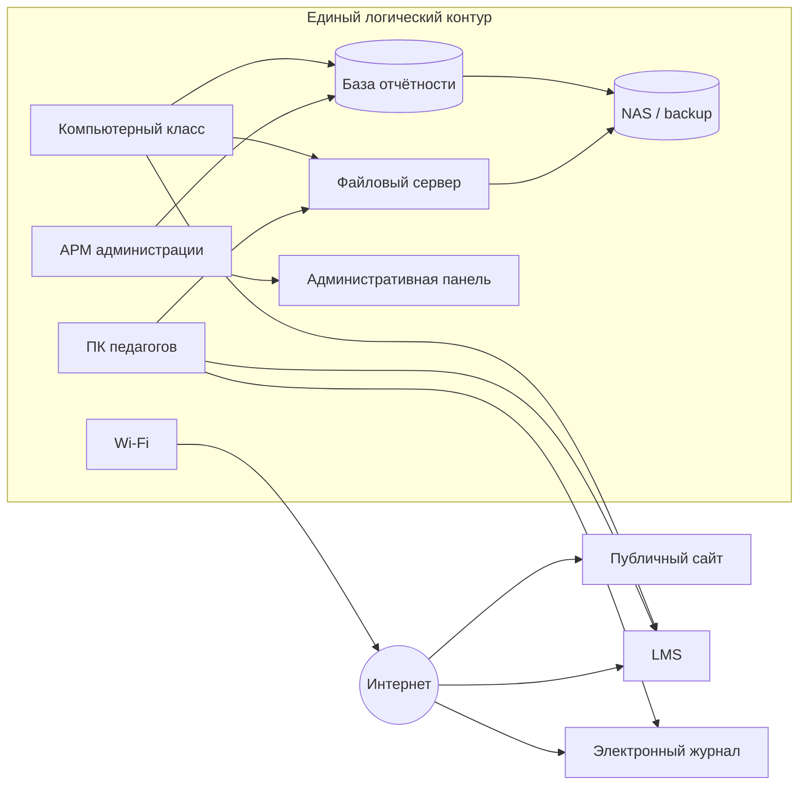
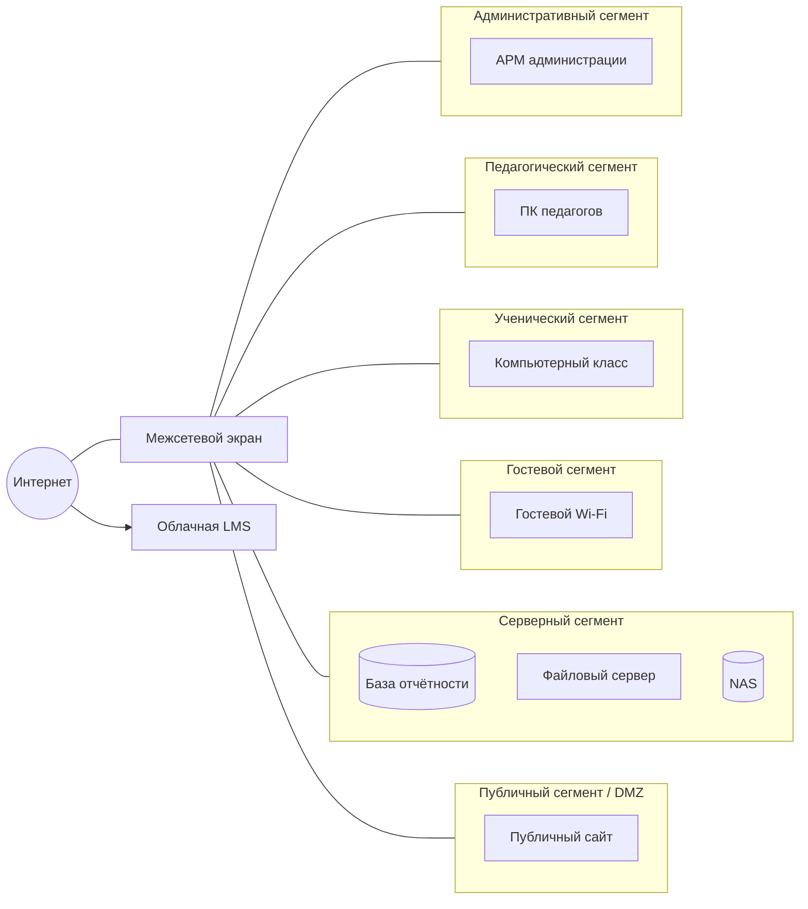

# Практическая работа № 2
## Проектирование защищённой инфраструктуры образовательной организации

**Дисциплина:** Информационная безопасность в образовательных учреждениях  
**Максимальная оценка:** 15 баллов  
**Формат выполнения:** индивидуально  
**Формат отчёта:** Markdown (`.md`)  
**Диаграммы:** Mermaid

---

## 1. Цель работы

Спроектировать защищённую цифровую инфраструктуру образовательной организации, применив сетевую сегментацию, ролевое управление доступом, многофакторную аутентификацию, управление жизненным циклом учётных записей и резервное восстановление.

---

## 2. Исходная ситуация

Рассматривается условная организация **«Школа цифровых практик»**.

В школе:

- 850 обучающихся;
- 62 педагогических работника;
- 18 административных и технических сотрудников;
- два компьютерных класса;
- LMS;
- электронный журнал;
- файловое облако;
- публичный сайт;
- локальная база отчётности;
- файловый сервер;
- NAS для резервных копий;
- корпоративный Wi-Fi;
- гостевой Wi-Fi.

### Проблема

Исходная локальная сеть фактически **плоская**: административные компьютеры, педагогические рабочие места, ученические ПК и серверы находятся в одном логическом контуре и могут обращаться друг к другу без чётко заданной модели межсегментного доступа.

Также известны следующие особенности:

1. системный администратор использует отдельную административную учётную запись;
2. MFA включена для администратора, но не обязательна для педагогов;
3. часть прав при переводе сотрудника на другую должность изменяется вручную;
4. блокирование учётной записи при увольнении выполняется по заявке;
5. несколько сервисных аккаунтов имеют расширенные права;
6. резервные копии создаются автоматически;
7. контрольное восстановление выполняется нерегулярно;
8. гостевой Wi-Fi должен иметь только доступ в Интернет;
9. ученические компьютеры не должны напрямую обращаться к административным ресурсам;
10. публичный сайт должен быть отделён от внутренних административных сервисов.

---

## 3. Исходная архитектура



Схема намеренно содержит небезопасные взаимодействия.

---

## 4. Исходные роли

| Роль | Основные задачи |
|---|---|
| Обучающийся | работа в LMS, получение учебных материалов |
| Педагог | работа в LMS, электронном журнале, учебных папках |
| Методист | организация учебных материалов, отчётность |
| Руководитель | просмотр отчётности, управленческие функции |
| Системный администратор | техническое сопровождение и настройка инфраструктуры |

---

## 5. Исходные сервисные аккаунты

| Аккаунт | Назначение | Текущие права |
|---|---|---|
| `svc_backup` | резервное копирование базы и файлов | администратор сервера |
| `svc_lms_report` | формирование отчётов LMS | чтение LMS + изменение пользователей |
| `svc_site_sync` | публикация подготовленных материалов на сайте | запись на сайт + чтение файлового сервера + доступ к БД |

Не все перечисленные права действительно необходимы.

---

## 6. Набор для проверки восстановления

Создайте локальный файл `restore_dataset.csv` со следующим содержимым:

```csv
id,class_code,status
S001,5A,active
S002,5A,active
S003,6B,active
S004,7A,active
S005,7A,active
S006,8B,active
S007,9A,active
S008,9A,active
S009,10B,active
S010,11A,active
```

Работайте только с этим синтетическим набором.

---

# 7. Что требуется выполнить

Работа состоит из **трёх блоков**.

---

# Блок 1. Сегментация и защищённая архитектура

## Задание 1. Четыре риска исходной сети

Опишите **ровно четыре наиболее существенных риска** плоской архитектуры.

| № | Проблема | Возможное событие | Что пострадает |
|---:|---|---|---|
| 1 | | | |
| 2 | | | |
| 3 | | | |
| 4 | | | |

Не пишите только «нет VLAN». Требуется показать последствие.

Пример:

> ученический ПК может обращаться к административному сервису → компрометация ПК увеличивает возможность несанкционированного доступа к служебному ресурсу.

## Задание 2. Новая архитектура

Постройте **одну новую Mermaid-схему**, содержащую минимум:

- административный сегмент;
- педагогический сегмент;
- ученический сегмент;
- гостевой сегмент;
- серверный сегмент;
- публичный/DMZ-сегмент;
- Интернет.

На схеме должны быть:

- LMS или другой внешний облачный сервис;
- база отчётности;
- файловый сервер;
- NAS;
- публичный сайт;
- межсетевой экран или иная логическая точка контроля.

Пример каркаса:



Каркас необходимо дополнить взаимодействиями.

## Задание 3. Шесть сетевых правил

Сформулируйте **6 ключевых правил межсегментного взаимодействия**.

| Источник | Назначение | Сервис / назначение | Решение | Обоснование |
|---|---|---|---|---|
| | | | разрешить / запретить | |
| | | | | |
| | | | | |
| | | | | |
| | | | | |
| | | | | |

Обязательно должны быть правила для гостевого, ученического и административного сегментов и доступа к серверной зоне.

---

# Блок 2. Доступ и учётные записи

## Задание 4. Компактная RBAC-матрица

Используйте обозначения:

- `—` — нет доступа;
- `R` — чтение;
- `RW` — чтение и изменение;
- `A` — администрирование.

| Роль | LMS | Электронный журнал | Файловое облако | База отчётности | Резервные копии |
|---|---|---|---|---|---|
| Обучающийся | | | | | |
| Педагог | | | | | |
| Методист | | | | | |
| Руководитель | | | | | |
| Системный администратор | | | | | |

После таблицы кратко объясните **два решения**, которые могут показаться неочевидными.

## Задание 5. Сервисные аккаунты

| Аккаунт | Лишние права | Минимально необходимые права | Интерактивный вход человека |
|---|---|---|---|
| `svc_backup` | | | да / нет |
| `svc_lms_report` | | | да / нет |
| `svc_site_sync` | | | да / нет |

## Задание 6. Пять правил жизненного цикла

Сформулируйте **ровно пять правил**:

1. где MFA обязательно;
2. как создаётся новая учётная запись;
3. как меняются права при смене должности/роли;
4. как блокируется доступ при увольнении/отчислении;
5. как восстанавливается доступ и кто подтверждает критичное изменение роли.

Формулировки должны быть проверяемыми.

---

# Блок 3. Резервирование и индивидуальный вариант

## Задание 7. RPO и RTO

| Сервис | RPO | RTO | Краткое обоснование |
|---|---|---|---|
| LMS | | | |
| Электронный журнал | | | |
| Публичный сайт | | | |

- **RPO** — допустимый объём потери данных, выраженный во времени.
- **RTO** — допустимое время восстановления работы сервиса.

Не требуется выбирать нулевые значения. Значения должны учитывать роль сервиса в образовательном процессе.

## Задание 8. Контрольное восстановление

1. Создайте `restore_dataset.csv` из блока 6.
2. Зафиксируйте размер, число строк данных и SHA-256.
3. Скопируйте файл как `restore_dataset_recovered.csv`.
4. Повторно проверьте число строк и SHA-256.
5. Сделайте вывод об идентичности восстановленной копии.

PowerShell:

```powershell
Get-FileHash .\restore_dataset.csv -Algorithm SHA256
Copy-Item .\restore_dataset.csv .\restore_dataset_recovered.csv
Get-FileHash .\restore_dataset_recovered.csv -Algorithm SHA256
```

Python:

```python
from pathlib import Path
import hashlib

for name in ["restore_dataset.csv", "restore_dataset_recovered.csv"]:
    data = Path(name).read_bytes()
    print(name, len(data), hashlib.sha256(data).hexdigest())
```

В отчёт включите **команды и полученный результат**.

---

# 8. Индивидуальный вариант

Выполните **три задания своего варианта**.

## Вариант 1. Административный сегмент
1. Добавьте риск компрометации административного ПК.
2. Покажите отдельный административный сегмент и доступ к базе отчётности.
3. Укажите три взаимодействия, которые должны быть разрешены или запрещены.

## Вариант 2. Педагогический сегмент
1. Добавьте риск распространения вредоносного ПО с педагогического ПК.
2. Покажите доступ педагогов к LMS, журналу и файловому серверу.
3. Укажите, к каким внутренним ресурсам педагогический сегмент не должен иметь прямого доступа.

## Вариант 3. Ученический сегмент
1. Добавьте риск обращения ученического ПК к административному ресурсу.
2. Покажите отдельный ученический сегмент.
3. Сформулируйте три ограничения для ученической сети.

## Вариант 4. Гостевой Wi-Fi
1. Добавьте риск ошибочной маршрутизации гостевого устройства во внутреннюю сеть.
2. Покажите гостевой сегмент.
3. Укажите, что гостям разрешено и что должно быть запрещено.

## Вариант 5. Серверный сегмент
1. Добавьте риск прямого доступа пользовательских ПК к NAS.
2. Покажите отдельный серверный сегмент.
3. Сформулируйте три правила доступа к серверной зоне.

## Вариант 6. Публичный сайт / DMZ
1. Добавьте риск компрометации публичного сайта.
2. Разместите сайт в отдельном DMZ/публичном сегменте.
3. Укажите, какие соединения из DMZ во внутреннюю сеть должны быть запрещены.

## Вариант 7. LMS
1. Добавьте риск недоступности LMS.
2. Покажите LMS как внешний облачный сервис.
3. Предложите резервный образовательный процесс на время отказа LMS.

## Вариант 8. Электронный журнал
1. Добавьте риск нарушения целостности оценок.
2. Отразите в RBAC, кто может изменять оценки.
3. Укажите, для каких ролей MFA должно быть обязательно при работе с журналом.

## Вариант 9. Файловое облако
1. Добавьте риск избыточных прав на общую папку.
2. Отразите в RBAC различия прав педагога, методиста и обучающегося.
3. Сформулируйте правило периодической ревизии прав.

## Вариант 10. База отчётности
1. Добавьте риск массовой выгрузки данных.
2. Покажите доступ к базе только из необходимых сегментов.
3. Определите минимальные права руководителя, методиста и системного администратора.

## Вариант 11. NAS и резервные копии
1. Добавьте риск удаления резервных копий после компрометации обычной учётной записи.
2. Покажите NAS в серверной зоне.
3. Укажите, какие роли должны и не должны иметь доступ к резервным копиям.

## Вариант 12. MFA
1. Определите три категории учётных записей, для которых MFA обязательна.
2. Укажите одну ситуацию, где MFA может затруднить учебный процесс.
3. Предложите организационное решение без отмены MFA.

## Вариант 13. Приём на работу
1. Опишите процесс создания учётной записи нового педагога.
2. Укажите, кто согласует роль и права.
3. Назовите три действия, которые нельзя выполнять до подтверждения назначения.

## Вариант 14. Увольнение работника
1. Опишите порядок блокирования учётной записи.
2. Укажите минимум три сервиса, где доступ должен быть закрыт.
3. Определите, кто подтверждает завершение процедуры.

## Вариант 15. Смена должности
1. Добавьте риск сохранения старых прав после назначения на новую должность.
2. Покажите, как должна измениться RBAC-роль.
3. Сформулируйте правило периодической проверки прав.

## Вариант 16. Сервисный аккаунт backup
1. Проанализируйте `svc_backup`.
2. Предложите минимальные права.
3. Укажите правила хранения и ротации его секрета.

## Вариант 17. Сервисный аккаунт LMS report
1. Проанализируйте `svc_lms_report`.
2. Определите, нужно ли ему право изменять пользователей.
3. Сформулируйте безопасный набор прав и запрет интерактивного входа.

## Вариант 18. Сервисный аккаунт site sync
1. Проанализируйте `svc_site_sync`.
2. Определите, нужен ли ему доступ к базе отчётности.
3. Предложите минимальные права для публикации материалов.

## Вариант 19. RPO/RTO LMS
1. Выберите RPO и RTO для LMS.
2. Объясните, как значения изменятся во время экзамена/аттестации.
3. Предложите одну меру обеспечения образовательной непрерывности.

## Вариант 20. RPO/RTO электронного журнала
1. Выберите RPO и RTO электронного журнала.
2. Объясните, почему целостность оценок может быть важнее мгновенного восстановления.
3. Предложите способ проверки корректности данных после восстановления.

## Вариант 21. Публичный сайт и RTO
1. Выберите RPO/RTO для публичного сайта.
2. Сравните их с LMS.
3. Объясните, почему одинаковые значения для всех сервисов обычно не нужны.

## Вариант 22. Удалённый доступ администратора
1. Добавьте риск удалённого административного доступа.
2. Покажите на схеме точку контролируемого удалённого входа.
3. Укажите три обязательные меры защиты такого доступа.

## Вариант 23. Личный ноутбук педагога
1. Добавьте риск подключения личного устройства к педагогическому сегменту.
2. Покажите отдельный способ доступа BYOD к облачным сервисам.
3. Предложите способ сохранить удобство работы без прямого доступа личного устройства к серверной зоне.

## Вариант 24. Журналирование
1. Добавьте поток журналов от межсетевого экрана или сервера.
2. Укажите четыре события, которые полезно фиксировать.
3. Объясните, почему журналирование не заменяет сегментацию и RBAC.

## Вариант 25. Комплексная защита инфраструктуры
1. Выберите **три наиболее критичных межсегментных взаимодействия** и обоснуйте решение «разрешить» или «запретить».
2. Выберите **две роли** из RBAC и объясните, почему их права должны существенно различаться.
3. Предложите **три приоритетные меры на первый месяц**: одну сетевую, одну связанную с доступом и одну связанную с восстановлением.

---

# 9. Педагогический комментарий

Выберите **одну меру безопасности**, которая может создать неудобство педагогам или обучающимся.

В 3–5 предложениях объясните:

1. какое неудобство возникает;
2. почему меру нельзя просто отменить;
3. как сохранить образовательную доступность.

---

# 10. Что сдаёт студент

**Один файл:**

```text
pr_02_Фамилия.md
```

Структура:

```markdown
# ПР2. Проектирование защищённой инфраструктуры

## 1. Четыре риска исходной сети
[таблица]

## 2. Защищённая архитектура
[Mermaid]

## 3. Шесть сетевых правил
[таблица]

## 4. RBAC
[таблица]

## 5. Сервисные аккаунты
[таблица]

## 6. Жизненный цикл учётных записей и MFA
[5 правил]

## 7. RPO/RTO
[таблица]

## 8. Контрольное восстановление
[команды, SHA-256, вывод]

## 9. Индивидуальный вариант № ...
### Задание 1
...
### Задание 2
...
### Задание 3
...

## 10. Педагогический комментарий
...

## 11. Вывод
...
```

---

# 11. Критерии оценивания — 15 баллов

| Критерий | Баллы |
|---|---:|
| Четыре риска исходной архитектуры | 1 |
| Mermaid-схема сегментированной инфраструктуры | 3 |
| Шесть сетевых правил | 1 |
| RBAC и минимальные привилегии | 2 |
| Сервисные аккаунты и жизненный цикл доступа | 1 |
| RPO/RTO и контрольное восстановление | 2 |
| Три задания индивидуального варианта | 4 |
| Педагогический комментарий и вывод | 1 |
| **Итого** | **15** |

---

# 12. Контрольные вопросы

1. Почему плоская сеть увеличивает последствия компрометации одного устройства?
2. Что даёт сетевое разделение, если у пользователя уже есть учётная запись?
3. Чем RBAC отличается от сетевой сегментации?
4. Что означает принцип минимальных привилегий?
5. Почему сервисный аккаунт не должен использоваться человеком для обычного входа?
6. Где MFA особенно важна?
7. Что необходимо сделать с доступом при увольнении?
8. Чем RPO отличается от RTO?
9. Почему наличие резервной копии не доказывает возможность восстановления?
10. Почему гостевой Wi-Fi не должен иметь прямой доступ к внутренним серверам?
