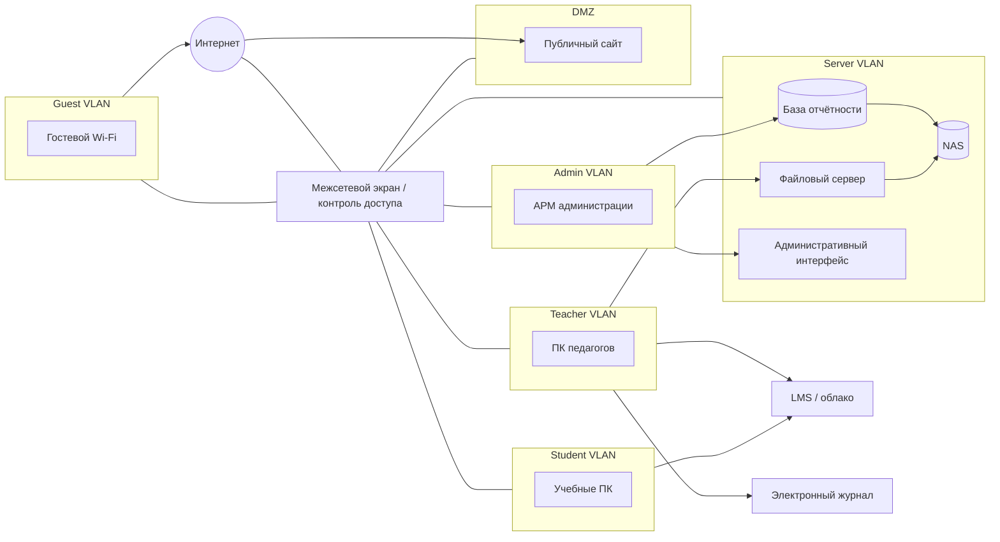

# Практическая работа № 2 — материалы преподавателя
## Проектирование защищённой инфраструктуры образовательной организации

**Максимальная оценка:** 15 баллов  
**Студенческий файл:** `pr_02.md`  
**Результат студента:** один файл `pr_02_Фамилия.md`

---

# 1. Методика проведения

Практика намеренно сокращена по сравнению с полной инженерной работой.

Студент выполняет:

1. четыре риска плоской сети;
2. одну Mermaid-схему сегментированной архитектуры;
3. шесть межсегментных правил;
4. компактную RBAC-матрицу;
5. анализ трёх сервисных аккаунтов;
6. пять правил жизненного цикла;
7. RPO/RTO для трёх сервисов;
8. одну воспроизводимую проверку восстановления;
9. три задания индивидуального варианта;
10. короткий педагогический комментарий.

Не требуется отдельный набор CSV, отдельный ACL-файл или настройка реального оборудования.

Главная логика:

> **сегментация → минимальные привилегии → управляемый доступ → резервирование → проверяемое восстановление**

---

# 2. Ориентир общего решения

## 2.1. Типовые риски плоской сети

Допустимы разные формулировки. Корректными являются, например:

1. компрометация ученического ПК → возможность обращения к административному ресурсу;
2. вредоносное ПО на педагогическом ПК → распространение на файловый сервер;
3. гостевое устройство → доступ к внутренним узлам при ошибочной маршрутизации;
4. компрометация публичного сайта → попытка перехода во внутренние сервисы;
5. обычная пользовательская учётная запись → возможность обращения к NAS;
6. отсутствие разделения управления → пользовательский трафик достигает административных интерфейсов.

Не требовать от студента все перечисленные риски: достаточно четырёх содержательных.

---

## 2.2. Ориентир защищённой архитектуры

Главное — не совпадение рисунка, а разделение зон и обоснованные связи.

---

## 2.3. Ориентир шести сетевых правил

| Источник | Назначение | Решение | Обоснование |
|---|---|---|---|
| Guest | Internet | разрешить | назначение гостевой сети |
| Guest | Server/Admin | запретить | нет учебной или административной необходимости |
| Student | LMS/Internet | разрешить | образовательная функция |
| Student | Admin/DB/NAS | запретить | отсутствует необходимость |
| Teacher | FileSrv/LMS/EJ | разрешить | учебная работа |
| Admin | DB/Mgmt | разрешить | административная функция |

Возможны другие корректные правила.

---

## 2.4. Ориентир RBAC

Один из допустимых вариантов:

| Роль | LMS | Электронный журнал | Файловое облако | База отчётности | Резервные копии |
|---|---|---|---|---|---|
| Обучающийся | RW* | R | RW* | — | — |
| Педагог | RW | RW | RW | — / R* | — |
| Методист | RW | R | RW | R | — |
| Руководитель | R | R | R | R | — |
| Системный администратор | A** | A** | A** | A** | A |

`RW*` — только собственные объекты/назначенные области.

`A**` — техническое администрирование не означает автоматического права читать всё содержание учебных и персональных данных.

Допустима более строгая модель.

---

## 2.5. Сервисные аккаунты

### `svc_backup`

**Лишнее:** полный интерактивный административный доступ.

**Минимально:** чтение источников резервирования и запись в целевое хранилище backup, только операции, необходимые задаче.

**Интерактивный вход человека:** нет.

### `svc_lms_report`

**Лишнее:** изменение пользователей.

**Минимально:** чтение необходимых отчётных данных.

**Интерактивный вход:** нет.

### `svc_site_sync`

**Лишнее:** доступ к базе отчётности.

**Минимально:** чтение каталога подготовленных материалов и запись в область публикации сайта.

**Интерактивный вход:** нет.

---

## 2.6. Пять правил жизненного цикла

Ориентир:

1. MFA обязательна для административных ролей и ролей с правом изменения критичных учебных данных.
2. Учётная запись создаётся только после кадрового/учебного события и подтверждения роли.
3. При смене должности старые права отзываются, новая роль назначается отдельно.
4. При увольнении/отчислении доступ блокируется не позднее момента прекращения полномочий.
5. Восстановление доступа выполняется после идентификации пользователя; критичное повышение роли подтверждает владелец процесса или руководитель.

---

## 2.7. RPO/RTO — ориентир

Не требовать конкретных значений.

Допустимый пример:

| Сервис | RPO | RTO | Логика |
|---|---|---|---|
| LMS | 4 часа | 4 часа | важна непрерывность занятий и сохранение работ |
| Электронный журнал | 1 час | 4 часа | критична целостность оценок и посещаемости |
| Публичный сайт | 24 часа | 8–24 часа | обычно менее критичен для текущего занятия |

Во время аттестации значения для LMS могут становиться строже.

---

## 2.8. Контрольное восстановление

Для полного балла студент должен показать:

1. создан исходный CSV;
2. зафиксирован SHA-256;
3. создан файл-копия;
4. SHA-256 совпадает;
5. количество строк совпадает;
6. есть вывод о целостности.

Не оценивать конкретное значение SHA заранее: оно может различаться из-за окончания строк или кодировки. Оценивать совпадение исходного и восстановленного файла в среде студента.

---

# 3. Критерии оценивания — 15 баллов

| Критерий | Баллы | Что проверять |
|---|---:|---|
| 4 риска | 1 | последствия, а не только название отсутствующей технологии |
| Mermaid | 3 | минимум 6 зон/контуров, серверная зона, DMZ, логика потоков |
| 6 сетевых правил | 1 | есть разрешения и запреты с обоснованием |
| RBAC | 2 | минимальные привилегии, отсутствие доступа к backup у обычных ролей |
| Сервисные аккаунты + lifecycle | 1 | лишние права сняты, интерактивный вход запрещён |
| RPO/RTO + restore | 2 | реалистичные значения и доказательство идентичности |
| Вариант | 4 | все 3 задания содержательно выполнены |
| Педагогический комментарий + вывод | 1 | безопасность не противопоставляется обучению |
| **Итого** | **15** | |

---

# 4. Ориентиры решений 25 вариантов

Решения являются ориентирами, а не единственным допустимым ответом.

## Вариант 1. Административный сегмент

1. **Риск:** компрометация административного ПК → доступ к БД или панели управления.
2. **Схема:** отдельный `ADMIN`, доступ к `DB` и `Mgmt` через FW.
3. **Правила:** ADMIN→DB разрешить; ADMIN→Mgmt разрешить; STUD/GUEST→ADMIN запретить.

## Вариант 2. Педагогический сегмент

1. **Риск:** заражённый ПК педагога → попытка распространения на внутренние ресурсы.
2. **Схема:** `TEACH` → LMS/EJ/FileSrv; без прямого доступа к NAS/Mgmt.
3. **Запреты:** прямой доступ к NAS, административным интерфейсам и БД без необходимости.

## Вариант 3. Ученический сегмент

1. **Риск:** пользовательский или заражённый ученический ПК → обращение к служебным ресурсам.
2. **Схема:** отдельный `STUD`.
3. **Ограничения:** нет доступа к ADMIN, DB, NAS; разрешены LMS/Internet и необходимые учебные сервисы.

## Вариант 4. Гостевой Wi-Fi

1. **Риск:** гостевое устройство получает внутренний маршрут.
2. **Схема:** отдельный `GUEST`.
3. **Правило:** GUEST→Internet разрешить; GUEST→ADMIN/SERVER/TEACH/STUD запретить.

## Вариант 5. Серверный сегмент

1. **Риск:** пользовательский ПК получает прямой доступ к NAS.
2. **Схема:** DB/FileSrv/NAS в `SERVER`.
3. **Правила:** доступ только от нужных сегментов; NAS доступен backup-процессу и администратору; management отдельно.

## Вариант 6. Публичный сайт / DMZ

1. **Риск:** компрометация сайта → дальнейшее продвижение во внутреннюю сеть.
2. **Схема:** Site в `DMZ`.
3. **Запреты:** DMZ→DB/NAS/Admin запретить; разрешать только конкретные необходимые соединения.

## Вариант 7. LMS

1. **Риск:** отказ LMS → невозможность выдачи или сдачи задания.
2. **Схема:** LMS как внешний облачный сервис.
3. **Резерв:** заранее определённая почта/облако/локальный канал и фиксация нового срока сдачи.

## Вариант 8. Электронный журнал

1. **Риск:** компрометация роли с правом изменения → искажение оценок.
2. **RBAC:** изменение оценок у педагога в пределах своей учебной деятельности.
3. **MFA:** педагогические роли с изменением оценок, руководители и администраторы.

## Вариант 9. Файловое облако

1. **Риск:** устаревшие или избыточные права на общую папку.
2. **RBAC:** обучающийся — назначенные области; педагог RW по своим; методист RW по методическим материалам.
3. **Ревизия:** периодически и при изменении роли или состава группы.

## Вариант 10. База отчётности

1. **Риск:** массовая выгрузка или избыточное чтение.
2. **Схема:** DB доступна из ADMIN и, при необходимости, ограниченного методического контура.
3. **Права:** руководитель R; методист R к нужным данным; системный администратор — техническое администрирование.

## Вариант 11. NAS и резервные копии

1. **Риск:** обычная скомпрометированная учётная запись удаляет backup.
2. **Схема:** NAS в `SERVER`, отдельный доступ backup.
3. **Доступ:** обучающиеся и педагоги — нет; backup account — только необходимые операции; администратор — контроль.

## Вариант 12. MFA

1. **Обязательно:** администратор, руководитель/критичные роли, педагог при изменении оценок или доступе к чувствительным данным.
2. **Неудобство:** второй фактор недоступен перед занятием.
3. **Решение:** резервные методы восстановления, аппаратные ключи или резервные коды, понятная поддержка — без отмены MFA.

## Вариант 13. Приём на работу

1. Кадровое событие → заявка → назначение роли → создание аккаунта → выдача MFA.
2. Роль подтверждает руководитель или владелец процесса.
3. До подтверждения нельзя назначать расширенные права, выдавать admin, открывать чувствительные папки.

## Вариант 14. Увольнение работника

1. Событие увольнения → блокирование → отзыв сессий/токенов → проверка.
2. Минимум: LMS, почта, облако, локальная сеть/домен.
3. Подтверждение: владелец процесса или назначенный ответственный после выполнения администратором.

## Вариант 15. Смена должности

1. **Риск:** старая роль остаётся вместе с новой.
2. **RBAC:** старые права снимаются, затем назначается новая роль.
3. **Ревизия:** при каждом кадровом событии плюс периодически.

## Вариант 16. `svc_backup`

1. Полный admin избыточен.
2. Минимум: чтение источника, запись в backup, доступ только к нужным путям.
3. Секрет хранить централизованно, ротировать по политике и после инцидента; интерактивный вход запретить.

## Вариант 17. `svc_lms_report`

1. Отчётный аккаунт не должен управлять пользователями.
2. Право изменения пользователей — лишнее.
3. Оставить чтение нужных отчётных данных; запретить интерактивный вход.

## Вариант 18. `svc_site_sync`

1. Требуется только публикация подготовленных материалов.
2. Доступ к базе отчётности не нужен.
3. Чтение staging-папки плюс запись в публикационную область сайта; без DB и interactive login.

## Вариант 19. RPO/RTO LMS

1. Например, RPO 1–4 ч, RTO 2–4 ч.
2. Во время экзамена требования могут стать строже.
3. Резервный канал заданий/сдачи и заранее опубликованный порядок действий.

## Вариант 20. RPO/RTO электронного журнала

1. Например, RPO 1 ч, RTO 4 ч.
2. Потеря или искажение оценок хуже кратковременной недоступности.
3. После восстановления — сверка журналов изменений или выборочная проверка данных.

## Вариант 21. Публичный сайт и RTO

1. Например, RPO 24 ч, RTO 8–24 ч.
2. LMS обычно требует более короткого RTO.
3. Критичность функций различна, поэтому одинаковые RPO/RTO не обязательны.

## Вариант 22. Удалённый доступ администратора

1. **Риск:** компрометация удалённого канала или admin credentials.
2. **Схема:** Internet → VPN/Jump Host → Mgmt.
3. **Меры:** MFA, ограничение источников или времени, отдельная admin-учётная запись, журналирование.

## Вариант 23. Личный ноутбук педагога

1. **Риск:** неконтролируемое устройство получает прямой доступ во внутреннюю сеть.
2. **Схема:** BYOD → Internet/отдельная зона → LMS/облако.
3. **Решение:** облачные сервисы через MFA, без прямого маршрута в SERVER.

## Вариант 24. Журналирование

1. Добавить `FW/Server --> Logs`.
2. События: входы admin, изменения правил, доступ к backup, ошибки/отказы, попытки запрещённых соединений.
3. Журналирование обнаруживает и фиксирует события, но не предотвращает доступ, поэтому не заменяет сегментацию/RBAC.

## Вариант 25. Комплексная защита инфраструктуры

### Задание 1. Три межсегментных взаимодействия

Ориентир:

| Источник | Назначение | Решение | Почему |
|---|---|---|---|
| Guest | Server | запретить | нет образовательной необходимости |
| Student | Admin/DB | запретить | снижает возможность перехода из учебной зоны |
| Admin | DB | разрешить | требуется административному процессу |

Допустимы другие три взаимодействия с хорошим обоснованием.

### Задание 2. Две роли RBAC

Например:

- **Педагог:** RW в LMS/журнале в рамках своей деятельности, нет доступа к backup.
- **Системный администратор:** техническое A для инфраструктуры и backup, но это не означает необходимости читать всё содержимое учебных документов.

Или допустимы пары обучающийся/методист, руководитель/педагог и др.

Главное — показать принцип минимальных привилегий.

### Задание 3. Три меры на первый месяц

Хороший пример:

1. **Сетевая:** отделить Guest/Student от Server/Admin и ввести базовые правила FW.
2. **Доступ:** обязательная MFA для привилегированных и критичных ролей плюс ревизия старых прав.
3. **Восстановление:** провести и задокументировать тестовое восстановление критичной резервной копии.

Другие меры допустимы, если приоритетность объяснена.

---

# 5. Педагогический комментарий — ориентиры

Хороший ответ не предлагает отменить меру.

Пример для MFA:

> MFA добавляет дополнительное действие при входе и может быть неудобна в начале занятия. Однако отключение MFA повышает риск компрометации учётной записи педагога и изменения учебных данных. Для сохранения доступности следует заранее настроить второй фактор, предусмотреть резервный способ восстановления и дать педагогу понятную инструкцию.

Пример для сегментации:

> Запрет прямого доступа ученического сегмента к внутреннему файловому серверу может мешать старому сценарию обмена файлами. Вместо снятия ограничения следует предоставить отдельную учебную папку, LMS или контролируемое облако.

---

# 6. Вопросы для быстрой защиты

Достаточно 2–3 вопросов:

1. Почему выбранный вами сегмент должен быть отделён?
2. Назовите одно разрешённое и одно запрещённое взаимодействие и объясните их.
3. Почему эта роль не должна видеть резервные копии?
4. Какой риск создаёт сервисный аккаунт с избыточными правами?
5. Чем RPO отличается от RTO?
6. Что именно доказало совпадение SHA-256?
7. Какая мера безопасности в вашей работе сильнее всего влияет на удобство педагогов?
