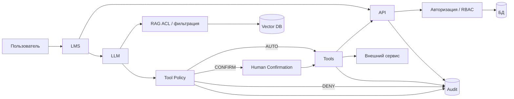

# Практическая работа № 4 — материалы преподавателя
## Комплексная оценка защищённости цифрового образовательного ресурса с ИИ-компонентом

**Максимальная оценка:** 15 баллов  
**Студенческий файл:** `pr_04.md`  
**Результат студента:** один файл `pr_04_Фамилия.md`

---

# 1. Методика проведения

Практика должна проверять архитектурное мышление, а не навыки «взлома LLM».

Основная логика:

> **пользователь → серверная авторизация → LLM → политика инструментов → подтверждение → инструмент → аудит**

Студент не должен:

- тестировать реальные API;
- отправлять prompt injection в реальные сервисы;
- выполнять вредоносный код;
- считать LLM доверенным субъектом авторизации.

---

# 2. Ориентир общего решения

## 2.1. Защищённая архитектура

Ключевые элементы:
- авторизация выполняется сервером;
- RAG фильтруется до передачи текста модели;
- инструменты проходят отдельную policy;
- критичные действия подтверждаются;
- всё журналируется.

---

## 2.2. Web/API — ориентиры

Хорошие четыре риска:

1. `GET /api/students/{id}` — BOLA/доступ к чужому профилю.
2. `GET /api/grades/{student_id}` — просмотр чужих оценок.
3. `POST /api/grades/{student_id}` — недостаточно одной роли teacher; нужна проверка связи преподавателя с курсом/обучающимся.
4. `POST /api/export/course/{id}` — массовый экспорт.
5. admin role change — только строго ограниченным администраторам и с аудитом.
6. delete file — подтверждение и серверная проверка объекта.

Серверные меры:
- object-level authorization;
- RBAC/ABAC;
- scope по курсу;
- лимиты;
- аудит;
- подтверждение критичных действий;
- отдельные admin-права.

---

## 2.3. Риски ИИ-контура

Ориентиры:

1. indirect prompt injection из D04;
2. RAG выдаёт материал другого курса;
3. раскрытие ПДн во внешний LLM;
4. агент меняет оценку без человека;
5. агент отправляет данные внешнему адресату;
6. run_code без изоляции;
7. hallucination влияет на педагогическое решение;
8. недоверенный документ попадает в RAG;
9. tool loop/ресурсное потребление.

---

## 2.4. Политика инструментов

Один из рекомендуемых вариантов:

| Инструмент | Режим | Логика |
|---|---|---|
| `search_course` | AUTO | только в разрешённом scope |
| `read_material` | AUTO | после ACL/RAG-фильтра |
| `send_email` | CONFIRM | внешний эффект и возможная передача данных |
| `change_grade` | DENY или CONFIRM* | критичная целостность; лучше прямой запрет агенту |
| `delete_file` | CONFIRM или DENY | потенциально разрушительное действие |
| `run_code` | DENY** | если код не нужен учебному сценарию |

`*` Для курса допустим `CONFIRM`, если студент вводит строгую серверную проверку, старое/новое значение и подтверждение педагога. Архитектурно более безопасно — `DENY` прямое изменение и разрешить ИИ только сформировать предложение.

`**` Если выполнение кода необходимо, нужна изолированная песочница.

---

## 2.5. Данные

Пример:

| Данные | Категория |
|---|---|
| публичный учебный текст | допустим |
| текст задания без ПДн | допустим |
| обезличенный ответ | после минимизации |
| ФИО | после минимизации/не передавать без необходимости |
| оценка + ФИО | не передавать внешнему сервису в учебном сценарии |
| API-токен | не передавать |
| служебные учётные данные | не передавать |

Главное — логика минимизации.

---

## 2.6. RAG

D04 должен рассматриваться как **недоверенный контент**, а не команда.

Нужно:
- provenance;
- owner;
- ACL/course;
- version;
- review;
- filter before retrieval context;
- журнал источников, вошедших в ответ.

---

## 2.7. Аудит

Минимальные поля:
- user;
- session/trace;
- model/version;
- RAG source IDs;
- tool;
- policy decision;
- confirmation;
- arguments/target;
- result;
- timestamp.

Аномалии:
- повторный вызов DENY-tool;
- массовый экспорт;
- change_grade;
- send_email на внешний домен;
- run_code;
- множество tool calls в одной trace;
- доступ к RAG другого курса.

---

## 2.8. Остаточный риск

Допустимые:
- LLM может дать неточный ответ;
- prompt injection нельзя полностью исключить;
- пользователь может подтвердить ошибочное действие;
- внешний поставщик остаётся частью цепочки;
- ошибки ACL/RBAC возможны;
- RAG-документ может быть ошибочно классифицирован.

Принимает:
- владелец цифрового сервиса;
- руководитель образовательной организации;
- владелец учебного процесса;
- ответственный за ИБ/ПДн — в зависимости от риска.

---

# 3. Оценивание — 15 баллов

| Критерий | Баллы | Что проверять |
|---|---:|---|
| Архитектура | 2 | auth, RAG filter, tool policy, audit |
| Web/API | 2 | серверные проверки, не UI |
| ИИ/RAG риски | 2 | не менее 5, разные классы |
| Tool policy | 2 | осмысленные AUTO/CONFIRM/DENY |
| Данные/RAG/аудит/остаточный риск | 2 | минимизация, provenance, monitoring |
| Индивидуальный вариант | 4 | все 3 задания |
| Педагогические правила + вывод | 1 | конкретность и применимость |
| **Итого** | **15** | |

---

# 4. Ориентиры решений 25 вариантов

## Вариант 1. `GET /api/students/{id}`
1. Риск: пользователь подставляет чужой ID.
2. Сервер проверяет право субъекта на конкретный объект.
3. Скрытая ссылка не мешает прямому HTTP-запросу.

## Вариант 2. `GET /api/grades/{student_id}`
1. Обучающийся — только свои оценки; педагог — только своих групп; руководитель — по полномочиям.
2. Риск раскрытия чужих результатов.
3. Object-level authorization + course scope.

## Вариант 3. `POST /api/grades/{student_id}`
1. Риск изменения чужой оценки.
2. Проверить роль, курс, принадлежность студента, допустимость операции.
3. AUTO для ИИ — нет; лучше DENY либо CONFIRM при строгой серверной политике.

## Вариант 4. Удаление файла
1. Риск удаления чужого/критичного файла.
2. CONFIRM или DENY.
3. Показывать имя файла, владельца, расположение, последствия, возможность восстановления.

## Вариант 5. Массовый экспорт
1. Риски: утечка и избыточный объём.
2. Ограничение scope/лимита/ролей.
3. Alert на необычный объём или частоту экспорта.

## Вариант 6. Административный метод
1. Только ограниченная admin-роль.
2. Нужен аудит и, возможно, дополнительное подтверждение.
3. ИИ лучше DENY: изменение ролей меняет модель безопасности.

## Вариант 7. Prompt injection
1. D04 — недоверенный текст.
2. Он не должен иметь приоритет над system/tool policy.
3. ACL/provenance + фильтрация/изоляция инструкций + tool policy.

## Вариант 8. RAG между курсами
1. INF-7A не должен получать D03 без права на INF-8B.
2. Фильтр курса/роли выполняется до передачи контекста модели.
3. course_id, role/ACL, owner, classification.

## Вариант 9. Учительский материал
1. D02 teacher-only.
2. Student не должен видеть методические рекомендации.
3. Серверный ACL на retrieval, не «просьба модели не показывать».

## Вариант 10. Недостоверный ответ
1. Галлюцинация/ошибка.
2. RAG citations + проверка педагогом/правила confidence.
3. Оценка, дисциплинарное или иное критичное решение не должно основываться только на LLM.

## Вариант 11. `send_email`
1. CONFIRM.
2. Адресат, тема, текст, вложения/данные.
3. Alert на внешний домен/массовую рассылку.

## Вариант 12. `change_grade`
1. Предпочтительно DENY.
2. Риск нарушения целостности результатов обучения.
3. ИИ может сформировать рекомендацию или черновик изменения, педагог применяет его сам.

## Вариант 13. `delete_file`
1. CONFIRM или DENY.
2. Риск необратимого удаления.
3. Корзина/soft-delete, подтверждение, журнал.

## Вариант 14. `run_code`
1. Если не нужен — DENY.
2. Если нужен: sandbox, CPU/RAM/time limit, read-only/fs isolation, no DB/network.
3. Не предоставлять опасную возможность без учебной необходимости.

## Вариант 15. Изоляция кода
1. Схема: LLM→validator→sandbox→result→audit.
2. Лимиты CPU/RAM/time.
3. Нет доступа к production DB, secrets, host FS, unrestricted network.

## Вариант 16. Персональные данные
1. Классификация по трём категориям.
2. Передавать только минимум для задачи.
3. Обезличивание недостаточно, если комбинация признаков позволяет реидентификацию.

## Вариант 17. API-токены
1. Токен в prompt/log может быть раскрыт.
2. Секрет хранит серверный vault/tool runtime; модель получает только имя действия.
3. Журналировать tool, target, result, но не сам секрет.

## Вариант 18. Аудит ИИ
1. AI03, AI04, AI07 — наиболее подозрительные/критичные.
2. Нужны user, trace, tool, policy, target, confirmation.
3. Alert на change_grade/send external/run_code.

## Вариант 19. AI03
1. Изменение оценки student.s01.
2. AUTO нарушает принцип минимальных привилегий.
3. DENY или CONFIRM; audit: actor, student, old/new, course, confirmation.

## Вариант 20. AI04
1. Внешняя отправка.
2. Возможна передача учебных или персональных данных.
3. CONFIRM + allowlist/ограничение доменов + показать данные и адресата.

## Вариант 21. AI07
1. run_code выполнен автоматически.
2. Не хватает sandbox info, resource limits, network/fs access, code hash, result.
3. Логировать trace, code hash, sandbox id, limits, network, exit code, output.

## Вариант 22. Ограничение инструментов
Ориентир:
- search/read — AUTO;
- send_email — CONFIRM;
- change_grade — DENY;
- delete_file — CONFIRM/DENY;
- run_code — DENY.
Спорное решение должно быть обосновано образовательной необходимостью.

## Вариант 23. Мониторинг
1. Повторный DENY call; массовый export; критичный tool.
2. Триггеры — policy=DENY, count/volume threshold, tool=change_grade/send_email/run_code.
3. Наивысший приоритет — изменение оценки/массовая передача/критичный tool в зависимости от аргументации.

## Вариант 24. Правила для педагогов и обучающихся
Педагоги:
- не передавать ПДн без необходимости;
- проверять результат;
- не подтверждать непонятное действие.
Обучающиеся:
- не вводить персональные данные без необходимости;
- проверять ответы по материалам курса;
- сообщать о странном поведении.
Общее: не считать ответ ИИ безусловно достоверным.

## Вариант 25. Комплексная безопасность ИИ-LMS

### Задание 1
Хорошие приоритеты:
- изменение оценки агентом;
- утечка данных через внешний tool/LLM;
- indirect prompt injection + tool abuse.

### Задание 2
Ориентир:
- `send_email` — CONFIRM;
- `change_grade` — DENY;
- `run_code` — DENY, если нет явной учебной необходимости.

Допустимы другие режимы при сильном обосновании.

### Задание 3
Первый этап:
1. **Данные/RAG:** ACL по курсу/роли + provenance.
2. **Инструменты:** tool policy с DENY/CONFIRM и серверной авторизацией.
3. **Мониторинг:** единый audit trace для RAG/tool/confirmation/result.

---

# 5. Педагогические правила — ориентир

### Для педагогов
1. Не передавать в ИИ персональные данные, если это не требуется и не разрешено.
2. Проверять ответы ИИ перед использованием в оценивании или учебных материалах.
3. Не подтверждать отправку, изменение или удаление, если объект и последствия непонятны.

### Для обучающихся
1. Не вводить в ИИ чужие персональные данные.
2. Проверять ответ по учебным материалам и источникам.
3. Сообщать преподавателю о неожиданном запросе ИИ на доступ, отправку данных или выполнение действия.

---

# 6. Вопросы для быстрой защиты

1. Где именно должна выполняться авторизация?
2. Почему D04 не должен менять поведение системы?
3. Какой tool вы бы запретили полностью?
4. Что должен видеть человек при CONFIRM?
5. Почему `change_grade` критичнее `search_course`?
6. Что нужно журналировать для воспроизводимости?
7. Какой остаточный риск вы считаете приемлемым и кто это решает?
