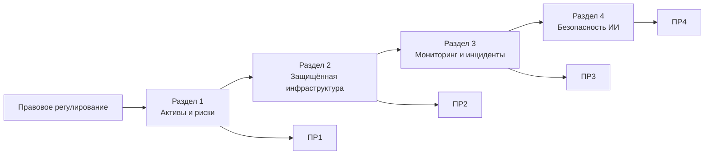

Информационная безопасность в образовательных учреждениях
Учебный репозиторий дисциплины «Информационная безопасность в образовательных учреждениях» для магистрантов направления 44.04.01 «Педагогическое образование», профиль «Методика преподавания информатики (СПВО)».
Курс посвящён практической защите цифровой образовательной среды: персональным данным, управлению рисками, защищённой инфраструктуре, реагированию на инциденты и безопасному применению искусственного интеллекта.
---
Преподаватель
Босенко Тимур Муртазович  
кандидат технических наук, доцент  
доцент департамента информатики, управления и технологий  
Московский городской педагогический университет
Профиль на сайте МГПУ
E-mail: `bosenkotm@mgpu.ru`
---
Материалы курса
Вводная тема. Правовое регулирование информационной безопасности в РФ
Краткий обзор законодательства и нормативного регулирования информационной безопасности, персональных данных и цифровой образовательной среды.
Материал:
Лекция «Правовое регулирование информационной безопасности в РФ»
---
Раздел 1. Управление информационной безопасностью и защита персональных данных
Основные темы:
конфиденциальность, целостность и доступность;
цифровая образовательная среда как объект защиты;
информационные активы;
персональные данные обучающихся, родителей и работников;
минимизация и обезличивание данных;
угрозы, уязвимости и риски;
реестр рисков;
локальные правила и распределение ответственности.
Материалы:
Мини-лекция по разделу 1
Практическая работа № 1 «Моделирование угроз цифровой образовательной среды»
---
Раздел 2. Защита цифровой инфраструктуры и образовательных информационных систем
Основные темы:
идентификация, аутентификация и авторизация;
MFA;
RBAC;
принцип минимальных привилегий;
жизненный цикл учётных записей;
сегментация сети;
Zero Trust;
сервисные аккаунты и секреты;
резервное копирование;
RPO и RTO;
безопасность облачных сервисов.
Материалы:
Мини-лекция по разделу 2
Практическая работа № 2 «Проектирование защищённой инфраструктуры образовательной организации»
---
Раздел 3. Мониторинг, реагирование на инциденты и устойчивость образовательного процесса
Основные темы:
события и инциденты информационной безопасности;
фишинг и социальная инженерия;
журналирование;
корреляция событий;
аномальная активность;
временная линия инцидента;
факты и аналитические гипотезы;
локализация;
восстановление;
непрерывность образовательного процесса.
Материалы:
Мини-лекция по разделу 3
Практическая работа № 3 «Расследование инцидента в цифровой образовательной среде»
---
Раздел 4. Безопасность цифровых образовательных ресурсов и систем искусственного интеллекта
Основные темы:
безопасность Web/API;
объектная авторизация;
управление секретами;
безопасность цепочки поставок;
генеративный ИИ;
prompt injection;
RAG и разграничение доступа;
персональные данные и внешние ИИ-сервисы;
ИИ-агенты;
режимы `AUTO`, `CONFIRM`, `DENY`;
безопасное выполнение кода;
аудит и мониторинг действий ИИ.
Материалы:
Мини-лекция по разделу 4
Практическая работа № 4 «Комплексная оценка защищённости цифрового образовательного ресурса с ИИ-компонентом»
---
Практические работы
Каждая практическая работа выполняется индивидуально и оценивается максимум в 15 баллов.
№	Практическая работа	Максимум
1	Моделирование угроз цифровой образовательной среды	15
2	Проектирование защищённой инфраструктуры	15
3	Расследование инцидента	15
4	Безопасность цифрового ресурса с ИИ-компонентом	15
	Итого	60
В каждой работе предусмотрены 25 индивидуальных вариантов, по три задания в каждом варианте.
Студент сдаёт один Markdown-файл:
```text
pr_01_Фамилия.md
pr_02_Фамилия.md
pr_03_Фамилия.md
pr_04_Фамилия.md
```
Диаграммы выполняются в Mermaid и включаются непосредственно в отчёт.
---
Тестирование
Для каждого основного раздела подготовлено по 40 тестовых вопросов с одним правильным ответом.
Всего:
```text
4 раздела × 40 вопросов = 160 вопросов
```
При размещении банка вопросов в репозитории рекомендуется использовать:
Банк тестовых вопросов
Ключи правильных ответов и преподавательские материалы не следует размещать в публичном репозитории курса.
---
Логика курса

---
Сквозной учебный кейс
Практические работы связаны общей моделью условной образовательной организации «Школа цифровых практик».
В кейсе используются:
LMS;
электронный журнал;
сайт;
файловое облако;
корпоративная почта;
видеоконференции;
база данных;
серверы и NAS;
административная, педагогическая, ученическая и гостевая сети;
внешние образовательные сервисы;
RAG и ИИ-ассистент.
Все имена, адреса, журналы, данные и идентификаторы являются синтетическими.
---
Безопасность выполнения заданий
Практические работы имеют учебный и архитектурно-аналитический характер.
Не допускается:
проверять уязвимости на реальных информационных системах;
выполнять несанкционированное сканирование;
использовать реальные персональные данные;
проверять prompt injection на продуктивных сторонних сервисах;
использовать реальные пароли, API-ключи и токены.
Работа с учебным стендом выполняется только в пределах задания преподавателя.
---
Рекомендуемая структура репозитория
```text
infsecedu/
├── README.md
│
├── lectures/
│   ├── 00_legal_regulation.md
│   ├── 01_security_management_pd.md
│   ├── 02_secure_infrastructure.md
│   ├── 03_incident_response.md
│   └── 04_ai_security.md
│
├── practice/
│   ├── pr_01.md
│   ├── pr_02.md
│   ├── pr_03.md
│   └── pr_04.md
│
└── tests/
    └── test_bank_160.md
```
> Файлы `pr_01_teacher.md` — `pr_04_teacher.md`, ключи тестов и другие материалы с решениями рекомендуется хранить отдельно от публичного студенческого репозитория.
---
Результаты освоения курса
После изучения курса студент должен уметь:
определять критичные информационные активы;
различать угрозы, уязвимости и риски;
оценивать риски цифровой образовательной среды;
проектировать сетевую сегментацию и RBAC;
применять принцип минимальных привилегий;
определять RPO и RTO;
анализировать журналы событий;
строить временную линию инцидента;
отделять факты от гипотез;
проектировать локализацию и восстановление;
оценивать риски Web/API/RAG/LLM;
проектировать ограничения для ИИ-инструментов;
формулировать правила безопасной работы для педагогов и обучающихся.
---
Ссылки
Репозиторий курса
Московский городской педагогический университет
Профиль преподавателя
---
Примечание
Нормативные документы, стандарты и требования информационной безопасности изменяются. Перед практическим применением необходимо проверять актуальную редакцию документа и область его применимости.
