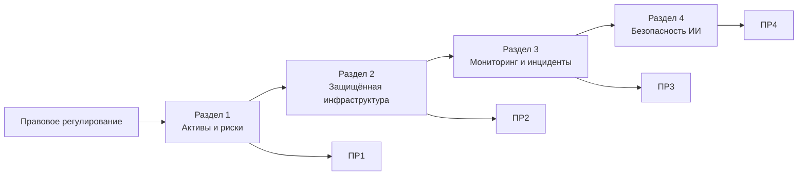

# Информационная безопасность в образовательных учреждениях

Учебный репозиторий дисциплины **«Информационная безопасность в образовательных учреждениях»** для магистрантов направления **44.04.01 «Педагогическое образование»**, профиль **«Методика преподавания информатики (СПВО)»**.

Курс посвящён практической защите цифровой образовательной среды: персональным данным, управлению рисками, защищённой инфраструктуре, реагированию на инциденты и безопасному применению искусственного интеллекта.

---

## Преподаватель

**Босенко Тимур Муртазович**  
кандидат технических наук, доцент  
доцент департамента информатики, управления и технологий  
Московский городской педагогический университет

- [Профиль на сайте МГПУ](https://www.mgpu.ru/personal/bosenko-timur-murtazovich/)
- E-mail: `bosenkotm@mgpu.ru`

---

## Материалы курса

### Вводная тема. Правовое регулирование информационной безопасности в РФ

Краткий обзор законодательства и нормативного регулирования информационной безопасности, персональных данных и цифровой образовательной среды.

- [Лекция «Правовое регулирование информационной безопасности в Российской Федерации»](2026/lectures/lect_00_Прав_рег_инф_без_в_РФ.md)

---

## Раздел 1. Управление информационной безопасностью и защита персональных данных

Основные темы:

- конфиденциальность, целостность и доступность;
- цифровая образовательная среда как объект защиты;
- информационные активы;
- персональные данные обучающихся, родителей и работников;
- минимизация и обезличивание данных;
- угрозы, уязвимости и риски;
- реестр рисков;
- локальные правила;
- распределение ответственности.

**Материалы:**

- [Мини-лекция по разделу 1](2026/lectures/section_01.md)
- [Практическая работа № 1 «Моделирование угроз цифровой образовательной среды»](2026/practice/pr_01/pr_01.md)

---

## Раздел 2. Защита цифровой инфраструктуры и образовательных информационных систем

Основные темы:

- идентификация, аутентификация и авторизация;
- многофакторная аутентификация;
- RBAC;
- принцип минимальных привилегий;
- жизненный цикл учётных записей;
- сегментация сети;
- Zero Trust;
- сервисные аккаунты и секреты;
- резервное копирование;
- RPO и RTO;
- безопасность облачных сервисов.

**Материалы:**

- [Мини-лекция по разделу 2](2026/lectures/section_02.md)
- [Практическая работа № 2 «Проектирование защищённой инфраструктуры образовательной организации»](2026/practice/pr_02/pr_02.md)

---

## Раздел 3. Мониторинг, реагирование на инциденты и устойчивость образовательного процесса

Основные темы:

- события и инциденты информационной безопасности;
- фишинг и социальная инженерия;
- журналирование;
- корреляция событий;
- аномальная активность;
- временная линия инцидента;
- факты и аналитические гипотезы;
- локализация;
- восстановление;
- непрерывность образовательного процесса.

**Материалы:**

- [Мини-лекция по разделу 3](2026/lectures/section_03.md)
- [Практическая работа № 3 «Расследование инцидента в цифровой образовательной среде»](2026/practice/pr_03/pr_03.md)

---

## Раздел 4. Безопасность цифровых образовательных ресурсов и систем искусственного интеллекта

Основные темы:

- безопасность Web/API;
- объектная авторизация;
- безопасная конфигурация;
- управление секретами;
- цепочка поставок;
- генеративный ИИ;
- prompt injection;
- RAG и разграничение доступа;
- персональные данные и внешние ИИ-сервисы;
- ИИ-агенты;
- режимы `AUTO`, `CONFIRM`, `DENY`;
- безопасное выполнение кода;
- аудит и мониторинг действий ИИ.

**Материалы:**

- [Мини-лекция по разделу 4](2026/lectures/section_04.md)
- [Практическая работа № 4 «Комплексная оценка защищённости цифрового образовательного ресурса с ИИ-компонентом»](2026/practice/pr_04/pr_04.md)

---

## Практические работы

Каждая практическая работа выполняется **индивидуально** и оценивается максимум в **15 баллов**.

| № | Практическая работа | Максимум |
|---:|---|---:|
| 1 | [Моделирование угроз цифровой образовательной среды](2026/practice/pr_01/pr_01.md) | 15 |
| 2 | [Проектирование защищённой инфраструктуры](2026/practice/pr_02/pr_02.md) | 15 |
| 3 | [Расследование инцидента](2026/practice/pr_03/pr_03.md) | 15 |
| 4 | [Безопасность цифрового ресурса с ИИ-компонентом](2026/practice/pr_04/pr_04.md) | 15 |
|  | **Итого** | **60** |

В каждой работе предусмотрены **25 индивидуальных вариантов**, по три задания в каждом варианте.

Студент сдаёт один Markdown-файл:

```text
pr_01_Фамилия.md
pr_02_Фамилия.md
pr_03_Фамилия.md
pr_04_Фамилия.md
```

Диаграммы выполняются в **Mermaid** и включаются непосредственно в отчёт.

---

## Логика курса



---

## Сквозной учебный кейс

Практические работы связаны общей моделью условной образовательной организации **«Школа цифровых практик»**.

В кейсе используются:

- LMS;
- электронный журнал;
- публичный сайт;
- файловое облако;
- корпоративная почта;
- видеоконференции;
- база данных;
- серверы и NAS;
- административная, педагогическая, ученическая и гостевая сети;
- внешние образовательные сервисы;
- RAG и ИИ-ассистент.

Все имена, адреса, журналы, данные и идентификаторы являются **синтетическими**.

---

## Безопасность выполнения заданий

Практические работы имеют учебный и архитектурно-аналитический характер.

Не допускается:

- проверять уязвимости на реальных информационных системах;
- выполнять несанкционированное сканирование;
- использовать реальные персональные данные;
- проверять prompt injection на продуктивных сторонних сервисах;
- использовать реальные пароли, API-ключи и токены.

Работа с учебным стендом выполняется только в пределах задания преподавателя.

---

## Фактическая структура материалов курса

```text
infsecedu/
├── README.md
└── 2026/
    ├── lectures/
    │   ├── lect_00_Прав_рег_инф_без_в_РФ.md
    │   ├── section_01.md
    │   ├── section_02.md
    │   ├── section_03.md
    │   └── section_04.md
    └── practice/
        ├── pr_01/
        │   └── pr_01.md
        ├── pr_02/
        │   └── pr_02.md
        ├── pr_03/
        │   └── pr_03.md
        └── pr_04/
            └── pr_04.md
```

---

## Результаты освоения курса

После изучения курса студент должен уметь:

1. определять критичные информационные активы;
2. различать угрозы, уязвимости и риски;
3. оценивать риски цифровой образовательной среды;
4. проектировать сетевую сегментацию и RBAC;
5. применять принцип минимальных привилегий;
6. определять RPO и RTO;
7. анализировать журналы событий;
8. строить временную линию инцидента;
9. отделять факты от гипотез;
10. проектировать локализацию и восстановление;
11. оценивать риски Web/API/RAG/LLM;
12. проектировать ограничения для ИИ-инструментов;
13. формулировать правила безопасной работы для педагогов и обучающихся.

---

## Ссылки

- [Репозиторий курса](https://github.com/BosenkoTM/infsecedu)
- [Московский городской педагогический университет](https://www.mgpu.ru/)
- [Профиль преподавателя](https://www.mgpu.ru/personal/bosenko-timur-murtazovich/)

---

## Примечание

Нормативные документы, стандарты и требования информационной безопасности изменяются. Перед практическим применением необходимо проверять актуальную редакцию документа и область его применимости.
